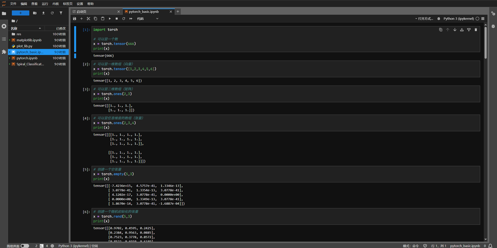
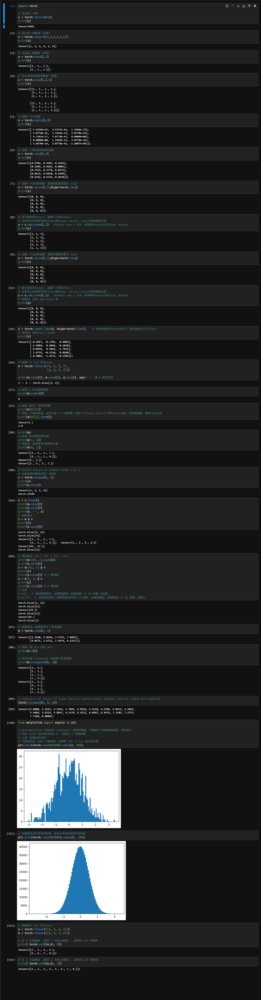
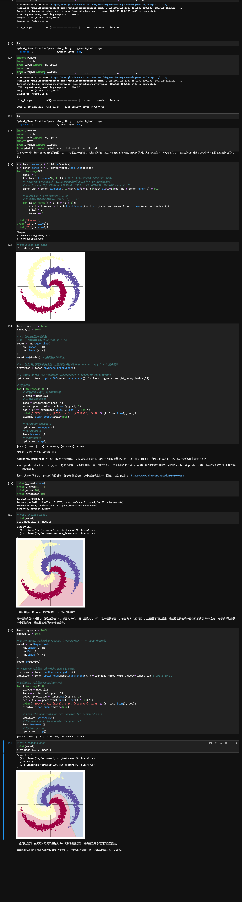
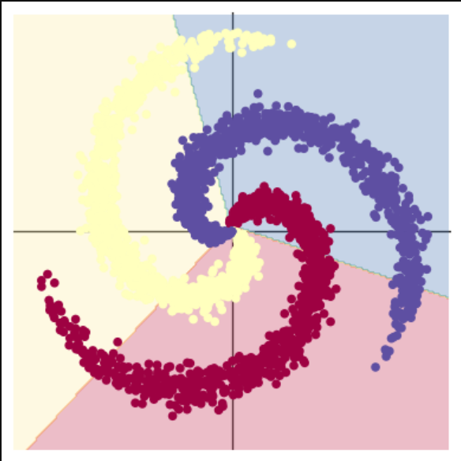
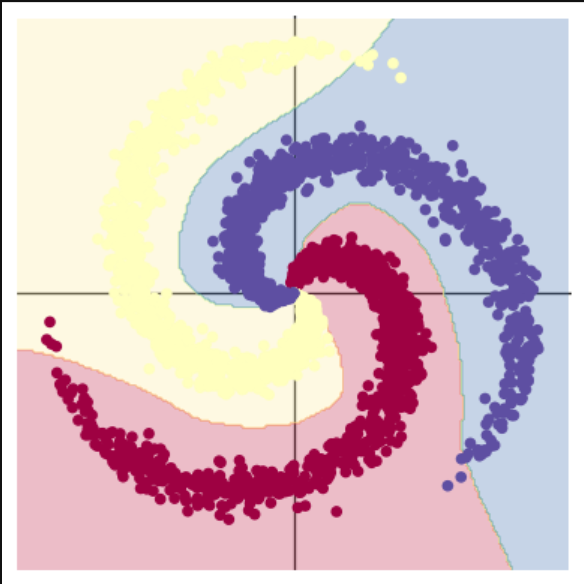
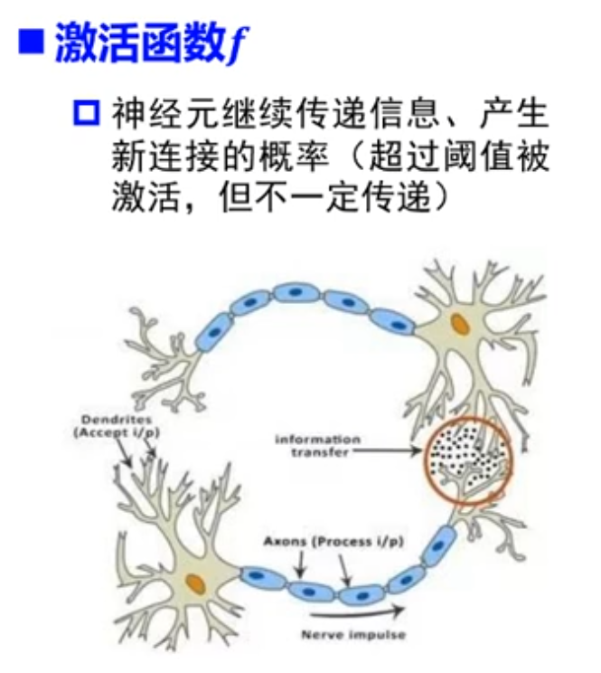
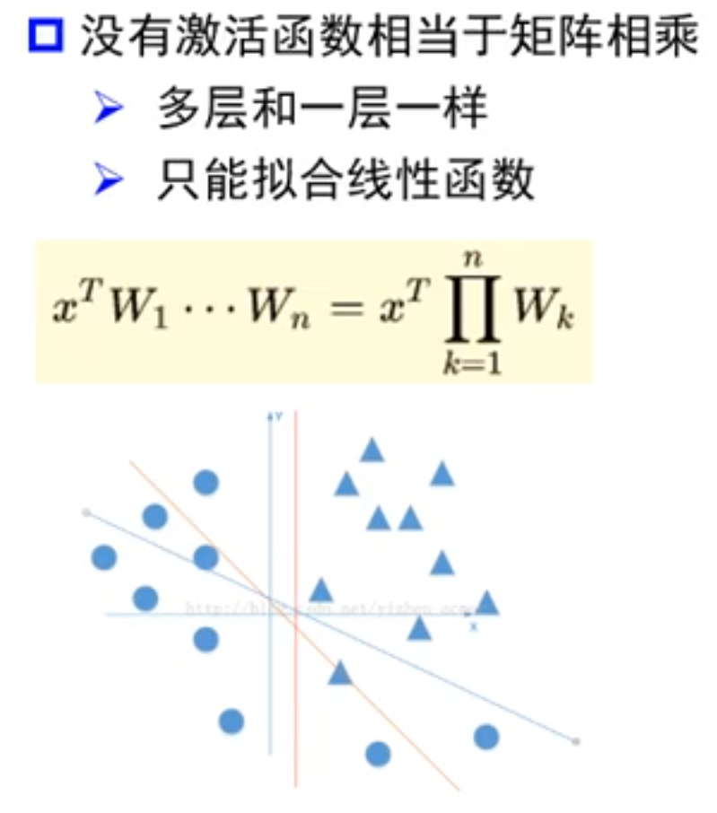
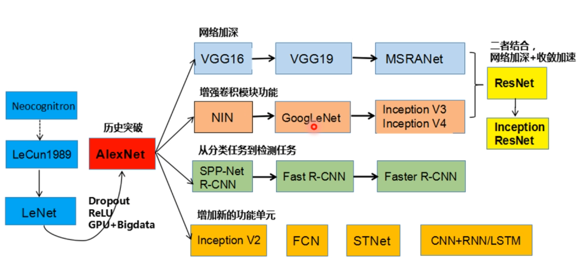
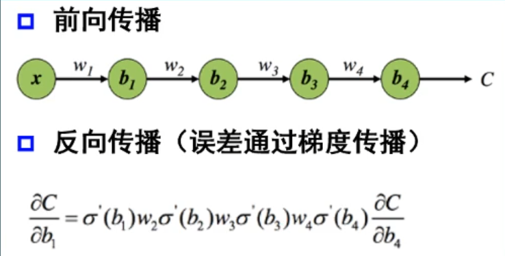
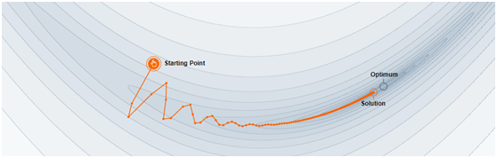

# 人工智能-第一周周报

本周任务：https://gitee.com/gaopursuit/ouc-dl/blob/master/week01.md

## 概述

这周主要先学一些深度学习的一些基础知识，认识一些基础概念和深度学习的一些底层逻辑

## 代码环境搭建

这不爱特服务器最近上新了一套新设备嘛，我整了台小主机，里面装了两块 v100 16G ，而主板支持 NVlink ，跑 LLM 的时候可把我爽疯了（缺点就是散热噪音有点太大了，开学以后再换新风扇吧）

所以我决定，不使用 Colab 了，自己搭 Jupyter Notebook ，Colab 那玩意我上计导的时候就用吐了，不想再用它了

对于这个，有一个现成的 docker [镜像](https://github.com/Tverous/pytorch-notebook)，大家想要自己搭的可以试试

进去以后，发现没有中文，字体不好看，主题难看。

可以参考以下文章自己调，总之调完以后挺爽的

[切换主题](https://www.cnblogs.com/shanger/p/12006161.html)、[修改字体](https://blog.csdn.net/sinat_32570141/article/details/112391698)、[中文包](https://jupyterlab.pythonlang.cn/en/latest/user/language.html)

其他的什么，比如 UI 、终端字体、字体大小什么的，Jupyter 设置里面都有，可以自己摸索一下



## pytorch 基础练习

pytorch 是人工智能常用的一个 python 框架，是人工智能学习的基础，这周我们先学习 pytorch 中张量的创建和操作

这里由于条目太多，我就单放截图了



这里面的坑有点多，这里需要注意几点：

第一，直接使用索引获取张量中的某个元素，得到的仍然是张量，而不是一个常规的 python 数字，比如

```python
m = torch.Tensor([[2, 5, 3, 7],
                  [4, 2, 1, 9]])

print(m[0][2])
# 这里输出的是 tensor(3.) ，是一个零维张量

print(m[0][2].item())
# 这里输出的才是正经的 3.0 ，是常规的 python 数字
```

第二，小心切片

```python
m = torch.Tensor([[2, 5, 3, 7],
                  [4, 2, 1, 9]])
                  
# m[[0], :] 和 m[0, :] ，你觉得这两个一样吗？
# 🤔，看上去就是一样的，但是维度不同了

z = m[[0], :]
print(z)
print(z.size()) # 显示 torch.Size([1])，这是一维张量，人话就是这样做会保持张量的维度
z = m[0, :]
print(z)
print(z.size()) # 显示 torch.Size([])，这是零维张量，人话就是这样张量会少一个维度
```

第三，要注意张量元素的数据类型

```python
# 假如 m 和 n 在数学上是可以做矩阵乘法的，但是他们的 dtype 不一样，比如 m 的元素都是 float ，n 的都是 int
# 现在做乘法
m @ n

# 这样会报错，所以在这么做之前，要先给张量统一元素的数据类型
n.float()

# 现在这么做就可以了
m @ n
```

第四，最新的 `MatlabPlotLib` 目前已经不需要手动将 torch 对象换成 numpy 对象了，它自己会换的，你只管用就好了

里面还留了一个问题叻，`transpose()` 方法是啥？

讲人话，这玩意就是交换张量的两个维度，图中使用了 `transpose(0, 1)` 就是交换张量的第零维（行）和第一维（列），等价于 `t()` 方法，矩阵转置方法

差不多就是这些了，如果想要学习更多，可以参考 [pytorch 文档](https://pytorch-cn.readthedocs.io/zh/latest/)

## 螺旋数据分类

本次代码中将解决 spiral classification 问题

讲人话就是一大坨螺旋状分布的数据，你咋用深度学习的方法给他分开

那我们先把代码丢到我们的 Jupyter 里面看看效果吧



*不得不说，v100 的 AI 性能确实很有性价比*

回归正题，先说一个问题，就是如果你是自己搭的 Notebook ，你是运行不了程序的，原因是 `plot_lib.py` 里面用到了一张照片，但是你的本地环境里面并没有

只需要再用 wget 拿一下那个资源：https://raw.githubusercontent.com/Atcold/pytorch-Deep-Learning/master/res/ziegler.png

然后在工作区文件夹里面创建一个 res 文件夹，把照片丢里面就可以了

来讲讲这个实验

### 1. 为什么两种回归方法得到的结果截然不同？

首先我们来看看两个结果




很明显的区别是前者的分割线是直线，后者是曲线，而且是能够几乎完美划分三种数据的曲线

其实两者的代码差不多，但是最关键的一点是啥？来看看

```python
# 前者创建线性模型的代码：
model = nn.Sequential(
    nn.Linear(D, H),
    nn.Linear(H, C)
)

# 后者创建线性模型的代码：
model = nn.Sequential(
    nn.Linear(D, H),
    nn.ReLU(),
    nn.Linear(H, C)
)
```

区别仅仅在于，后者用了一个 ReLU 激活函数

那 ReLU 激活函数是何方神圣？为什么有这么大的魔力？首先来认识认识激活函数是什么？我这里有两张图帮助理解





我们都知道，人工智能的底层简单的说是 **矩阵** 可以理解为一大堆线性方程组列在一起，那如果你只有矩阵，乘来乘去，加来减去，还是矩阵，那不就只能拟合直线了呗，再专业一些，神经网络中每一层的核心计算都是一次线性变换

而多次线性变换的堆叠，其结果仍然等价于一次单独的线性变换。比如 W2 * (W1 * x + b1) + b2 可以被简化成一个新的 W' * x + b'。因此，一个没有激活函数的网络，其表达能力和一个单层网络没有区别

而在每一层神经网络加上激活函数，“神经元”在收到“刺激”的时候，应答就不会那么死板，而是能够做到在达到收到某种程度的“刺激”再激活，甚至应该是怎么样的激活

这似乎不能够解释它为啥能把线性变成非线性，从数学上说，感知器的工作步骤是给每一个输入的值乘一个**权重**，之后也可能会再加一个**偏置值**，形如：

::: center

权重 * 数据值 + 偏置值

:::

之后求和再过一遍激活函数，激活函数可不一定是线性的，它可能是一个曲线（比如 Sigmoid 、tanh 激活函数）或者是直线，但是是分段直线（比如 ReLU 、Leaky ReLU 激活函数）

我们就会得到

::: center

结果 = 激活函数($\sum$权重 * 数据值 + 偏置值)

:::

那这好像也不是很线性啊，也不可能拟合成图中那么夸张的吧？

别急，之后，这个结果会传递到下一层神经网络中，以此类推，我们就会得到这样一个函数：

::: center

结果 = 激活函数(激活函数(激活函数(...)))

:::

你把这个函数一复合，就会得到一个很复杂的函数，大概率不是线性的，我们就可以得到非线性的结果了

如果这还理解不了？那你可以想想一下打印在纸上的数据，不要想数据，把这张纸拿起来，揉几下，直到这些数据点用肉眼直接看上去能够被一条线分割

因此，激活函数的另外一层理解，是**每一层非线性激活都会对数据空间进行一次“扭曲”或“折叠”** 

### 2. 还能再厉害吗？

当然可以，我们注意到这里我们定义了 4 个常量

```python
N = 1000  # 每类样本的数量
D = 2  # 每个样本的特征维度
C = 3  # 样本的类别
H = 100  # 神经网络里隐层单元的数量
```

大可修改一些数据再来跑跑看看，如果效果不好，可以尝试增加**迭代次数**或换做其他**激活函数**看看效果

## 问题解答

**`Q: AlexNet 有哪些特点？为什么可以⽐ LeNet 取得更好的性能？`**

> A: 我们来看一张图吧
> 
> 首先，AlexNet 使用了 ReLU 作为激活函数，比起 LeNet 使用的 Sigmoid 和 tanh 性能更佳，求导也更简单，也不会出现梯度消失这些问题，收敛也更加快速
> 基于上句话，这也就决定了 AlexNet 相比于 LeNet，能够将神经网络训练的更深，也就能够得到更好的结果
> 其次，AlexNet 使用了 Dropout 来防止过拟合，这样网络就不会过于依赖某些神经元，让所有神经元都能够好好工作，不要摸鱼，从而减少过拟合现象
> 不仅如此，AlexNet 甚至还会自己给自己造训练数据，通过将已有数据进行变换来达到自己造数据的目的，以减少过拟合现象并增强了模型的泛化能力，类似人类的“举一反三”
> AlexNet 还能利用多 GPU ，实现了多块 GPU 并行训练，大大优化了训练
> 事实上，AlexNet 还有很多方面超越了 LeNet，这里就不再赘述了

**`Q: 激活函数有哪些作⽤？`**

> A: 从上文我们知道，最直接的作用就是实现了非线性回归
> 而且，激活函数还能控制输出值的范围，让输出不会太大，也不会太小，充当阀门的作用
> 在第一问中，我们知道，选择了好的激活函数，一定程度上可以避免梯度消失、收敛速度太慢、训练不充分等问题

**`Q: 梯度消失现象是什么？`**

> A: 首先我们要知道，在神经网络学习过程中，还有一个叫反向传递的过程来调整内部参数，本质上是在计算损失函数对网络参数的梯度
> 简单的来说，反向传递类似你考试并对完答案过后，一个复盘的过程
> 当然，你复盘的过程自然要从尾到头反着倒退一遍才能知道自己错哪了，这就是反向传递。在数学上，深度学习的反向传递的表达式看起来是这样的：
> 
> 其中，$\sigma'$表示激活函数的导数，整体就是这样一个链式求导的一个公式，来得出每一步的梯度值，如果我们选择了类似 Sigmoid 这样的激活函数时，发现它的导数都很小
> 同时看到，图中的 $w$ 也会影响梯度计算的结果，这个 $w$ 是神经网络的权重值，因此权重值选取不当也可能会造成梯度消失的情况
> 那么从这里可以看出，如果神经网络越深，那么计算出来的梯度值也就会越接近 0 ，这就是**梯度消失现象**
> 如果出现梯度消失现象，就人类而言，你如果找不到错在哪，那么你的学习进度就会停滞，那么深度学习也是如此，模型的学习可能会减缓甚至停滞，也就无法训练更深的神经网络，模型性能就会很差
> 想要解决梯度消失现象，最简单的方法就是换一个激活函数，比如 ReLU 激活函数，当然还有其他一些方法，这里就不再多说了

**`Q: 神经⽹络是更宽好还是更深好？`**

> 先说结论，更深更好
> 有实验指出，同样的神经网络节点数，构建的更深比构建的更宽的网络有更强的**网络表示能力**，错误率更低
> 深度和宽度对整个函数的复杂程度贡献是不同的，深度的贡献是**指数**增长的，而宽度只是**线性**增长的，可以参考下面这个公式
> ::: center
> $FC = \prod_{l=1}^{d} (\alpha_{l} \cdot \theta_{l})^{\beta_{l}}$
> :::
> 其中 $\alpha_l$ 是宽度对函数复杂度的贡献，$\beta_l$ 是深度对函数复杂度的贡献，显然，神经网络是更深更好的

**`Q: 为什么要使⽤Softmax？`**

> 先来解释一下 Softmax 的基本功能，它能够将一个模型的原始输出变换成一个概率分布，取值范围在 0 到 1 之间，结果的总和等于 1 ，也就是 100%
> 如果单看原始输出，那你可能不知道这一大堆数是啥意思，比如大模型输出一个很抽象的结果：
> 狗: 523.42354，猫: 123.1652，鸟: 56.51243
> 这谁知道这什么意思？但是如果在输出层套上一个 Softmax 函数，结果可能会变成
> 狗: 0.8，猫: 0.1，鸟: 0.1
> 我们就能够直观理解为大模型识别出狗的概率是 80% 猫和鸟是 10% ，能够得到一个解释性强的结果
> 通过 Softmax ，在处理多类别的分类任务时，我们就能通过每个类别的概率，得到最可能、最符合要求的结果

**`Q: SGD 和 Adam 哪个更有效？`**

> 一般是 Adam 更加有效
> 先来说说这两个是什么东西，这两个是优化器，用来优化梯度下降
> 梯度下降，就好比一个人从山上跑到山谷的最低点，用最快的速度跑到最低的地方
> 而 SGD 和 Adam 就是这样一个优化器，让这个人尽快下山，而且要下到最低点
> 其中，SGD 全名叫 Stochastic Gradient Descent 翻译作 随机梯度下降
> 它的路径大概是这样的
> 
> *来自 https://distill.pub/2017/momentum/*
> 它通过引入动量的概念，类似将人比作一个滚石，自然能够快速下山
> 但这也引入一个问题，就是 SGD 有可能会陷入局部最优而不是全局最优
> 而且这也导致 SDG 对初始化和学习率比较敏感
> 于是 Adam 就对 SDG 很多缺点进行了优化，跟 SDG 相比，Adam 对内存的需求更少，对初始学习率的要求也不会很高
> 通过解决这些问题，Adam 很适合应用在数据、参数规模巨大的工作当中
> 综合来看，Adam 在很多情况下，都是非常优秀的优化器，它的路径大致是这样的：
> 
> *来自 https://zhuanlan.zhihu.com/p/32698042*
> 但是 Adam 也有一些缺点，比如有报告指出，Adam 的自适应学习率机制在训练后期可能会导致学习率过小，从而错过最优解
> 更详细的解读可以看这篇文章：https://zhuanlan.zhihu.com/p/32698042