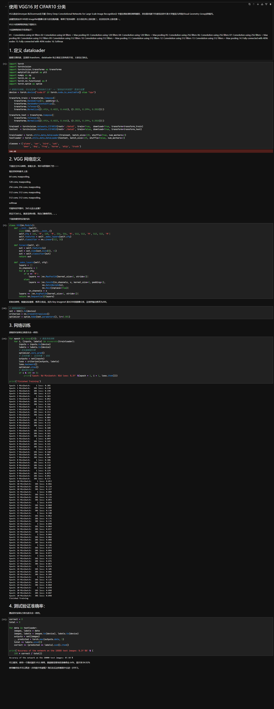

# 人工智能-第二周周报

本周任务：https://gitee.com/gaopursuit/ouc-dl/blob/master/week02.md

## 概述

这周开始学习 CNN 的理论知识，并做一些实践实验

## CNN 是什么？


CNN，也就是**卷积神经网络**(Convolutional Neural Network)，其与传统神经网络(NN)的不同之处在于其增加了**卷积层**(Convolutional Layer)和**池化层**(Pooling Layer)

先来说说传统神经网络的主要结构：**全连接层**(Fully Connected Layer)。全连接层最显著的特征是该层的每一个神经元都与前一层的神经元相连，如果前一层有 1000 个神经元，后一层有 1000 个神经元，那么链接之后就一共有 1000 * 1000 = 1000000 条连接！

假如你想用传统神经网络实现计算机视觉，试想一下会怎么样？

我拿来了一张分辨率是 1920x1080 的图片，给 1000 个神经元进行全连接，那么连接数就有恐怖的 1920 * 1080 * 1000 = 207360000 条！也就是参数量太大了！

参数量过大也会造成另外一个问题，也就是我们上周学到过的**过拟合**

而 CNN 就在这一方面进行了优化，通过局部关联和参数共享的方式减少了参数量，从而优化了性能并减少了过拟合现象

### 卷积


*出自https://blog.csdn.net/zhenz0729/article/details/139196813*

卷积简单的来说，就是把一个大矩阵变小

在卷积层中，我们会接收一个很大的矩阵，可能是 100x100，那么如何把他变小呢？

我们引入一个**卷积核**或者**过滤器**(Kernel / Filter)的概念，他也是一个矩阵，我们假定其为 3x3 ，里面的元素可以理解为权重(weights)，可以浓缩大矩阵的"特征"，并缩小矩阵

第一步，卷积核会贴在大矩阵的右上角，对齐，经过对两个矩阵重合位置元素进行乘法并求加和，我们得到一个 1x1 的矩阵，也就相当于浓缩了

第二步，按步长(stride)往左移动，这里假设步长为 2 ，那么卷积核就会向右滑动两格以后继续第一步的操作，如果这一行扫完了，就下降两格并重新从左开始

当然，这也会引出一个问题，也就是这样滑动万一最后面的不够覆盖了怎么办？这里引入一个新的东西，零填充(padding)，如果不够，就往外面围几圈 0 就可以了

最终，输出的矩阵我们称其为特征图(feature map / activation map)，这里给出特征图大小的公式：

::: center

特征图某边长 = (N - F) / stride + 1
*N表示输入矩阵的某边长，F表示卷积核的某边长*

:::

当然，卷积还有一个概念，叫做深度(depth / channel)，或者理解为通道数，就像图片有 RGB 三个通道一样，

但是，如果你有多个卷积核来执行卷积操作，那么有多少个卷积核就是深度，获得的输出的深度也和卷积核的数量一样

### 池化

池化与卷积类似，也可以用来减小矩阵的大小，通过划定矩阵中的范围(比如分割成很多个 2x2 的小矩阵)，然后对内部值进行处理，将小块中的值合并成一个值，最终就能得到一个更小的矩阵了

它在保留了主要特征的同时减少了参数和计算量，能够防止过拟合，提升模型泛化能力，其主要位于卷积层和卷积层或全连接层和全连接层之间

常见的池化类型主要有：最大值池化(Max pooling)和平均池化(Average pooling)，非常好理解，这里不再多讲了

直到最后，得到一个足够小的矩阵，现在我们就可以把他铺成一个一维的数组来处理了，而此时的数据已经足够小，我们就能够使用传统的全连接神经网络进行处理了，这便是 CNN

## MNIST 数据集分类

实验过程如下：


### FC vs CNN

这个实验主要是对比传统全连接网络和 CNN 神经网络的性能和准确率，我们发现，在像素顺序打乱之前，CNN 表现更好，但打乱后有所下降

主要原因是 CNN 作为一个主要利用像素局部关系(卷积和池化就相当于一个突出数据特点的操作)来识别图像的模型，我们在打乱像素后，必定会影响它对图像特点的采集，因此在这种情况下是不能很好的表现出它的性能的

### 从代码上区别 CNN 和 FC

这是 FC 的类

```python
class FC2Layer(nn.Module):
    def __init__(self, input_size, n_hidden, output_size):
        super(FC2Layer, self).__init__()
        self.input_size = input_size
        self.network = nn.Sequential(
            nn.Linear(input_size, n_hidden), 
            nn.ReLU(), 
            nn.Linear(n_hidden, n_hidden), 
            nn.ReLU(), 
            nn.Linear(n_hidden, output_size), 
            nn.LogSoftmax(dim=1)
        )
    def forward(self, x):
        return self.network(x)
```

而这是 CNN 的类

```python
class CNN(nn.Module):
    def __init__(self, input_size, n_feature, output_size):
        super(CNN, self).__init__()
        self.n_feature = n_feature
        self.conv1 = nn.Conv2d(in_channels=1, out_channels=n_feature, kernel_size=5)
        self.conv2 = nn.Conv2d(n_feature, n_feature, kernel_size=5)
        self.fc1 = nn.Linear(n_feature*4*4, 50)
        self.fc2 = nn.Linear(50, 10)    

    def forward(self, x, verbose=False):
        x = self.conv1(x)
        x = F.relu(x)
        x = F.max_pool2d(x, kernel_size=2)
        x = self.conv2(x)
        x = F.relu(x)
        x = F.max_pool2d(x, kernel_size=2)
        x = x.view(-1, self.n_feature*4*4)
        x = self.fc1(x)
        x = F.relu(x)
        x = self.fc2(x)
        x = F.log_softmax(x, dim=1)
        return x
```

注意到，CNN 在构造函数中使用了一个神奇的方法 `nn.Conv2d()` 也就是卷积，同时注意到，向前传递函数出现了最大值池化函数 `max_pool2d()` 

这也就体现了 CNN 的核心概念，卷积和池化，之后也确实进行了降维操作和全连接层上的操作，这也就是 CNN 的完整工作过程

## CIFAR10 数据集分类


## 使⽤ VGG16 对 CIFAR10 分类



这两个实验都挺好玩的，强烈推荐试试看

## 思考题

**`Q: dataloader ⾥⾯ shuffle 取不同值有什么区别？`**

> A: 之前不知道你是否有注意到一段代码：
> ```python
> # 注意下面代码中：训练的 shuffle 是 True，测试的 shuffle 是 false
> # 训练时可以打乱顺序增加多样性，测试是没有必要
> trainset = torchvision.datasets.CIFAR10(root='./data2', train=True,
> download=True, transform=transform)
> trainloader = torch.utils.data.DataLoader(trainset, batch_size=128,
> shuffle=True, num_workers=2)
> 
> testset = torchvision.datasets.CIFAR10(root='./data2', train=False,
> download=True, transform=transform)
> testloader = torch.utils.data.DataLoader(testset, batch_size=128,
> shuffle=False, num_workers=2)
> ```
> 显然，shuffle 是在数据加载时起作用
> 当 shuffle = True ，那么在每个 epoch 开始之前，会将整个数据集的顺序打乱，否则为 false 时，会按照数据顺序进行训练
> 这样做有两大好处
> 第一，能够防止模型从数据的顺序中学习到信息，换句话说，如果一直让模型按一定的顺序去"刷题"，那遇到不同顺序的"题型"时，会表现不佳
> 第二，能够增加数据的随机性，加强模型的稳定性并提高准确率

**`Q: transform ⾥，取了不同值，这个有什么区别？`**

> A: 我们分别取出实验二和三的对应部分的代码：
> ```python
> # 实验二
> transform = transforms.Compose(
>    [transforms.ToTensor(),
>    transforms.Normalize((0.5, 0.5, 0.5), (0.5, 0.5, 0.5))])
>```
> ```python
> # 实验三
> transform_train = transforms.Compose([
>     transforms.RandomCrop(32, padding=4),
>     transforms.RandomHorizontalFlip(),
>     transforms.ToTensor(),
>     transforms.Normalize((0.4914, 0.4822, 0.4465), (0.2023, 0.1994, 0.2010))])
>
>  transform_test = transforms.Compose([
>     transforms.ToTensor(),
>     transforms.Normalize((0.4914, 0.4822, 0.4465), (0.2023, 0.1994, 0.2010))])
> ```
> 顾名思义，`transform` 的意思是转化，也就是用于转化数据
> 先说 `ToTensor`，这个方法可以把数据范围转化到 [0, 1] ，是必写一项，不仅如此，他也可以进行维度调整、格式转换等操作
> 再说 `Normalize` ，这个方法原型为`transforms.Normalize(mean, std)`，作用是根据给定的均值和标准差对张量进行归一化操作，其中 mean 为均值，std 为标准差
> 内部实现是这样的：input[channel] = (input[channel] - mean[channel]) / std[channel]
> 拿 `(0.5, 0.5, 0.5), (0.5, 0.5, 0.5)` 为例，这项操作使得数据范围变成 [-1, 1] ，总的来说，这项变换操作，主要是为了优化数据，方便模型进行学习和减少一些负面影响
> 最后说说 `RandomCrop` 和 `RandomHorizontalFlip` ，他们用于数据增强，前者的操作是先在图像周边填充 padding ，然后随机裁剪 N * N (实验三中为 32x32) 的区域进行学习，能够迫使模型从某些特征中学习
> 后者则是对数据进行随机的镜像操作(概率一般是 50%)，如果数据翻转前后的意义不变，那么这项操作有利于模型的学习

**`Q: epoch 和 batch 的区别？`**

> A: epoch 可以为 `一代` ，而 batch 则是 `批次` 的意思
> 在一代(epoch)训练中，会将整个数据集进行学习，而学习的形式，则是按批次(batch)来的，比如一代有 10 个批次的学习
> 从我们身上来理解的话，书上的一个单元或者章节，就可以理解为一个批次，而学完整本书，就是一代

**`Q: 1x1的卷积和 FC 有什么区别？主要起什么作⽤？`**

> A: 不同点在于，FC 在接收数据后，相当于会把数据压缩成一维向量，但 1x1 的卷积不同，他在操作完后依然保留空间信息，不会丢失维度
> 此外，1x1 卷积还可以调整 channel 数，达到升维和降维的作用
> 
> *出自https://cloud.tencent.com/developer/article/1636071*
> 总的来说，1x1 卷积可以改变特征图的通道数、引入非线性变换以及融合多个 feature map 的信息
> 而 FC 则实现特征到类别的映射(如 CNN 最后接近输出层那一部分)、增强特征学习、增强模型非线性能力等等

**`Q: residual learning 为什么能够提升准确率？`**

> A: 残差学习(residual learning)，主要解决了深度学习中的一个重大问题：退化问题(Degradation Problem)
> 所谓退化问题，就是在神经网络变得越来越深的时候，准确率反而出现了下降
> 在 ResNet 中，就应用了残差学习，通过学习残差而非直接学习目标，比如你想要把你的分数提高到 90 分，那么除了直接提高到 90 分
> 假如你本身就已经考到 80 分了，那么你只需要在此基础上再提高 10 分就可以了，相比之下任务就更加清晰了
> 
> *出自[Deep Residual Learning for Image Recognition，CVPR2016](https://arxiv.org/pdf/1512.03385)*
> 也就是说，如果说传统网络的学校目标是 H(x) ，那么残差学习，就相当于在你原来就有 x 的情况下，再新学习一个 f(x) ，让 f(x) + x = H(x)
> 这里的 f(x) 也就是残差了，极端情况下 f(x) = 0，相当于一个恒等映射(Identity mapping)，也就是什么都不学

**`Q: 代码练习⼆⾥，⽹络和1989年 Lecun 提出的 LeNet 有什么区别？`**

> A: 从通道数上，LeNet 只有一个通道(灰度图)，而实验二中有三个通道(彩色图)
> 从激活函数上，LeNet 使用 Sigmoid 或 tanh 而实验二使用 ReLU
> 从池化类型上，LeNet 使用平均池化，而实验二使用最大池化

**`Q: 代码练习⼆⾥，卷积以后 feature map 尺⼨会变⼩，如何应⽤ Residual Learning?`**

> A: 出现这种问题，主要是因为 feature map 的高或宽变化或通道数发生变化后，f(x) 与 x 的维度不匹配
> 此时，我们便可以使用 1x1 的卷积，调整特征图的通道，使得二者的维度匹配即可

**`Q: 有什么⽅法可以进⼀步提升准确率？`**

> A: 对于 CNN 而言，从第一个实验我们知道，它对局部特点敏感，因此想要提升它的准确率，其中一个方法是仔细挑选我们喂给它的数据，要喂给 CNN 优质数据才能得到优质输出
> 另外一个方面，我们可以多训练几个 epoch 来提升准确度，如 `使⽤ VGG16 对 CIFAR10 分类` 实验中，我在最后训练了 20 个 epoch ，最终准确率比原来 10 个 epoch 的时候高了大约 2~3 个百分点
> 此外，我们还可以通过优化网络的结构如增加 dropout 和 BatchNorm 等神经网络结构、选择更加合适的优化器比如 SGD 优化器以及使用数据增强(也就是之前在介绍 AlexNet 时提到的 Data Augmentation)来提升准确率
> 最后，可以使用其他的神经网络模型，比如 VGG16、VGG19、GoogleNet 等
