# 人工智能-第三周周报

本周任务：https://gitee.com/gaopursuit/ouc-dl/blob/master/week03.md

Deep Residual Learning for Image Recognition：https://arxiv.org/pdf/1512.03385

ResNet⽹络讲解： https://www.bilibili.com/video/BV1T7411T7wa/

Pytorch搭建ResNet⽹络：https://www.bilibili.com/video/BV14E411H7Uw/

Aggregated Residual Transformations for Deep Neural Networks：https://arxiv.org/pdf/1611.05431

ResNeXt⽹络讲解：https://www.bilibili.com/video/BV1Ap4y1p71v/

Pytorch搭建ResNeXt⽹络：https://www.bilibili.com/video/BV1rX4y1N7tE/

## 概述

这周学习 ResNet 和 ResNeXt

这里先尝试解读两篇论文的内容

## Deep Residual Learning for Image Recognition

### 故事背景

之前我们说过，网络训练的更深还是更宽好？当然是更深更好了

然而传统神经网络极其难训练到很深，而且效果也很差，如论文作者呈现出的这张图中，不论是训练还是测试，56 层的神经网络错误率均明显高于 20 层的神经网络

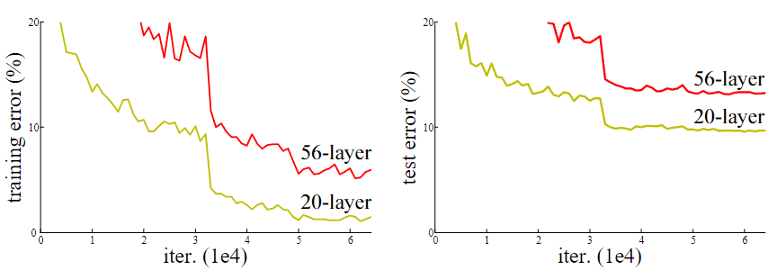

这种现象被称为退化问题(Degradation Problem)

::: warning

注意区分退化与过拟合(Overfitting)的区别，作者特别提到，退化并不是过拟合导致的

过拟合表现的形式是训练时出错低但是测试的时候出错高，而退化是两种情况都很高

:::

**为什么会退化？**

文中提到了两点：

1. **梯度爆炸/消失**：在之前的文章中我们提出过，越深的网络，梯度是越难控制的，从公式中便能看出。而梯度爆炸/消失现象就会导致严重后果，虽然使用了批量归一化(Batch Normalization)和 ReLU 激活函数等方法缓解了这种现象，然而在网络深度加深的情况下，依然无法避免这种问题
2. **优化困难**：经过实验，人们知道，加深网络虽然理论上能得到更好的结果，然而在实际训练中，这样也会导致网络的参数量和运算量巨大，使得优化变得非常困难，比较容易陷入次优解

**如何解决这个问题？**

作者引入了一个全新的概念，叫做残差学习(Residual Learning)

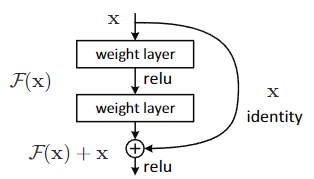

在传统网络中，假如我的 input 是 x ，而需要的 output 是 H(x) ，那么神经网络就需要拟合一个函数，使其能够从 x 变成 H(x)，那么在网络很深的情况下，我们发现从 x 学习成 H(x) 是很困难的一件事情，这就像给了你一个鸡蛋，让你想象出鸡的样子

然而作者提到的这个残差学习，是构建一个残差函数，型如：

:::center

$H(x) = F(x) + x$

:::

里面的 F(x) 也就是残差，这里的 x 被称为恒等映射(Identity Mapping)，通过残差连接(Shortcut Connection)直接传递到输出

通过学习残差而间接得到学习目标，显然是更简单的，也就能达到更好的效果

但是需要注意的是，如果最后得出的 f(x) 与 x 的深度不同，则需要对 x 进行处理，如图中标注的虚线节点处


其中有关这种深度变化的处理，作者提到了两种方法：

1. **Zero-padding shortcut**：在深度不足的时候用零矩阵补充不够的深度
2. **Projection shortcut**：使用 1x1 的卷积层来调整 x 的通道数

其中关于 Projection shortcut ，作者提到，即使维度一开始就一样，也就是直接做恒等映射，你也同样可以再过一遍 Projection shortcut

以下是不同层数的 ResNet 的结构，一会儿我们写代码的时候会参考这个表

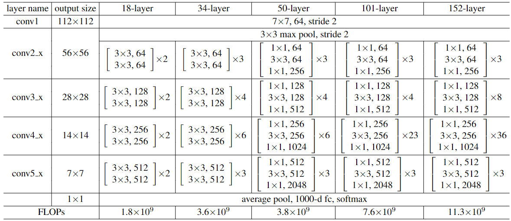

现在，我们来看看 ResNet 的效果

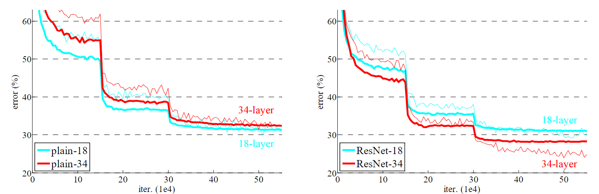

可以看出，ResNet 训练更深的网络性能确实更好了，然而，如果需要考虑训练时间等因素，在网络很深的情况下，恐怕就要算到天荒地老了。此时，作者又提出了一个结构，在 ResNet-50/101/152 中使用，叫做瓶颈(Bottleneck)设计，其结构如下图

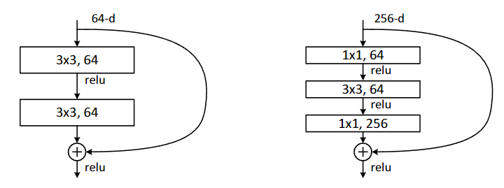

原理是先用 1x1 卷积把深度降下来，处理一次再升回去，从作者给出的结构图中我们可以看到 ResNet-50/101/152 所需的计算量并没有因层数增加而发生爆炸性增长，反而是更加缓和的

基于这个特点，作者之后甚至还构建了一个 1000 层的网络，然而效果并没有想象中表现的那么好，其训练错误率小于 0.1% 而测试时却只有 7.93% ，刚好够看的水平，比 110 层的网络性能还低一些，作者觉得应该是过拟合导致的问题，比较他们没有使用 dropout/maxout 这些的，他们觉得用了以后应该可以更好

### 迁移学习

在课程中还介绍了迁移学习概念，你可以理解为，在别人已经训练好的模型的基础上，继续训练，其中场景的迁移学习方式有：

1.载入权重后训练所有参数
2.载入权重后训练最后几层的参数
3.载入权重后在原网络基础上再加一层全连接层，仅训练最后一个全连接层

通过迁移学习，可以在更短的时间里获得不错的训练成果，这里我用 ResNet 做了一下迁移学习

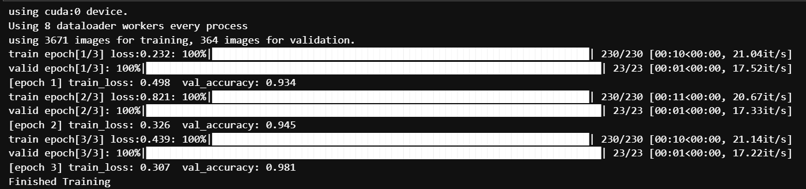

可以发现，第一个 epoch 的精度就已经很高了，效果非常不错

### 代码实现 ResNet

我们先来写一个最基础的模块，也就是我们文章开篇第一张图里展示的结构

```python
class BasicBlock(nn.Module): # 对应 18 层和 34 层 ResNet 的残差结构
    expansion = 1
    # 对应残差结构中的卷积核个数是否变换，1 为不变

    def __init__(self, in_channel, out_channel, stride=1, downsample=None): 
        # downsample: 下采样当残差块（BasicBlock）主分支的输出特征图与输入特征图的尺寸（高度、宽度）或通道数不一致时，
        # 无法直接进行逐元素相加。这时就需要对输入特征图（也就是残差连接）进行下采样操作，使其维度与主分支的输出维度相匹配，以便进行后续的相加操作。
        # 相当于 ResNet 论文中标虚线的残差结构
        super(BasicBlock, self).__init__()
        self.conv1 = nn.Conv2d(in_channels=in_channel, out_channels=out_channel,
                              kernel_size=3, stride=stride, padding=1, bias=False) 
        # bias: 偏置，如果 bias 设置为 True，卷积层会在其输出上加上一个可学习的偏置向量。这个偏置项可以增加模型的拟合能力
        # 这里设置为 False，因为下面的 BatchNormalization 已经起到了 bias 的作用
        self.bn1 = nn.BatchNorm2d(out_channel)
        self.relu = nn.ReLU()
        self.conv2 = nn.Conv2d(in_channels=out_channel, out_channels=out_channel,
                    kernel_size=3, stride=1, padding=1, bias=False)
        self.bn2 = nn.BatchNorm2d(out_channel)
        self.downsample = downsample

    def forward(self, x):
        identity = x
        
        if self.downsample is not None: # 下采样过程
            identity = self.downsample(x)

        out = self.conv1(x)
        out = self.bn1(out)
        out = self.relu(out)

        out = self.conv2(out)
        out = self.bn2(out)

        out += identity # f(x) + x = H(x)
        out = self.relu(out)

        return out
```

然后来实现 Bottleneck

```python
class Bottleneck(nn.Module):
    expansion = 4

    def __init__(self, in_channel, out_channel, stride=1, downsample=None): 
        super(BasicBlock, self).__init__()
        self.conv1 = nn.Conv2d(in_channels=in_channel, out_channels=out_channel,
                              kernel_size=3, stride=1, bias=False) # 压缩 channel
        self.bn1 = nn.BatchNorm2d(out_channel)
        # --------------------------------------------------------------------
        self.conv2 = nn.Conv2d(in_channels=in_channel, out_channels=out_channel,
                              kernel_size=3, stride=stride, padding=1, bias=False) 
        self.bn2 = nn.BatchNorm2d(out_channel)
        # --------------------------------------------------------------------
        self.conv = nn.Conv2d(in_channels=out_channel, out_channels=out_channel*self.expansion,
                              kernel_size=1, stride=1, bias=False) # 激励 channel (人话：升维)
        self.bn3 = nn.BatchNorm2d(out_channel*self.expansion)
        self.relu = nn.ReLU(inplace=True) 
        # inplace=True 参数表示对输入进行“就地操作”，不分配新的内存空间，直接对原张量进行处理
        self.downsample = downsample

    def forward(self, x):
        indentity = x
        if self.downsample is not None:
            identity = self.downsample(x)

        out = self.conv1(x)
        out = self.bn1(out)
        out = self.relu(out)
        
        out = self.conv2(out)
        out = self.bn2(out)
        out = self.relu(out)
                
        out = self.conv3(out)
        out = self.bn3(out)

        out += identity
        out = self.relu(out)

        return out
```

最后实现 ResNet 类，把这些东西组合起来

```python
class ResNet(nn.Module):

    def __init__(self, block, blocks_num, num_classes, include_top=True):
        super(ResNet, self).__init__()
        self.include_top = include_top
        self.in_channel = 64

        self.conv1 = nn.Conv2d(3, self.in_channel, kernel_size=7, stride=2,
                               padding=3, bias=False)
        self.bn1 = nn.BatchNorm2d(self.in_channel)
        self.relu = nn.ReLU(inplace=True)
        self.maxpool = nn.MaxPool2d(kernel_size=3, stride=2, padding=1)
        self.layer1 = self._make_layer(block, 64, blocks_num[0])
        self.layer2 = self._make_layer(block, 128, blocks_num[1], stride=2)
        self.layer3 = self._make_layer(block, 256, blocks_num[2], stride=2)
        self.layer4 = self._make_layer(block, 512, blocks_num[3], stride=2)
        if self.include_top:
            self.avgpool = nn.AdaptiveAvgPool2((1, 1)) # 输出大小 (1, 1)
            self.fc = nn.Linear(512 * block.expansion, num_classes)

        for m in self.modules():
            if isinstance(m, nn.Conv2d):
                nn.init.kaiming_normal_(m.weight, mode='fan_out', nonlinearity='relu')
                # 凯明初始化（这篇论文的作者之一）
                # 功能是对模块 m 的权重 weight  进行原地(inplace)初始化
                # fan_in：指当前层的输入神经元（或输入特征）的数量
                # fan_out：指当前层的输出神经元（或输出特征）的数量
                # nonlinearity: 非线性激活函数，这里选择了 ReLU

    def _make_layer(self, block, channel, block_num, stride=1): # block: 基础结构, block_num: 该层叠了几个基础结构
        downsample = None
        if stride != 1 or self.in_channel != channel * block.expansion:
            downsample = nn.Sequential(
                nn.Conv2d(self.in_channel, channel * block.expansion, kernel_size=1, stride=stride, bias=False),
                nn.BatchNorm2d(channel * block.expansion))

        layers = []
        layers.append(block(self.in_channel, channel, downsample=downsample, stride=stride))
        self.in_channel = channel * block.expansion

        for _ in range(1, block_num):
            layers.append(block(self.in_channel, channel))

        return nn.Sequential(*layers) # *layers: 把列表 layers 中的所有元素解开并将每个元素作为独立参数传递给函数

    def forward(self, x):
        x = self.conv1(x)
        x = self.bn1(x)
        x = self.relu(x)
        x = self.maxpool(x)

        x = self.layer1(x)
        x = self.layer2(x)
        x = self.layer3(x)
        x = self.layer4(x)

        if self.include_top:
            x = self.avgpool(x) # 输出: 长 1 宽 1 通道数不变 
            x = torch.flatten(x, 1) # 变成向量
            x = self.fc(x) # 全连接层

        return x
```

来试试构建 34 层和 101 层的ResNet吧

```python
def ResNet_34(num_classes=1000, include_top=True):
    return ResNet(BasicBlock, [3, 4, 6, 3], num_classes=num_classes, include_top=include_top)

def ResNet_101(num_classes=1000, include_top=True):
    return ResNet(Bottleneck, [3, 4, 23, 3], num_classes=num_classes, include_top=include_top)
```

## Aggregated Residual Transformations for Deep Neural Networks

### 背景故事

在 ResNet 的基础上，何凯明又提出了一个新的框架 ResNeXt

摘要中指出，"基数(cardinality)" 也是与神经网络深度和宽度一样，影响性能的一大重要因素，那什么是"基数"呢？可以理解为卷积分支数，如图所示

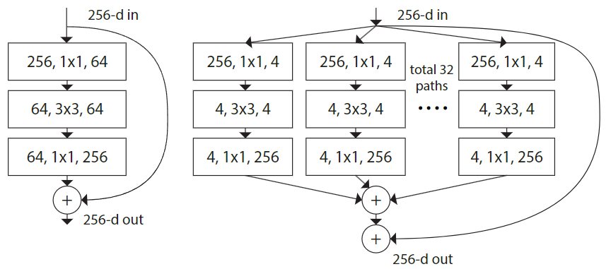

其与 ResNet 的结构比较

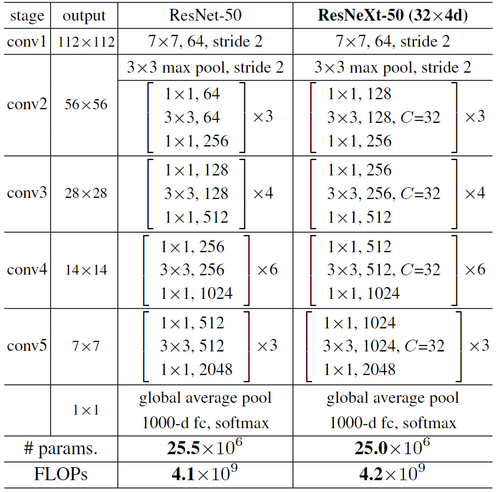
e
*注: 里面的 "C=X" 是指有 X 组卷积分支*

而这是他们的性能比较

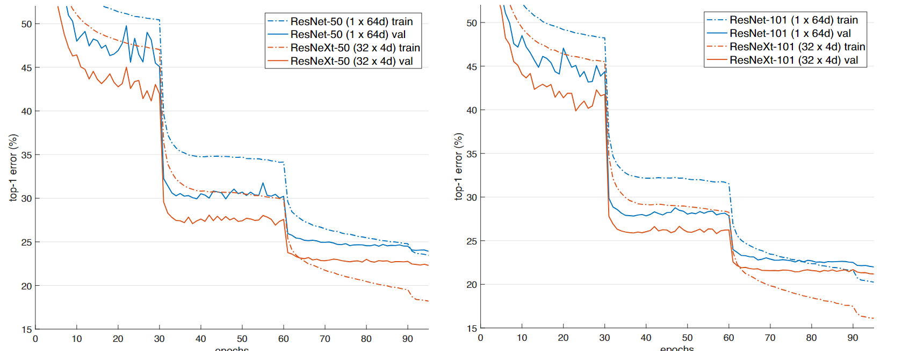

看起来确实不错，那如果用不同的卷积分支组数会怎么样？作者同样给出了回答

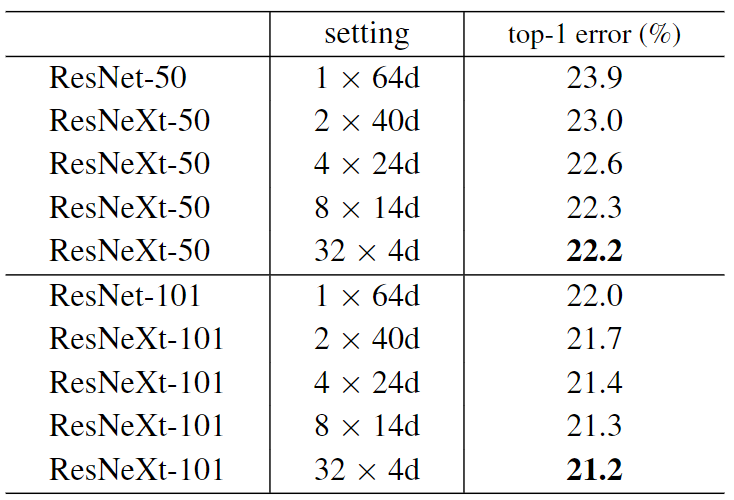

具体其他细节就可以自己去看论文了，这里只放一些比较关键的

### 代码实现

其实 ResNeXt 和 ResNet 的区别不会很大，也就多了一个分支组的内容，先来实现基础框架

```python
class BasicBlock(nn.Module):
    expansion = 1

    def __init__(self, in_channel, out_channel, stride=1, downsample=None, **kwargs):
        super(BasicBlock, self).__init__()
        self.conv1 = nn.Conv2d(in_channels=in_channel, out_channels=out_channel,
                               kernel_size=3, stride=stride, padding=1, bias=False)
        self.bn1 = nn.BatchNorm2d(out_channel)
        self.relu = nn.ReLU()
        self.conv2 = nn.Conv2d(in_channels=out_channel, out_channels=out_channel,
                               kernel_size=3, stride=1, padding=1, bias=False)
        self.bn2 = nn.BatchNorm2d(out_channel)
        self.downsample = downsample

    def forward(self, x):
        identity = x
        if self.downsample is not None:
            identity = self.downsample(x)

        out = self.conv1(x)
        out = self.bn1(out)
        out = self.relu(out)

        out = self.conv2(out)
        out = self.bn2(out)

        out += identity
        out = self.relu(out)

        return out
```

Bottleneck

```python
class Bottleneck(nn.Module):
    expansion = 4

    def __init__(self, in_channel, out_channel, stride=1, downsample=None,
                 groups=1, width_per_group=64):
        super(Bottleneck, self).__init__()

        width = int(out_channel * (width_per_group / 64.)) * groups # 不同点

        self.conv1 = nn.Conv2d(in_channels=in_channel, out_channels=width,
                               kernel_size=1, stride=1, bias=False)  # squeeze channels
        self.bn1 = nn.BatchNorm2d(width)
        # -----------------------------------------
        self.conv2 = nn.Conv2d(in_channels=width, out_channels=width, groups=groups,
                               kernel_size=3, stride=stride, bias=False, padding=1)
        self.bn2 = nn.BatchNorm2d(width)
        # -----------------------------------------
        self.conv3 = nn.Conv2d(in_channels=width, out_channels=out_channel*self.expansion,
                               kernel_size=1, stride=1, bias=False)  # unsqueeze channels
        self.bn3 = nn.BatchNorm2d(out_channel*self.expansion)
        self.relu = nn.ReLU(inplace=True)
        self.downsample = downsample

    def forward(self, x):
        identity = x
        if self.downsample is not None:
            identity = self.downsample(x)

        out = self.conv1(x)
        out = self.bn1(out)
        out = self.relu(out)

        out = self.conv2(out)
        out = self.bn2(out)
        out = self.relu(out)

        out = self.conv3(out)
        out = self.bn3(out)

        out += identity
        out = self.relu(out)

        return out
```

ResNeXt 本体

```python
class ResNet(nn.Module):

    def __init__(self,
                 block,
                 blocks_num,
                 num_classes=1000,
                 include_top=True,
                 groups=1, # 不同点
                 width_per_group=64): # 不同点
        super(ResNet, self).__init__()
        self.include_top = include_top
        self.in_channel = 64

        self.groups = groups # 不同点
        self.width_per_group = width_per_group # 不同点

        self.conv1 = nn.Conv2d(3, self.in_channel, kernel_size=7, stride=2,
                               padding=3, bias=False)
        self.bn1 = nn.BatchNorm2d(self.in_channel)
        self.relu = nn.ReLU(inplace=True)
        self.maxpool = nn.MaxPool2d(kernel_size=3, stride=2, padding=1)
        self.layer1 = self._make_layer(block, 64, blocks_num[0])
        self.layer2 = self._make_layer(block, 128, blocks_num[1], stride=2)
        self.layer3 = self._make_layer(block, 256, blocks_num[2], stride=2)
        self.layer4 = self._make_layer(block, 512, blocks_num[3], stride=2)
        if self.include_top:
            self.avgpool = nn.AdaptiveAvgPool2d((1, 1))  # output size = (1, 1)
            self.fc = nn.Linear(512 * block.expansion, num_classes)

        for m in self.modules():
            if isinstance(m, nn.Conv2d):
                nn.init.kaiming_normal_(m.weight, mode='fan_out', nonlinearity='relu')

    def _make_layer(self, block, channel, block_num, stride=1):
        downsample = None
        if stride != 1 or self.in_channel != channel * block.expansion:
            downsample = nn.Sequential(
                nn.Conv2d(self.in_channel, channel * block.expansion, kernel_size=1, stride=stride, bias=False),
                nn.BatchNorm2d(channel * block.expansion))

        layers = []
        layers.append(block(self.in_channel,
                            channel,
                            downsample=downsample,
                            stride=stride,
                            groups=self.groups,
                            width_per_group=self.width_per_group))
        self.in_channel = channel * block.expansion

        for _ in range(1, block_num):
            layers.append(block(self.in_channel,
                                channel,
                                groups=self.groups,
                                width_per_group=self.width_per_group))

        return nn.Sequential(*layers)

    def forward(self, x):
        x = self.conv1(x)
        x = self.bn1(x)
        x = self.relu(x)
        x = self.maxpool(x)

        x = self.layer1(x)
        x = self.layer2(x)
        x = self.layer3(x)
        x = self.layer4(x)

        if self.include_top:
            x = self.avgpool(x)
            x = torch.flatten(x, 1)
            x = self.fc(x)

        return x
```

来实现一下

```python
def resnet34(num_classes=1000, include_top=True):
    return ResNet(BasicBlock, [3, 4, 6, 3], num_classes=num_classes, include_top=include_top)


def resnet50(num_classes=1000, include_top=True):
    return ResNet(Bottleneck, [3, 4, 6, 3], num_classes=num_classes, include_top=include_top)


def resnet101(num_classes=1000, include_top=True):
    return ResNet(Bottleneck, [3, 4, 23, 3], num_classes=num_classes, include_top=include_top)


def resnext50_32x4d(num_classes=1000, include_top=True):
    groups = 32
    width_per_group = 4
    return ResNet(Bottleneck, [3, 4, 6, 3],
                  num_classes=num_classes,
                  include_top=include_top,
                  groups=groups,
                  width_per_group=width_per_group)


def resnext101_32x8d(num_classes=1000, include_top=True):
    groups = 32
    width_per_group = 8
    return ResNet(Bottleneck, [3, 4, 23, 3],
                  num_classes=num_classes,
                  include_top=include_top,
                  groups=groups,
                  width_per_group=width_per_group)
```

## 思考题

**`Q: Residual learning 的基本原理?`**

> A: 如文章第一部分

**`Q: Batch Normalization 的原理，思考 BN、LN、IN 的主要区别`**

> A: 在网络调整权重的时候，因为其他神经元的权重变了，导致其他的神经元也会变，那么，如果网络很深，就会导致这个调整过程异常艰难，这被称为内部协变量偏移(Internal Covariate Shift)
> 在这种情况下，学习率就不得不变低，就意味着学习缓慢甚至最后直接不收敛了，此时，就可以用 批归一化(Batch Normalization) 了，简称 BN
> 如果 Batch size 为 m ，那么在向前传递时，网络中每个节点都有 m 个输出，而 BN 则是对这 m 个输出进行归一化后再输出，一般 BN 被插在每个 ReLU 激活层之前
> 那什么是归一化呢？就是让数据的输出规则规律一些，否则学习数据里面一点分布规律都没有，别说机器了，人类也很难学习
> 而 BN 的具体任务是将 feature map 中的数据，归一为均值为 0 方差为 1 的数据，对每个通道独立进行运算，而且比较看 Batch Size 的设置，设置太小没什么用，它的具体计算如图
> 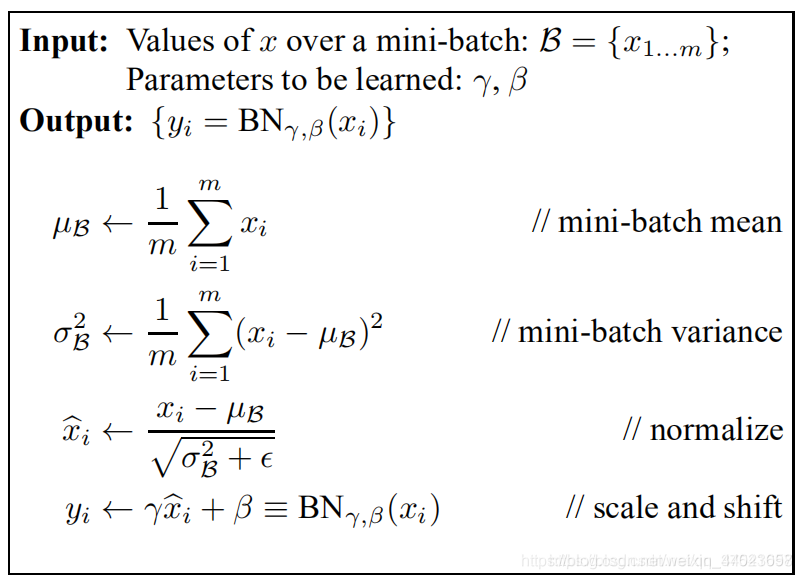
> *转自 https://blog.csdn.net/weixin_44023658/article/details/105844861 这篇文章写的确实不错*
> 而 LN(Layer Normalization) 是在 (Channel, Height, Width) 这三个维度上计算均值和方差，对每个样本是独立进行的，一般效果不如 BN
> IN(Instance Normalization) 只在 (H, W) 这两个空间维度上计算均值和方差，对每个样本和每个通道都是独立进行的，并不依赖 Batch Size

**`Q: 为什么分组卷积可以提升准确率？既然分组卷积可以提升准确率，同时还能降低计算量，分组数量尽量多不⾏吗?`**

> A: 如上文所说，论文作者在实验的时候发现，并不是分组越多越好的，而是有一个适宜的值，如果分组数量太多，反而会导致准确率下降
> 通过给卷积分组，就相当于把一个大的、复杂的变换，分成了多个更加简单的变换，显然是更好的，然而，如果分了太多组，就像一个会议如果有太多人说话，最后所有人都别想好，差不多就是这么一个意思了