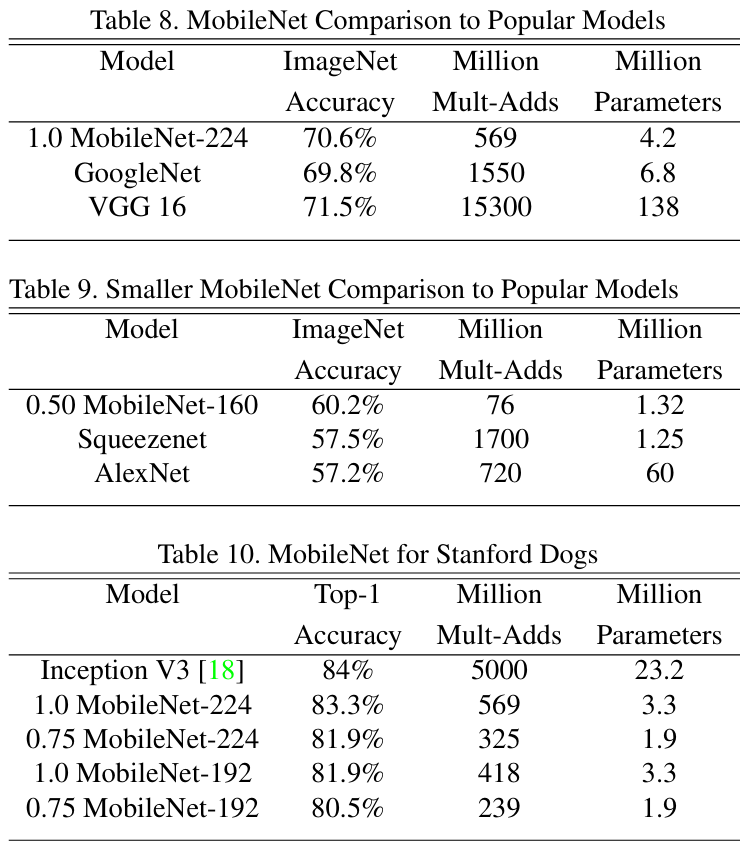
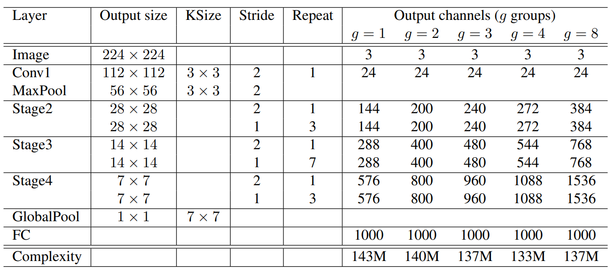
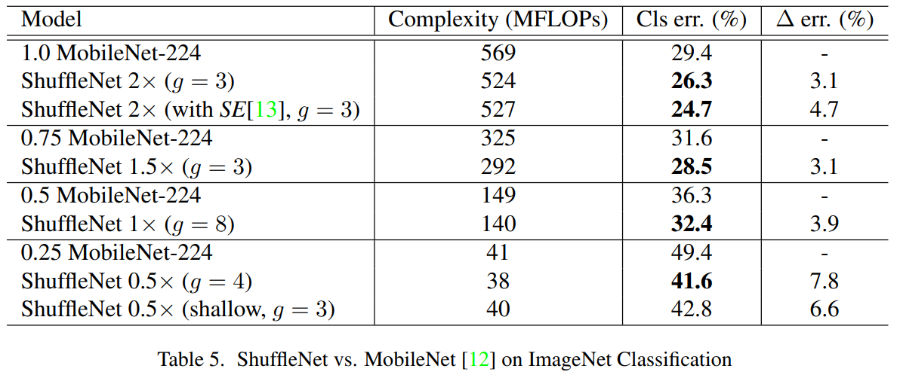

# 人工智能-第四周周报

本周任务：https://gitee.com/gaopursuit/ouc-dl/blob/master/week04.md

MobileNet_V1_V2⽹络讲解：https://www.bilibili.com/video/BV1yE411p7L7/

MobileNet_V3⽹络讲解：https://www.bilibili.com/video/BV1GK4y1p7uE/

ShuffleNet ⽹络讲解：https://www.bilibili.com/video/BV15y4y1Y7SY/

## 概述

本周学习 MobileNet、ShuffleNet、HybridSN、SENet&CBAM 网络

## MobileNet

之前我们说的网络，虽然效果不错，但是如果我想让手机、嵌入式设备运行，恐怕性能是不够的

于是，Google 团队研发的 MobileNet 诞生了，使得神经网络模型在小型设备上运行成为可能

### MobileNet-V1

我们知道，在传统卷积中

- 卷积核channel = 输入特征矩阵channel
- 输出特征矩阵channel = 卷积核个数


而 MobileNet 提出了一种卷积，叫 **DW卷积**(Depthwise Conv, 深度卷积)，他的特性如下

- 卷积核channel = 1
- 输入特征矩阵channel=卷积核个数=输出特征矩阵channel


从图中我们看到，一个 `3x3` 卷积核只负责一个 channel ，一共 input_channel 个卷积核

此外，他们还提出了一种 **PW卷积**(Pointwise Conv, 点卷积)


从图中我们发现，这里则是 out_channel 个 `1x1xinput_channel` 的卷积核

这两个部分共同组成我们的深度可分离卷积(Depthwise Separable Convolution)，计算量只有传统卷积的 $\frac{1}{9}$ 到 $\frac{1}{8}$

其基本结构如图


完整结构如下


虽然 MobileNet 本身已经很精简，但是有时候一些 App 需要模型非常非常精简和快速，于是，我们引入了一个参数

:::center

Width Multiplier 宽度超参数$\alpha$

:::

定义是：如果输入的通道是 N 个，那么输出的通道是 $\alpha$·N，其中$\alpha$一般取(0, 1]，一般是取 1、0.75、0.5、0.25

这个操作可以大大降低模型的计算量，对比图如下


*注：ImageNet Accuracy 是准确率，Million Mult-Adds 是计算量，Million Parameters 是百万参数量*

:::tip 区分 FLOPS 和 FLOPs

- FLOPS(floating point operations per second) 是指每秒浮点运算次数，是计算速度，用于衡量硬件性能
- FLOPs(floating point operations) 是指浮点运算次数，用于衡量算法/模型的复杂度，表示计算量，此外还有 GFLOPs(每秒 10 亿次) 和 TFLOPs(每秒 1 万亿次)

:::

此外，我们还引入了另外一个参数

:::center

Resolution Multiplier 分辨率超参数$\rho$

:::

这个参数主要用于设置输出分辨率，通过减小 feature map 的分辨率来降低计算量，比如原来的长宽是 D ，设置 $\rho$ 后是 $\rho$·D

对比图如下


从上到下依次是传统卷积、深度可分离卷积、$\alpha$=0.75的情况、$\rho$=0.714的情况

其中卷积核 3x3 ，feature map 14x14 输入通道 512 输出通道 512


最终性能对比图，这里不多说了，可以自己慢慢看



### MobileNet-V2

相比 V1 ，V2 主要有以下特点：

- 线性瓶颈(Linear Bottleneck)和倒残差结构(Inverted Residual Block)
- SE 结构
- 优化耗时结构

#### 线性瓶颈和倒残差结构

当我们单独去看 feature map 每个通道的像素的值的时候，我们发现，低维的信息损失很严重，但是高维的信息还保留的不错，如图所示


这种损失导致的原因，是使用 ReLU 激活函数后导致的信息损耗，既然如此，我们有两种解决方法

- 更换为线性激活函数减少信息损失
- 增加通道数，相对来说，信息损失更少一些

在增加通道数这一块，则使用了倒残差结构，如图所示


其中 k 和 k' 是指通道数，s 是指 stride，t 是拓展因子

与残差结构相反，倒残差结构使用了 1x1 卷积升维，经过 DW 卷积后再经过 1x1 卷积降维，但要注意的是，倒残差结构中基本使用 ReLU6 激活函数，而在最后 1x1 卷积层降维时，则使用线性激活函数

此外，在倒残差结构中，并非所有倒残差结构都有 shortcut 连接，而是 stride=1 **并且** 输入特征矩阵和输出特征矩阵 shape 相同时才有(毕竟 shape 不同做不了加法运算)


他的详细网络结构如下


其中，t 表示拓展因子，c 表示输出通道数，n 表示结构的重复次数，s 表示 stride

说了这么多，来看看在 ImageNet 上的性能表现吧


#### 代码实现

```python
from torch import nn
import torch

def _make_divisible(ch, divisor=8, min_ch=None):
    """
    此函数取自原始 tf 存储库。
    它确保所有图层都具有可被 8 整除的通道数
    可以在这里看到：
    https://github.com/tensorflow/models/blob/master/research/slim/nets/mobilenet/mobilenet.py
    """
    if min_ch is None:
        min_ch = divisor
    new_ch = max(min_ch, int(ch + divisor / 2) // divisor * divisor)
    # 确保向下舍入不会减少超过 10%
    if new_ch < 0.9 * ch:
        new_ch += divisor
    return new_ch


class ConvBNReLU(nn.Sequential): # 先过卷积，然后过 BN，最后过 ReLU 一站式解决
    def __init__(self, in_channel, out_channel, kernel_size=3, stride=1, groups=1):# groups=1 普通卷积
        padding = (kernel_size - 1) // 2
        super(ConvBNReLU, self).__init__(
            nn.Conv2d(in_channel, out_channel, kernel_size, stride, padding, groups=groups, bias=False),
            nn.BatchNorm2d(out_channel),
            nn.ReLU6(inplace=True)
        )

# 倒残差结构
class InvertedResidual(nn.Module):
    def __init__(self, in_channel, out_channel, stride, expand_ratio):#expand_ratio 扩展因子
        super(InvertedResidual, self).__init__()
        hidden_channel = in_channel * expand_ratio # 拓展，自然是对隐藏层的拓展，想什么呢 🤔
        self.use_shortcut = stride == 1 and in_channel == out_channel 
        # 只有 stride=1 **并且** 输入特征矩阵和输出特征矩阵 shape 相同时才使用 shortcut

        layers = []
        if expand_ratio != 1:
            # 1x1 PW 卷积，用来扩充 channel，如果拓展因子是 1 就不需要这一步了
            # 先过卷积，然后过 BN，最后过 ReLU 一站式解决
            layers.append(ConvBNReLU(in_channel, hidden_channel, kernel_size=1))
        layers.extend([
            # 3x3 DW 卷积
            ConvBNReLU(hidden_channel, hidden_channel, stride=stride, groups=hidden_channel),
            # 1x1 PW 卷积 降维回去(这里用线性激活函数)
            nn.Conv2d(hidden_channel, out_channel, kernel_size=1, bias=False),
            nn.BatchNorm2d(out_channel),
        ])

        self.conv = nn.Sequential(*layers)

    def forward(self, x):
        if self.use_shortcut:
            return x + self.conv(x)
        else:
            return self.conv(x)


class MobileNetV2(nn.Module):
    def __init__(self, num_classes=1000, alpha=1.0, round_nearest=8):# α 超参数
        super(MobileNetV2, self).__init__()
        block = InvertedResidual
        input_channel = _make_divisible(32 * alpha, round_nearest)
        last_channel = _make_divisible(1280 * alpha, round_nearest)

        # 网络设置
        inverted_residual_setting = [
            # t, c, n, s
            # 啥意思懂得都懂
            [1, 16, 1, 1],
            [6, 24, 2, 2],
            [6, 32, 3, 2],
            [6, 64, 4, 2],
            [6, 96, 3, 1],
            [6, 160, 3, 2],
            [6, 320, 1, 1],
        ]

        features = []
        # 第一层卷积层
        features.append(ConvBNReLU(3, input_channel, stride=2))
        # 构建倒残差结构
        for t, c, n, s in inverted_residual_setting:
            output_channel = _make_divisible(c * alpha, round_nearest)
            for i in range(n):
                stride = s if i == 0 else 1
                features.append(block(input_channel, output_channel, stride, expand_ratio=t))
                input_channel = output_channel
        # 构建最后几层结构
        features.append(ConvBNReLU(input_channel, last_channel, 1))
        # 我们联合！
        self.features = nn.Sequential(*features)

        # 构建分类器
        self.avgpool = nn.AdaptiveAvgPool2d((1, 1))
        self.classifier = nn.Sequential(
            nn.Dropout(0.2),
            nn.Linear(last_channel, num_classes)
        )

        # 权重初始化
        for m in self.modules():
            if isinstance(m, nn.Conv2d):
                nn.init.kaiming_normal_(m.weight, mode='fan_out') # 经典凯明初始化
                if m.bias is not None:
                    nn.init.zeros_(m.bias)
            elif isinstance(m, nn.BatchNorm2d):
                nn.init.ones_(m.weight)
                nn.init.zeros_(m.bias)
            elif isinstance(m, nn.Linear):
                nn.init.normal_(m.weight, 0, 0.01)
                nn.init.zeros_(m.bias)

    def forward(self, x):
        x = self.features(x)
        x = self.avgpool(x)
        x = torch.flatten(x, 1)
        x = self.classifier(x)
        return x
```

### MobileNet-V3

V3 相比于 V2 主要有以下改进

- 使用新**激活函数**
- **SE(Squeeze-and-Excitation)模块**
- 重设计**耗时的网络层**

#### 新激活函数

这里主要引入了两个激活函数，一个是 `h-Sigmoid`，对标 Sigmoid ，另外一个是 `h-swish` 对标 ReLU，研究人家叫它们硬激活函数

它们的图像是这样的


而他们的表达式是这样的

:::center

$\text{swish } x = x \cdot \sigma(x)$

$\text{h-swish}[x] = x \frac{\text{ReLU6}(x+3)}{6}$

:::

python 实现如下

```python
class hswish(nn.Module):
    def forward(self, x):
        out = x * F.relu6(x + 3, inplace=True) / 6
        return out
        
class hsigmoid(nn.Module):
    def forward(self, x):
        out = F.relu6(x + 3, inplace=True) / 6
        return out
```

#### SE 模块

图中下面那条 Bottleneck 结构下的神秘小路，就是 SE 模块


这条小路的工作路线如下


先过一个平均池化，压成一个 `1x1xchannel` 的长条，然后再过两遍全连接层并分别用 ReLU 和 H-Sigmoid 激活，最后把得到的数乘给原来张量的每一个元素，这个就叫 SE 模块

这过了一遍什么？为什么要这么过？

SE 全称 Squeeze-and-Excitation，挤压(Squeeze) 和 激励(Excitation)

通过一个全局平均池化的操作，相当于告诉了大模型全局的一个大致情况，使得模型能够从全局上审视通道的重要性(可以理解为计算通道的权重，让模型侧重于那个通道)而非局部上

而后面的操作则用于激励，第一层全连接层用于降维降低计算量，然后再过一层全连接层用来调整输出的权重在合理的范围内，这样就能够提示网络的学习效果了

#### 重新设计的耗时层

论文中提到，最后的几层性能不是特别好，经过优化，为整个网络节省了 11% 的计算时间


注意，最后的 1x1 卷积，其实就相当于一层全连接层

最后我们来看看网络的结构和性能表现吧


注：SE 表示是否有 SE 模块，HS 表示使用 h-swish 激活函数，RE 表示 ReLU ，s 表示 stride ，NBN 表示不使用 BN


其中 P-1 P-2 P-3 都是谷歌自己研发的 Pixel 手机

#### 代码实现

```python
# 这里我直接拿的官方的实现方法，看起来应该更加清楚一些
class InvertedResidualConfig:
    # 这个类用于存储 MobileNetV3 论文中表1和表2所列出的配置信息。
    # 每个 inverted residual block 的参数都在这里定义。
    def __init__(
        self,
        input_channels: int,        # 输入通道数
        kernel: int,                # 卷积核大小
        expanded_channels: int,     # 扩展层的通道数
        out_channels: int,          # 输出通道数
        use_se: bool,               # 是否使用 Squeeze-and-Excitation 模块
        activation: str,            # 激活函数类型 ("RE" for ReLU, "HS" for Hardswish)
        stride: int,                # 步长
        dilation: int,              # 膨胀率 (Dilation rate)
        width_mult: float,          # 宽度乘数，用于调整网络的通道数
    ):
        self.input_channels = self.adjust_channels(input_channels, width_mult)
        self.kernel = kernel
        self.expanded_channels = self.adjust_channels(expanded_channels, width_mult)
        self.out_channels = self.adjust_channels(out_channels, width_mult)
        self.use_se = use_se
        self.use_hs = activation == "HS"  # 判断是否使用 Hardswish 激活函数
        self.stride = stride
        self.dilation = dilation

    @staticmethod
    def adjust_channels(channels: int, width_mult: float):
        # 这个静态方法用于根据宽度乘数调整通道数，并确保通道数是8的倍数。
        # 这是为了硬件优化的常见做法。
        return _make_divisible(channels * width_mult, 8)


class InvertedResidual(nn.Module):
    # 这个类实现了 MobileNetV3 论文第5节中描述的 Inverted Residual 模块。
    # 这是 MobileNetV3 的核心构建模块。
    def __init__(
        self,
        cnf: InvertedResidualConfig,
        norm_layer: Callable[..., nn.Module],
        se_layer: Callable[..., nn.Module] = partial(SElayer, scale_activation=nn.Hardsigmoid),
    ):
        super().__init__()
        if not (1 <= cnf.stride <= 2):
            raise ValueError("illegal stride value")

        self.use_res_connect = cnf.stride == 1 and cnf.input_channels == cnf.out_channels

        layers: List[nn.Module] = []
        activation_layer = nn.Hardswish if cnf.use_hs else nn.ReLU

        # 扩展层 (Expansion phase)
        # 如果扩展通道数不等于输入通道数，则添加一个1x1的卷积层来扩展通道。
        if cnf.expanded_channels != cnf.input_channels:
            layers.append(
                Conv2dNormActivation(
                    cnf.input_channels,
                    cnf.expanded_channels,
                    kernel_size=1,
                    norm_layer=norm_layer,
                    activation_layer=activation_layer,
                )
            )

        # 深度可分离卷积 (Depthwise convolution)
        layers.append(
            Conv2dNormActivation(
                cnf.expanded_channels,
                cnf.expanded_channels,
                kernel_size=cnf.kernel,
                stride=cnf.stride,
                groups=cnf.expanded_channels, # groups 等于输入通道数，实现深度可分离卷积
                norm_layer=norm_layer,
                activation_layer=activation_layer,
            )
        )

        # Squeeze-and-Excitation 模块
        if cnf.use_se:
            squeeze_channels = _make_divisible(cnf.expanded_channels // 4, 8)
            layers.append(se_layer(cnf.expanded_channels, squeeze_channels))

        # 逐点卷积 (Pointwise convolution) / 线性瓶颈层
        layers.append(
            Conv2dNormActivation(
                cnf.expanded_channels, cnf.out_channels, kernel_size=1, norm_layer=norm_layer, activation_layer=None
            )
        )

        self.block = nn.Sequential(*layers)
        self.out_channels = cnf.out_channels
        self._is_cn = cnf.stride > 1

    def forward(self, input: Tensor) -> Tensor:
        result = self.block(input)
        if self.use_res_connect:
            # 如果步长为1且输入输出通道数相同，则使用残差连接。
            result += input
        return result


class MobileNetV3(nn.Module):
    def __init__(
        self,
        inverted_residual_setting: List[InvertedResidualConfig], # 一个包含所有 block 配置的列表
        last_channel: int, # 最后一个卷积层的输出通道数
        num_classes: int = 1000, # 分类任务的类别数
        block: Optional[Callable[..., nn.Module]] = None,
        norm_layer: Optional[Callable[..., nn.Module]] = None,
        dropout: float = 0.2,
        **kwargs: Any,
    ) -> None:
        super().__init__()

        if not inverted_residual_setting:
            raise ValueError("The inverted_residual_setting should not be empty")
        elif not (
            isinstance(inverted_residual_setting, Sequence)
            and all([isinstance(s, InvertedResidualConfig) for s in inverted_residual_setting])
        ):
            raise TypeError("The inverted_residual_setting should be List[InvertedResidualConfig]")

        if block is None:
            block = InvertedResidual

        if norm_layer is None:
            norm_layer = partial(nn.BatchNorm2d, eps=0.001, momentum=0.01)

        layers: List[nn.Module] = []

        # 构建第一个卷积层
        firstconv_output_channels = inverted_residual_setting[0].input_channels
        layers.append(
            Conv2dNormActivation(
                3, # 输入图像为 3 通道 (RGB)
                firstconv_output_channels,
                kernel_size=3,
                stride=2,
                norm_layer=norm_layer,
                activation_layer=nn.Hardswish,
            )
        )

        # 根据配置构建所有的 InvertedResidual 模块
        for cnf in inverted_residual_setting:
            layers.append(block(cnf, norm_layer))

        # 构建网络的最后几个层
        lastconv_input_channels = inverted_residual_setting[-1].out_channels
        lastconv_output_channels = 6 * lastconv_input_channels
        layers.append(
            Conv2dNormActivation(
                lastconv_input_channels,
                lastconv_output_channels,
                kernel_size=1,
                norm_layer=norm_layer,
                activation_layer=nn.Hardswish,
            )
        )

        self.features = nn.Sequential(*layers)
        self.avgpool = nn.AdaptiveAvgPool2d(1) # 自适应平均池化层
        self.classifier = nn.Sequential(
            nn.Linear(lastconv_output_channels, last_channel),
            nn.Hardswish(inplace=True),
            nn.Dropout(p=dropout, inplace=True),
            nn.Linear(last_channel, num_classes),
        )

        # 初始化权重
        for m in self.modules():
            if isinstance(m, nn.Conv2d):
                nn.init.kaiming_normal_(m.weight, mode="fan_out")
                if m.bias is not None:
                    nn.init.zeros_(m.bias)
            elif isinstance(m, (nn.BatchNorm2d, nn.GroupNorm)):
                nn.init.ones_(m.weight)
                nn.init.zeros_(m.bias)
            elif isinstance(m, nn.Linear):
                nn.init.normal_(m.weight, 0, 0.01)
                nn.init.zeros_(m.bias)

    def _forward_impl(self, x: Tensor) -> Tensor:
        x = self.features(x)
        x = self.avgpool(x)
        x = torch.flatten(x, 1)
        x = self.classifier(x)
        return x

    def forward(self, x: Tensor) -> Tensor:
        return self._forward_impl(x)


def _mobilenet_v3_conf(arch: str, width_mult: float = 1.0, reduced_tail: bool = False, dilated: bool = False, **kwargs: Any):
    # 这个函数根据架构名称 ("large" or "small") 返回相应的 InvertedResidualConfig 列表。
    reduce_divider = 2 if reduced_tail else 1
    dilation = 2 if dilated else 1

    bneck_conf = partial(InvertedResidualConfig, width_mult=width_mult)
    adjust_channels = partial(InvertedResidualConfig.adjust_channels, width_mult=width_mult)

    if arch == "large":
        inverted_residual_setting = [
            bneck_conf(16, 3, 16, 16, False, "RE", 1, 1),
            bneck_conf(16, 3, 64, 24, False, "RE", 2, 1),  # C1
            bneck_conf(24, 3, 72, 24, False, "RE", 1, 1),
            bneck_conf(24, 5, 72, 40, True, "RE", 2, 1),  # C2
            bneck_conf(40, 5, 120, 40, True, "RE", 1, 1),
            bneck_conf(40, 5, 120, 40, True, "RE", 1, 1),
            bneck_conf(40, 3, 240, 80, False, "HS", 2, 1),  # C3
            bneck_conf(80, 3, 200, 80, False, "HS", 1, 1),
            bneck_conf(80, 3, 184, 80, False, "HS", 1, 1),
            bneck_conf(80, 3, 184, 80, False, "HS", 1, 1),
            bneck_conf(80, 3, 480, 112, True, "HS", 1, 1),
            bneck_conf(112, 3, 672, 112, True, "HS", 1, 1),
            bneck_conf(112, 5, 672, 160 // reduce_divider, True, "HS", 2, dilation),  # C4
            bneck_conf(160 // reduce_divider, 5, 960 // reduce_divider, 160 // reduce_divider, True, "HS", 1, dilation),
            bneck_conf(160 // reduce_divider, 5, 960 // reduce_divider, 160 // reduce_divider, True, "HS", 1, dilation),
        ]
        last_channel = adjust_channels(1280 // reduce_divider)  # C5
    elif arch == "small":
        inverted_residual_setting = [
            bneck_conf(16, 3, 16, 16, True, "RE", 2, 1),  # C1
            bneck_conf(16, 3, 72, 24, False, "RE", 2, 1),  # C2
            bneck_conf(24, 3, 88, 24, False, "RE", 1, 1),
            bneck_conf(24, 5, 96, 40, True, "HS", 2, 1),  # C3
            bneck_conf(40, 5, 240, 40, True, "HS", 1, 1),
            bneck_conf(40, 5, 240, 40, True, "HS", 1, 1),
            bneck_conf(40, 5, 120, 48, True, "HS", 1, 1),
            bneck_conf(48, 5, 144, 48, True, "HS", 1, 1),
            bneck_conf(48, 5, 288, 96 // reduce_divider, True, "HS", 2, dilation),  # C4
            bneck_conf(96 // reduce_divider, 5, 576 // reduce_divider, 96 // reduce_divider, True, "HS", 1, dilation),
            bneck_conf(96 // reduce_divider, 5, 576 // reduce_divider, 96 // reduce_divider, True, "HS", 1, dilation),
        ]
        last_channel = adjust_channels(1024 // reduce_divider)  # C5
    else:
        raise ValueError(f"Unsupported model type {arch}")

    return inverted_residual_setting, last_channel


def mobilenet_v3_large(
    *, weights: Optional[Any] = None, progress: bool = True, **kwargs: Any
) -> MobileNetV3:
    """
    构造一个 MobileNetV3-Large 模型。

    Args:
        weights (WeightsEnum, optional): 预训练权重。默认为 None。
        progress (bool, optional): 如果为 True，则显示下载预训练权重的进度条。默认为 True。
        **kwargs: 其他可以传递给 MobileNetV3 的参数。
    """
    inverted_residual_setting, last_channel = _mobilenet_v3_conf("large", **kwargs)
    return MobileNetV3(inverted_residual_setting, last_channel, **kwargs)


def mobilenet_v3_small(
    *, weights: Optional[Any] = None, progress: bool = True, **kwargs: Any
) -> MobileNetV3:
    """
    构造一个 MobileNetV3-Small 模型。

    Args:
        weights (WeightsEnum, optional): 预训练权重。默认为 None。
        progress (bool, optional): 如果为 True，则显示下载预训练权重的进度条。默认为 True。
        **kwargs: 其他可以传递给 MobileNetV3 的参数。
    """
    inverted_residual_setting, last_channel = _mobilenet_v3_conf("small", **kwargs)
    return MobileNetV3(inverted_residual_setting, last_channel, **kwargs)
```

## ShuffleNet

### ShuffleNet-V1

这也是个给移动设备用的模型，不过它引入了两个全新的概念 逐点组卷积(Pointwise Group Convolution)和通道洗牌(Channel Shuffle)，从而减小了计算量


群卷积其实之前的 ResNeXt 就已经讲过了(如图a)，不过这个分组的话，每一组都是隔离开的，但是如果这样的话，会导致各组的信息无法沟通，而如果使用 1x1 逐点卷积，则会导致性能下降等副作用

于是 ShuffleNet 提出了一种方案，通道洗牌(如图b)，那如何实现这个操作呢？

如果 feature map 尺寸为 w x h x c1 ，分为 g 个组，那么它是这样操作的

1. 将 feature map 展开成 `w x h x g x n` 的四维矩阵
2. 沿 `w x h x g x n` 的 g 和 n 轴进行转置，也就是变成 `w x h x n x g`
3. 将 g 和 n 轴进行平铺后得到洗牌后的 feature map
4. 进行组内 1x1 卷积操作

示意图如下


代码实现

```python
import torch
def channel_shuffle(x, groups):
    batch_size, num_channels, height, width = x.size()
    channels_per_group = num_channels // groups
    print(channels_per_group)
    # reshape
    # b, c, h, w =======>  b, g, c_per, h, w
    x = x.view(batch_size, groups, channels_per_group, height, width)
    x = torch.transpose(x, 1, 2).contiguous()
    # flatten
    x = x.view(batch_size, -1, height, width)
    return x

a = torch.randn(1,15,3,3) #1x15x3x3
print(a.shape)
groups = 3
x = channel_shuffle(a, 3)
print(x.shape)
```

了解了它的洗牌过程，现在来看看它的基本结构


其中，(a) 是一个残差模块，(b) 是 ShuffleNet Unit ，将原来的 1x1 卷积换成了逐点组卷积，并增加了洗牌操作，(c) 是做了降采样的 ShuffleNet Unit

注意 (c) 的 Concat 操作，这是通道级联操作，其实就是当新的 channel 叠上去了，可以增大通道维度的同时还降低计算量

现在来看看整体结构吧



关于性能对比上，原文中篇幅比较长，这里就不放了，总结就是比 MobileNet-V1 效果好几个百分点



#### 代码实现

代码篇幅有点长，这里给出一篇文章可以看看：https://blog.csdn.net/weixin_47332746/article/details/142817342

### ShuffleNet-V2

V2 感觉有点复杂，了解一点就可以了，个人觉得这篇文章写的不错，可以看看：https://zhuanlan.zhihu.com/p/51566209

## SENet & CBAM

SENet 是什么呢，大家还记得刚刚说的 SE 模块吧，其实基本上也就那样，看看图就明白了


花销大概增加了 2%~10%，增加的参数都在 SE 的两个全连接层上，但是计算量增加量理论上小于 1%

受不了了，直接做实验

### 实验


效果确实不错，而且训练看起来也蛮快的，用 V100-16G 练大概 10 秒多一些一个 epoch

## HybridSN

这玩意主要引入了一个 3D 卷积，它的原理和 2D 的差不多，也是那样运动的，挺容易想象出来的

那你一定会问，这和多通道的卷积，有什么区别呢？


的确，这玩意看起来会搞乱通道之间的关系，也会把模型搞的很复杂，但是你都想到通道了，那 3D 卷积就不能再往上有通道了吗？

还真是，这个特别的 channel 可以是视频的帧，也可以是立体图像里不同位置的切片，可以用于医疗领域什么的，比如 CT 分析，以及处理高光谱图像(这种图像通道数非常多，非传统 RGB)之类的

### 实验


实验过程没什么好讲的了，但是要注意一点，就是代码 [12] 的第 24 行，原来是

```python
outputs[i][j] = prediction+1
```

这个 prediction 是 numpy 的一个 argmax 对象得到数组中最大数的索引值，但是它现在的写法是

```python
outputs[i][j] = prediction[0]+1
```

注意一些就可以了

## 思考题

**`Q: 训练HybridSN，然后多测试⼏次，会发现每次分类的结果都不⼀样，请思考为什么？`**

> A: 因为使用 `Dropout` 了，而 `Dropout` 是让神经元随机失活的，这里就有一个随机的因素了
> 此外，在训练数据集上，我们将 `shuffle` 设置为 True 了，这样就会随机打乱数据，也是一个随机的因子，因此每次分类的结果或许都是不同的

**`Q: 如果想要进⼀步提升⾼光谱图像的分类性能，可以如何改进？`**

> A: 除了优化网络结构(优化后准确率到达 97%~98%)外，我们还可以增加训练的代数，以及使用我们之前提到的迁移学习的方法来实现短时间内达到高性能的模型，当然方法还是很多的

**`Q: depth-wise conv 和 分组卷积有什么区别与联系？`**

> A: 联系就是它们俩实际上都对数据进行了分组处理，但是 DW 不同的是，它是每个通道一个卷积核来处理它，相当于组数和通道数一样，它可以在精度下降不多的情况下，大大降低计算量，而分组卷积则是可以提升精度的

**`Q: SENet 的注意⼒是不是可以加在空间位置上？`**

> A: 标准的SENet注意力机制是针对通道，而非直接作用于空间位置的
> 虽然 SENet 没有，但是 CBAM 有，它同时有空间和通道注意力，它的空间注意力就是先用 SENet 的操作，找出哪个通道比较重要，然后再用 Self-Attention(关注输入序列内部元素之间的依赖关系) 来实现空间关系的感知的

**`Q: 在 ShuffleNet 中，通道的 shuffle 如何⽤代码实现？`**

> A: 上面写了

## 参考的文章&论文

我觉得这些文章讲的都还不错，我这边只是浓缩了一下，只写了重点，如果想仔细一点可以看下面的文章

### MobileNet-V1

- https://arxiv.org/pdf/1704.04861
- https://blog.csdn.net/weixin_44023658/article/details/105962635

### MobileNet-V2

- https://arxiv.org/pdf/1801.04381
- https://blog.csdn.net/weixin_44023658/article/details/105962635

### MobileNet-V3

- https://arxiv.org/pdf/1905.02244
- https://blog.csdn.net/qq_32892383/article/details/143170942
- https://blog.csdn.net/weixin_43334693/article/details/130834849

### ShuffleNet-V1

- https://arxiv.org/pdf/1707.01083
- https://zhuanlan.zhihu.com/p/51566209
- https://blog.csdn.net/weixin_34910922/article/details/109865599
- https://blog.csdn.net/zfjBIT/article/details/127557639
- https://blog.csdn.net/weixin_47332746/article/details/142817342

### SENet & CBAM

- https://cloud.tencent.com/developer/article/1052599
- https://blog.csdn.net/Evan123mg/article/details/80058077
- https://tobefans.github.io/2020/05/08/SENet/

### HybridSN

- https://arxiv.org/pdf/1902.06701
- https://zhuanlan.zhihu.com/p/55567098