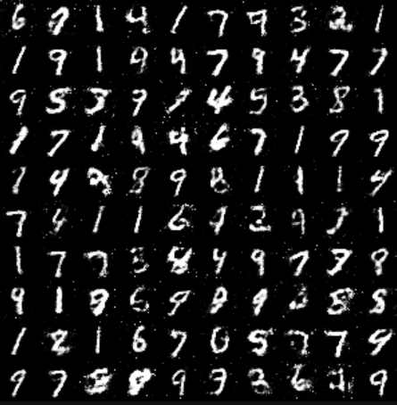
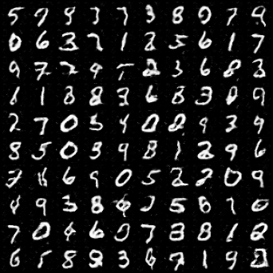

# 人工智能-第五周周报

本周任务：https://gitee.com/gaopursuit/ouc-dl/blob/master/week05.md

## 概要

本周学习 GAN 以及其衍生以及 Diffusion 模型

## GAN

生成式对抗网络模型(Generative Adversarial Network)，这个名字听起来很高级，但是它的内在逻辑其实很好理解

何为**对抗**?

简单的说，就是生成器(generator)和判别器(discriminator)之间的对抗，你可以将生成器理解为假币制作者，判别器理解为验钞员，假币制作者制作成能做出让验钞员信以为真的假币时，验钞员必定要提升自己验钞的能力，下次就不会被骗了，此时，假币制造者发现自己制作的假币无法通过检验，同样会开始提升工艺，于是，两者之间的对抗就开始了，最终二者的能力都会变得十分高，这便是**对抗**

何为**生成式**

想象一下，你有成百上千张猫的图片，让你寻找出猫的所有特征，然后再让你自己根据理解，生成出独一无二的猫的照片

换句话说，就是根据这些数据点的分布，拟合出对应的函数，或者理解为根据类对象，得出类的构造，进而就可以自己创建这个类的类对象了

判别器其实我们之前都学了怎么搭建，但生成器我们还是第一次见，那生成器是如何训练的呢？

我们来简述一下 GAN 的训练流程

1. 初始化生成器和判别器
2. 重复执行以下的步骤：
   - 固定判别器，生成器采样噪声并从中生成图片，然后让判别器打分并优化判别器，使得真实图片的分数尽量高（最高分为1），生成的图片分数尽量低（最低分为0）
   - 生成器计算损失后，反向传递优化生成器
3. 在一个 epoch 结束后，将生成器转换为测试模型，输出训练后生成的图片

现在我们来看看实际的代码实现

```python
import torch
import torch.nn as nn
import torch.optim as optim
import torchvision
import torchvision.transforms as transforms
from torchvision.utils import save_image

import os

# 超参数
gpu_id = '0'
if gpu_id is not None:
	os.environ['CUDA_VISIBLE_DEVICES'] = gpu_id
	device = torch.device('cuda')
else:
	device = torch.device('cpu')
if os.path.exists('gan_images') is False:
	os.makedirs('gan_images')
z_dim = 100
batch_size = 64
learning_rate = 0.0002
total_epochs = 200

# 定义模型
class Discriminator(nn.Module):
    # 全连接判别器，用于 1x28x28的MNIST数据
    def __init__(self):
        super(Discriminator, self).__init__()
        
        layers = []
        # 第一层
        layers.append(nn.Linear(in_features=28*28, out_features=512, bias=True))
        layers.append(nn.LeakyReLU(0.2, inplace=True))
        # 第二层
        layers.append(nn.Linear(in_features=512, out_features=256, bias=True))
        layers.append(nn.LeakyReLU(0.2, inplace=True))
        # 第三层
        layers.append(nn.Linear(in_features=256, out_features=1, bias=True))
        layers.append(nn.Sigmoid())
        
        self.model = nn.Sequential(*layers)
        
    def forward(sekf, x):
        x = x.view(x.size(0), -1)
        validity = self.model(x)
        return validity
    
class Generator(nn.Module):
    # 全连接生成器
    def __init__(self, z_dim):
        super(Generator, self).__init__()
        
        layers = []
        # 第一层
        layers.append(nn.Linear(in_features=z_dim, out_features=128))
        layers.append(nn.LeakyReLU(0.2, inplace=True))
        # 第二层
        layers.append(nn.Linear(in_features=128, out_features=256))
        layers.append(nn.BatchNorm1d(256, 0.8))
        layers.append(nn.LeakyReLU(0.2, inplace=True))
        # 第三层
        layers.append(nn.Linear(in_features=256, out_features=512))
        layers.append(nn.BatchNorm1d(256, 0.8))
        layers.append(nn.LeakyReLU(0.2, inplace=True))
        # 输出层
        layers.append(nn.Linear(in_features=512, out_features=28*28))
        layers.append(nn.Tanh())
        
        self.model = nn.Sequential(*layers)
        
    def forward(sekf, x):
        x = x.view(z)
        x = view(-1, 1, 28, 28)
        return x

# 初始化判别器和生成器
discriminator = Discriminator().to(device)
generator = Generator(z_dim=z_dim).to(device)

# 准备工作
# 初始化二值交叉熵损失
bce = nn.BCELoss().to(device)
ones = torch.ones(batch_size, 1).to(device)
zeros = torch.zeros(batch_size, 1).to(device)

# 初始化优化器，使用 Adam
g_optimizer = optim.Adam(generator.parameters(), lr=learning_rate, betas=[0.5, 0.999])
d_optimizer = optim.Adam(discriminator.parameters(), lr=learning_rate, betas=[0.5, 0.999])

# 加载 MNIST 数据集
transform = transforms.Compose([transforms.ToTensor(), 
                                transforms.Normalize((0.5,), (0.5,))
                               ])
dataset = torchvision.datasets.MNIST(root='gan_data/', train=True, transform=transform, download=True)
dataloader = torch.utils.data.DataLoader(dataset, batch_size=batch_size, shuffle=True, drop_last=True)

# 随机产生 100 个向量，用于生成效果图
fixed_z = torch.randn([100, z_dim]).to(device)

# 开始训练
for epoch in range(total_epochs):
    
    # 在训练阶段把生成器调成训练模型，后面再搞成测试模型
    generator = generator.train()
    
    for i, data in enumerate(dataloader):
        #加载真实数据二部加载标签
        real_images, _ = data
        real_images = real_images.to(device)
        
        # 从正态分布中采样 batch_size 个噪声，然后生成图片
        z = torch.randn([batch_size, z_dim]).to(device)
        fake_images = generator(z)
        
        # 计算判别器损失并优化判别器
        real_loss = bce(discriminator(real_images), ones)
        fake_loss = bce(discriminator(fake_images.detach()), zeros)
        d_loss = real_loss + fake_loss
        
        d_optimizer.zero_grad()
        d_loss.backward()
        d_optimizer.step()
        
        # 计算生成器损失并优化生成器
        g_loss = bce(discriminator(fake_images), ones)
        
        g_optimizer.zero_grad()
        g_loss.backward()
        g_optimizer.step()

        # 输出损失
        print("[Epoch %d/%d] [Batch %d/%d] [D loss: %f] [G loss: %f]" % (epoch, total_epochs, i, len(dataloader), d_loss.item(), g_loss.item()))

    # 把生成器设置为测试模型，生成效果图并保存
    generator = generator.eval()
    fixed_fake_images = generator(fixed_z)
    save_image(fixed_fake_images, 'gan_images/{}.png'.format(epoch), nrow=10, normalize=True)
```

实践中发现，其实 GAN 还是很难训练的，我们来看看效果图

| epoch  |                                 1                                 |                                20                                 |                                40                                 |                                60                                 |                                80                                 |                                100                                |
|:------:|:-----------------------------------------------------------------:|:-----------------------------------------------------------------:|:-----------------------------------------------------------------:|:-----------------------------------------------------------------:|:-----------------------------------------------------------------:|:-----------------------------------------------------------------:|
| output |  |  |  |  |  |  |

可以发现，原版 GAN 的效果还是有点差的，到 100 epoch 效果依然不是特别好，并且数字杂乱无章，咱先来解决一下数字杂乱无章的问题吧

## cGAN

数字杂乱无章，主要是因为我们在训练的过程中，没有去管物品的标签导致的

比如，虽然我想让生成器生成一只狗给我，但是生成器给我生成了一只很逼真的猫，判别器和数据集里面的图片一比对，发现真实度很高，直接高分通过，给我输出了一只猫，这自然是不行的，因此，除了被训练物体本身，我们还要加上物品的标签，使得判别器在打分的时候，如果发现完全不是期望的东西，也会打出低分

代码实现

```python
#coding:utf-8
import torch
import torch.nn as nn
import torch.optim as optim
import torchvision
import torchvision.transforms as transforms
from torchvision.utils import save_image

import numpy as np

import os


# 超参数
gpu_id = None
if gpu_id is not None:
	os.environ['CUDA_VISIBLE_DEVICES'] = gpu_id
	device = torch.device('cuda')
else:
	device = torch.device('cpu')
if os.path.exists('cgan_images') is False:
	os.makedirs('cgan_images')
z_dim = 100
batch_size = 64
learning_rate = 0.0002
total_epochs = 200


class Discriminator(nn.Module):
	'''全连接判别器，用于1x28x28的MNIST数据,输出是数据和类别'''
	def __init__(self):
		super(Discriminator, self).__init__()

		layers = []
		# 第一层
		layers.append(nn.Linear(in_features=28*28+10, out_features=512, bias=True))
		layers.append(nn.LeakyReLU(0.2, inplace=True))
		# 第二层
		layers.append(nn.Linear(in_features=512, out_features=256, bias=True))
		layers.append(nn.LeakyReLU(0.2, inplace=True))
		# 输出层
		layers.append(nn.Linear(in_features=256, out_features=1, bias=True))
		layers.append(nn.Sigmoid())

		self.model = nn.Sequential(*layers)
  
	def forward(self, x, c): # c: 条件
		x = x.view(x.size(0), -1)
		validity = self.model(torch.cat([x, c], -1))
		return validity

class Generator(nn.Module):
	'''全连接生成器，用于1x28x28的MNIST数据，输入是噪声和类别'''
	def __init__(self, z_dim):
		super(Generator, self).__init__()

		layers = []
		# 第一层
		layers.append(nn.Linear(in_features=z_dim+10, out_features=128))
		layers.append(nn.LeakyReLU(0.2, inplace=True))
		# 第二层
		layers.append(nn.Linear(in_features=128, out_features=256))
		layers.append(nn.BatchNorm1d(256, 0.8))
		layers.append(nn.LeakyReLU(0.2, inplace=True))
		# 第三层
		layers.append(nn.Linear(in_features=256, out_features=512))
		layers.append(nn.BatchNorm1d(512, 0.8))
		layers.append(nn.LeakyReLU(0.2, inplace=True))
		# 输出层
		layers.append(nn.Linear(in_features=512, out_features=28*28))
		layers.append(nn.Tanh())

		self.model = nn.Sequential(*layers)

	def forward(self, z, c):
		x = self.model(torch.cat([z, c], dim=1))
		x = x.view(-1, 1, 28, 28)
		return x


def one_hot(labels, class_num):
	'''把标签转换成one-hot类型'''
	tmp = torch.FloatTensor(labels.size(0), class_num).zero_()
	one_hot = tmp.scatter_(dim=1, index=torch.LongTensor(labels.view(-1, 1)), value=1)
	return one_hot


# 初始化构建判别器和生成器
discriminator = Discriminator().to(device)
generator = Generator(z_dim=z_dim).to(device)

# 初始化二值交叉熵损失
bce = torch.nn.BCELoss().to(device)
ones = torch.ones(batch_size, 1).to(device)
zeros = torch.zeros(batch_size, 1).to(device)

# 初始化优化器，使用Adam优化器
g_optimizer = optim.Adam(generator.parameters(), lr=learning_rate, betas=[0.5, 0.999])
d_optimizer = optim.Adam(discriminator.parameters(), lr=learning_rate, betas=[0.5, 0.999])

# 加载MNIST数据集
transform = transforms.Compose([transforms.ToTensor(), 
                                transforms.Normalize((0.5,), (0.5,))
                               ])
dataset = torchvision.datasets.MNIST(root='gan_data/', train=True, transform=transform, download=True)
dataloader = torch.utils.data.DataLoader(dataset, batch_size=batch_size, shuffle=True, drop_last=True)

#用于生成效果图
# 生成100个one_hot向量，每类10个
fixed_c = torch.FloatTensor(100, 10).zero_()
fixed_c = fixed_c.scatter_(dim=1, index=torch.LongTensor(np.array(np.arange(0, 10).tolist()*10).reshape([100, 1])), value=1)
fixed_c = fixed_c.to(device)
# 生成100个随机噪声向量
fixed_z = torch.randn([100, z_dim]).to(device)

# 开始训练，一共训练total_epochs
for epoch in range(total_epochs):

	# 在训练阶段，把生成器设置为训练模式；对应于后面的，在测试阶段，把生成器设置为测试模式
	generator = generator.train()

	# 训练一个epoch
	for i, data in enumerate(dataloader):

		# 加载真实数据
		real_images, real_labels = data
		real_images = real_images.to(device)
		# 把对应的标签转化成 one-hot 类型
		tmp = torch.FloatTensor(real_labels.size(0), 10).zero_()
		real_labels = tmp.scatter_(dim=1, index=torch.LongTensor(real_labels.view(-1, 1)), value=1)
		real_labels = real_labels.to(device)

		# 生成数据
		# 用正态分布中采样batch_size个随机噪声
		z = torch.randn([batch_size, z_dim]).to(device)
		# 生成 batch_size 个 ont-hot 标签
		c = torch.FloatTensor(batch_size, 10).zero_()
		c = c.scatter_(dim=1, index=torch.LongTensor(np.random.choice(10, batch_size).reshape([batch_size, 1])), value=1)
		c = c.to(device)
		# 生成数据
		fake_images = generator(z,c)

		# 计算判别器损失，并优化判别器
		real_loss = bce(discriminator(real_images, real_labels), ones)
		fake_loss = bce(discriminator(fake_images.detach(), c), zeros)
		d_loss = real_loss + fake_loss

		d_optimizer.zero_grad()
		d_loss.backward()
		d_optimizer.step()

		# 计算生成器损失，并优化生成器
		g_loss = bce(discriminator(fake_images, c), ones)

		g_optimizer.zero_grad()
		g_loss.backward()
		g_optimizer.step()

		# 输出损失
		print("[Epoch %d/%d] [Batch %d/%d] [D loss: %f] [G loss: %f]" % (epoch, total_epochs, i, len(dataloader), d_loss.item(), g_loss.item()))

	# 把生成器设置为测试模型，生成效果图并保存
	generator = generator.eval()
	fixed_fake_images = generator(fixed_z, fixed_c)
	save_image(fixed_fake_images, 'cgan_images/{}.png'.format(epoch), nrow=10, normalize=True)
```

效果图

| epoch  |                                 1                                  |                                 20                                 |                                 40                                 |                                 60                                 |                                 80                                 |                                100                                 |
|:------:|:------------------------------------------------------------------:|:------------------------------------------------------------------:|:------------------------------------------------------------------:|:------------------------------------------------------------------:|:------------------------------------------------------------------:|:------------------------------------------------------------------:|
| output |  |  |  |  |  |  |

看上去确实更加规整了，那我们来继续优化 GAN 吧

## dcGAN

聪明如你，应该想到可以用卷积来做这些事，之前我们的 GAN 和 cGAN 都用的是全连接网络，之前我们学习到，全连接处理图像性能很差，CNN 的性能更佳，那我们能不能借鉴一些 CNN 的经验呢

答案是肯定的，dcGAN 主要有以下改动：

- dcGAN 的生成器和判别器都舍弃了 CNN 的池化层，判别器保留 CNN 的整体架构(毕竟本质也是个图像识别网络)，生成器则是将卷积层替换成了**反卷积层**(fractional-strided convolution)
- 在判别器和生成器中在每一层之后都是用了Batch Normalization（BN）层，有助于处理初始化不良导致的训练问题，加速模型训练，提升了训练的稳定性
- 利用 1x1 卷积层替换到所有的全连接层
- 在生成器中除输出层使用Tanh（Sigmoid）激活函数，其余层全部使用ReLu激活函数
- 在判别器所有层都使用LeakyReLU激活函数，防止梯度稀

直接看代码实现吧

```python
#coding:utf-8
import torch
import torch.nn as nn
import torch.optim as optim
import torchvision
import torchvision.transforms as transforms
from torchvision.utils import save_image

import os


# 超参数
gpu_id = None
if gpu_id is not None:
	os.environ['CUDA_VISIBLE_DEVICES'] = gpu_id
	device = torch.device('cuda')
else:
	device = torch.device('cpu')
if os.path.exists('dcgan_images') is False:
	os.makedirs('dcgan_images')
z_dim = 100
batch_size = 64
learning_rate = 0.0002
total_epochs = 100


def weights_init_normal(m):
    classname = m.__class__.__name__
    if classname.find('Conv') != -1:
        torch.nn.init.normal_(m.weight.data, 0.0, 0.02)
    elif classname.find('BatchNorm2d') != -1:
        torch.nn.init.normal_(m.weight.data, 1.0, 0.02)
        torch.nn.init.constant_(m.bias.data, 0.0)

class Discriminator(nn.Module):
	'''滑动卷积判别器'''
	def __init__(self):
		super(Discriminator, self).__init__()

		# 定义卷积层
		conv = []
		# 第一个滑动卷积层，不使用BN，LRelu激活函数
		conv.append(nn.Conv2d(in_channels=1, out_channels=16, kernel_size=3, stride=2, padding=1)) # in_channel是1因为这是灰度图
		conv.append(nn.LeakyReLU(0.2, inplace=True))
		# 第二个滑动卷积层，包含BN，LRelu激活函数
		conv.append(nn.Conv2d(in_channels=16, out_channels=32, kernel_size=3, stride=2, padding=1))
		conv.append(nn.BatchNorm2d(32))
		conv.append(nn.LeakyReLU(0.2, inplace=True))
		# 第三个滑动卷积层，包含BN，LRelu激活函数
		conv.append(nn.Conv2d(in_channels=32, out_channels=64, kernel_size=3, stride=2, padding=1))
		conv.append(nn.BatchNorm2d(64))
		conv.append(nn.LeakyReLU(0.2, inplace=True))
		# 第四个滑动卷积层，包含BN，LRelu激活函数
		conv.append(nn.Conv2d(in_channels=64, out_channels=128, kernel_size=4, stride=1))
		conv.append(nn.BatchNorm2d(128))
		conv.append(nn.LeakyReLU(0.2, inplace=True))
		# 卷积层
		self.conv = nn.Sequential(*conv)

		# 全连接层+Sigmoid激活函数
		self.linear = nn.Sequential(nn.Linear(in_features=128, out_features=1), nn.Sigmoid())

	def forward(self, x):
		x = self.conv(x)
		x = x.view(x.size(0), -1)
		validity = self.linear(x)
		return validity

class Generator(nn.Module):
	'''反滑动卷积生成器'''

	def __init__(self, z_dim):
		super(Generator, self).__init__()

		self.z_dim = z_dim
		layers = []

		# 第一层：把输入线性变换成256x4x4的矩阵，并在这个基础上做反卷机操作
		self.linear = nn.Linear(self.z_dim, 4*4*256)
		# 第二层：bn+relu
		layers.append(nn.ConvTranspose2d(in_channels=256, out_channels=128, kernel_size=3, stride=2, padding=0)) # ConvTranspose2d 滑动反卷积
		layers.append(nn.BatchNorm2d(128))
		layers.append(nn.ReLU(inplace=True))
		# 第三层：bn+relu
		layers.append(nn.ConvTranspose2d(in_channels=128, out_channels=64, kernel_size=3, stride=2, padding=1))
		layers.append(nn.BatchNorm2d(64))
		layers.append(nn.ReLU(inplace=True))
		# 第四层:不使用BN，使用tanh激活函数
		layers.append(nn.ConvTranspose2d(in_channels=64, out_channels=1, kernel_size=4, stride=2, padding=2))
		layers.append(nn.Tanh())

		self.model = nn.Sequential(*layers)

	def forward(self, z):
		# 把随机噪声经过线性变换，resize成256x4x4的大小
		x = self.linear(z)
		x = x.view([x.size(0), 256, 4, 4])
		# 生成图片
		x = self.model(x)
		return x

# 构建判别器和生成器
discriminator = Discriminator().to(device)
generator = Generator(z_dim=z_dim).to(device)
# 使用均值为0，方差为0.02的正态分布初始化神经网络
generator.apply(weights_init_normal)
discriminator.apply(weights_init_normal)

# 初始化二值交叉熵损失
bce = torch.nn.BCELoss().to(device)
ones = torch.ones(batch_size, 1).to(device)
zeros = torch.zeros(batch_size, 1).to(device)

# 初始化优化器，使用Adam优化器
g_optimizer = optim.Adam(generator.parameters(), lr=learning_rate, betas=[0.5, 0.999])
d_optimizer = optim.Adam(discriminator.parameters(), lr=learning_rate, betas=[0.5, 0.999])

# 加载MNIST数据集
transform = transforms.Compose([transforms.Resize(32), transforms.ToTensor(), transforms.Normalize((0.5,), (0.5,))])
dataset = torchvision.datasets.MNIST(root='gan_data/', train=True, transform=transform, download=True)
dataloader = torch.utils.data.DataLoader(dataset, batch_size=batch_size, shuffle=True, drop_last=True)

# 随机产生100个向量，用于生成效果图
fixed_z = torch.randn([100, z_dim]).to(device)

# 开始训练，一共训练total_epochs
for epoch in range(total_epochs):

	# 在训练阶段，把生成器设置为训练模型；对应于后面的，在测试阶段，把生成器设置为测试模型
	generator = generator.train()

	# 训练一个epoch
	for i, data in enumerate(dataloader):

		# 加载真实数据，不加载标签
		real_images, _ = data
		real_images = real_images.to(device)

		# 用正态分布中采样batch_size个噪声，然后生成对应的图片
		z = torch.randn([batch_size, z_dim]).to(device)
		fake_images = generator(z)

		# 计算判别器损失，并优化判别器
		real_loss = bce(discriminator(real_images), ones)
		fake_loss = bce(discriminator(fake_images.detach()), zeros)
		d_loss = real_loss + fake_loss

		d_optimizer.zero_grad()
		d_loss.backward()
		d_optimizer.step()

		# 计算生成器损失，并优化生成器
		g_loss = bce(discriminator(fake_images), ones)

		g_optimizer.zero_grad()
		g_loss.backward()
		g_optimizer.step()

		# 输出损失
		print ("[Epoch %d/%d] [Batch %d/%d] [D loss: %f] [G loss: %f]" % (epoch, total_epochs, i, len(dataloader), d_loss.item(), g_loss.item()))

	# 把生成器设置为测试模型，生成效果图并保存
	generator = generator.eval()
	fixed_fake_images = generator(fixed_z)
	save_image(fixed_fake_images, 'dcgan_images/{}.png'.format(epoch), nrow=10, normalize=True)
```

代码没什么好说的，我们直接看看效果

| epoch  |                                  1                                  |                                 20                                  |                                 40                                  |                                 60                                  |                                 80                                  |                                 100                                 |
|:------:|:-------------------------------------------------------------------:|:-------------------------------------------------------------------:|:-------------------------------------------------------------------:|:-------------------------------------------------------------------:|:-------------------------------------------------------------------:|:-------------------------------------------------------------------:|
| output |  |  |  |  |  |  |

# wGAN & wGAN-GP

wGAN 全称 Wasserstein GAN，他解决了 GAN 中出现的经典问题，就是判别器虽然很好，但是生成器学习到一定程度以后，就学不动了(loss 为 0 导致梯度消失)。而 wGAN 和 wGAN-GP 的解决方案很巧妙，但是具体解释起来偏数学，本人数学不是很好，这里就放两篇我觉得写的不错的文章参考了

https://zhuanlan.zhihu.com/p/25071913

http://zhuanlan.zhihu.com/p/52799555

具体训练起来，他训练其实很慢，比原版 GAN 慢得多，但是他好就好在稳定


具体训练到 100 epoch 是什么样的就不放了，练到 200 epoch 都和原来 GAN 到 50 epoch 的样子差不多

来看看代码实现

```python
#coding:utf-8
import torch
import torch.nn as nn
import torch.optim as optim
import torchvision
import torchvision.transforms as transforms
from torchvision.utils import save_image

import os


# 超参数
gpu_id = None
if gpu_id is not None:
	os.environ['CUDA_VISIBLE_DEVICES'] = gpu_id
	device = torch.device('cuda')
else:
	device = torch.device('cpu')
if os.path.exists('wgan_images') is False:
	os.makedirs('wgan_images')
z_dim = 100
batch_size = 64
learning_rate = 0.00005
total_epochs = 200
clip_value = 0.01
n_critic = 5


class Discriminator(nn.Module):
	'''全连接判别器，用于1x28x28的MNIST数据'''

	def __init__(self):
		super(Discriminator, self).__init__()

		layers = []
		# 第一层
		layers.append(nn.Linear(in_features=28*28, out_features=512, bias=True))
		layers.append(nn.LeakyReLU(0.2, inplace=True))
		# 第二层
		layers.append(nn.Linear(in_features=512, out_features=256, bias=True))
		layers.append(nn.LeakyReLU(0.2, inplace=True))
		# 输出层：相比gan，不需要sigmoid
		layers.append(nn.Linear(in_features=256, out_features=1, bias=True))

		self.model = nn.Sequential(*layers)

	def forward(self, x):
		x = x.view(x.size(0), -1)
		validity = self.model(x)
		return validity


class Generator(nn.Module):
	'''全连接生成器，用于1x28x28的MNIST数据'''

	def __init__(self, z_dim):
		super(Generator, self).__init__()

		layers= []

		# 第一层
		layers.append(nn.Linear(in_features=z_dim, out_features=128))
		layers.append(nn.LeakyReLU(0.2, inplace=True))
		# 第二层
		layers.append(nn.Linear(in_features=128, out_features=256))
		layers.append(nn.BatchNorm1d(256, 0.8))
		layers.append(nn.LeakyReLU(0.2, inplace=True))
		# 第三层
		layers.append(nn.Linear(in_features=256, out_features=512))
		layers.append(nn.BatchNorm1d(512, 0.8))
		layers.append(nn.LeakyReLU(0.2, inplace=True))
		# 输出层
		layers.append(nn.Linear(in_features=512, out_features=28*28))
		layers.append(nn.Tanh())

		self.model = nn.Sequential(*layers)

	def forward(self, z):
		x = self.model(z)
		x = x.view(-1, 1, 28, 28)
		return x

# 初始化构建判别器和生成器
discriminator = Discriminator().to(device)
generator = Generator(z_dim=z_dim).to(device)

# 初始化优化器，使用Adam优化器
g_optimizer = torch.optim.RMSprop(generator.parameters(), lr=learning_rate)
d_optimizer = torch.optim.RMSprop(discriminator.parameters(), lr=learning_rate)

# 加载MNIST数据集
transform = transforms.Compose([transforms.ToTensor(), transforms.Normalize((0.5, 0.5, 0.5), (0.5, 0.5, 0.5))])
dataset = torchvision.datasets.MNIST(root='gan_data/', train=True, transform=transform, download=True)
dataloader = torch.utils.data.DataLoader(dataset, batch_size=batch_size, shuffle=True, drop_last=True)

# 随机产生100个向量，用于生成效果图
fixed_z = torch.randn([100, z_dim]).to(device)

# 开始训练，一共训练total_epochs
for epoch in range(total_epochs):

	# 在训练阶段，把生成器设置为训练模式；对应于后面的，在测试阶段，把生成器设置为测试模式
	generator = generator.train()

	# 训练一个epoch
	for i, data in enumerate(dataloader):

		# 加载真实数据，不加载标签
		real_images, _ = data
		real_images = real_images.to(device)

		# 从正态分布中采样batch_size个噪声，然后生成对应的图片
		z = torch.randn([batch_size, z_dim]).to(device)
		fake_images = generator(z)

		# 计算判别器损失，并优化判别器
		d_loss = - torch.mean(discriminator(real_images)) + torch.mean(discriminator(fake_images.detach()))
		d_optimizer.zero_grad()
		d_loss.backward()
		d_optimizer.step()

		# 为了保证利普斯次系数小于一个常数，进行权重截断
		for p in discriminator.parameters():
			p.data.clamp_(-clip_value, clip_value)

		# 每优化n_critic次判别器， 优化一次生成器
		if i % n_critic == 0:
			g_loss = - torch.mean(discriminator(fake_images))
			g_optimizer.zero_grad()
			g_loss.backward()
			g_optimizer.step()

			# 输出损失
			print ("[Epoch %d/%d] [Batch %d/%d] [D loss: %f] [G loss: %f]" % (epoch, total_epochs, i, len(dataloader), d_loss.item(), g_loss.item()))

	# 每训练一个epoch，把生成器设置为测试模型，生成效果图并保存
	generator = generator.eval()
	fixed_fake_images = generator(fixed_z)
	save_image(fixed_fake_images, 'wgan_images/{}.png'.format(epoch), nrow=10, normalize=True)
```

wGAN-GP

```python
#coding:utf-8
import torch
import torch.nn as nn
import torch.autograd as autograd
import torch.optim as optim
import torchvision
import torchvision.transforms as transforms
from torchvision.utils import save_image

import numpy as np

import os


# 超参数
gpu_id = None
if gpu_id is not None:
	os.environ['CUDA_VISIBLE_DEVICES'] = gpu_id
	device = torch.device('cuda')
else:
	device = torch.device('cpu')
if os.path.exists('wgangp_images') is False:
	os.makedirs('wgangp_images')
z_dim = 100
batch_size = 64
total_epochs = 200
learning_rate = 0.0001
weight_gp = 10
n_critic = 5


class Discriminator(nn.Module):
	'''全连接判别器，用于1x28x28的MNIST数据'''

	def __init__(self):
		super(Discriminator, self).__init__()

		layers = []

		# 第一层
		layers.append(nn.Linear(in_features=28*28, out_features=512, bias=True))
		layers.append(nn.LeakyReLU(0.2, inplace=True))

		# 第二层
		layers.append(nn.Linear(in_features=512, out_features=256, bias=True))
		layers.append(nn.LeakyReLU(0.2, inplace=True))

		# 输出层：相比gan，不需要sigmoid
		layers.append(nn.Linear(in_features=256, out_features=1, bias=True))

		self.model = nn.Sequential(*layers)

	def forward(self, x):
		x = x.view(x.size(0), -1)
		validity = self.model(x)
		return validity


class Generator(nn.Module):
	'''全连接生成器，用于1x28x28的MNIST数据'''

	def __init__(self, z_dim):
		super(Generator, self).__init__()

		layers= []

		# 第一层
		layers.append(nn.Linear(in_features=z_dim, out_features=128))
		layers.append(nn.LeakyReLU(0.2, inplace=True))

		# 第二层
		layers.append(nn.Linear(in_features=128, out_features=256))
		layers.append(nn.BatchNorm1d(256, 0.8))
		layers.append(nn.LeakyReLU(0.2, inplace=True))

		# 第三层
		layers.append(nn.Linear(in_features=256, out_features=512))
		layers.append(nn.BatchNorm1d(512, 0.8))
		layers.append(nn.LeakyReLU(0.2, inplace=True))

		# 输出层
		layers.append(nn.Linear(in_features=512, out_features=28*28))
		layers.append(nn.Tanh())

		self.model = nn.Sequential(*layers)

	def forward(self, z):
		x = self.model(z)
		x = x.view(-1, 1, 28, 28)
		return x

# 初始化构建判别器和生成器
discriminator = Discriminator().to(device)
generator = Generator(z_dim=z_dim).to(device)

# 计算梯度惩罚正则项
def compute_gradient_penalty(D, real_samples, fake_samples):
	# 在真实样本所在空间 和 生成样本空间 之间采样样本 （通过插值进行采样）
    alpha = torch.Tensor(np.random.random((real_samples.size(0), 1, 1, 1))).to(device)
    interpolates = (alpha * real_samples + ((1 - alpha) * fake_samples)).requires_grad_(True)
	# 计算判别器对于这些样本的梯度
    d_interpolates = D(interpolates)
    fake = autograd.Variable(torch.Tensor(real_samples.shape[0], 1).fill_(1.0), requires_grad=False).to(device)
    gradients = autograd.grad(
        outputs=d_interpolates,
        inputs=interpolates,
        grad_outputs=fake,
        create_graph=True,
        retain_graph=True,
        only_inputs=True,
    )[0]
    gradients = gradients.view(gradients.size(0), -1)
    # 计算梯度损失
    gradient_penalty = ((gradients.norm(2, dim=1) - 1) ** 2).mean()
    return gradient_penalty

# 初始化优化器，使用Adam优化器
g_optimizer = torch.optim.Adam(generator.parameters(), lr=learning_rate, betas=[0.5, 0.9])
d_optimizer = torch.optim.Adam(discriminator.parameters(), lr=learning_rate, betas=[0.5, 0.9])

# 加载MNIST数据集
transform = transforms.Compose([transforms.ToTensor(), transforms.Normalize((0.5,), (0.5,))])
dataset = torchvision.datasets.MNIST(root='gan_data/', train=True, transform=transform, download=True)
dataloader = torch.utils.data.DataLoader(dataset, batch_size=batch_size, shuffle=True, drop_last=True)

# 随机产生100个向量，用于生成效果图
fixed_z = torch.randn([100, z_dim]).to(device)

# 开始训练，一共训练total_epochs
for epoch in range(total_epochs):

	# 在训练阶段，把生成器设置为训练模式；对应于后面的，在测试阶段，把生成器设置为测试模式
	generator = generator.train()

	# 训练一个epoch
	for i, data in enumerate(dataloader):

		# 加载真实数据，不加载标签
		real_images, _ = data
		real_images = real_images.to(device)

		# 从正态分布中采样batch_size个噪声，然后生成对应的图片
		z = torch.randn([batch_size, z_dim]).to(device)
		fake_images = generator(z)

		# 计算判别器损失，并优化判别器
		d_gan = - torch.mean(discriminator(real_images)) + torch.mean(discriminator(fake_images))
		d_gp = compute_gradient_penalty(discriminator, real_images.data, fake_images.data)
		d_loss = d_gan + weight_gp * d_gp
		d_optimizer.zero_grad()
		d_loss.backward()
		d_optimizer.step()

		# 每优化n_critic次判别器， 优化一次生成器
		if i % n_critic == 0:
			fake_images = generator(z)
			g_loss = - torch.mean(discriminator(fake_images))
			g_optimizer.zero_grad()
			g_loss.backward()
			g_optimizer.step()

			# 输出损失
			print ("[Epoch %d/%d] [Batch %d /%d] [D loss: %f %f] [G loss: %f]" % (epoch, total_epochs, i, len(dataloader), d_gan.item(), d_gp.item(), g_loss.item()))

	# 每训练一个epoch，把生成器设置为测试模型，生成效果图并保存
	generator = generator.eval()
	fixed_fake_images = generator(fixed_z)
	save_image(fixed_fake_images, 'wgangp_images/{}.png'.format(epoch), nrow=10, normalize=True)
```

## GAN 的应用

应用了解一下就行了

### Progressive GAN

通过逐步训练(套娃)，可以实现高分辨率的图像


### Self-Attention GAN

SAGAN 是一个注意力驱动，长范围关联模型，人话就是，这玩意可以注意到全局的空间关系，而不是和传统一样的只注意细节

通过在 GAN 中引入自注意力机制，有以下好处

- 可以很好的处理长范围、多层次的依赖（人话：发现图像中的依赖关系）
- 生成图像中的每一个位置的细节和远端的细节并协调好
- 判别器还可以更准确地对全局图像结构实施复杂的几何约束

## Diffusion

这个玩意炼丹老哥应该不陌生了，具体介绍就看老师推荐的介绍视频，我之后觉得可以神入研究的话我再继续写关于 Diffusion 的文章吧
