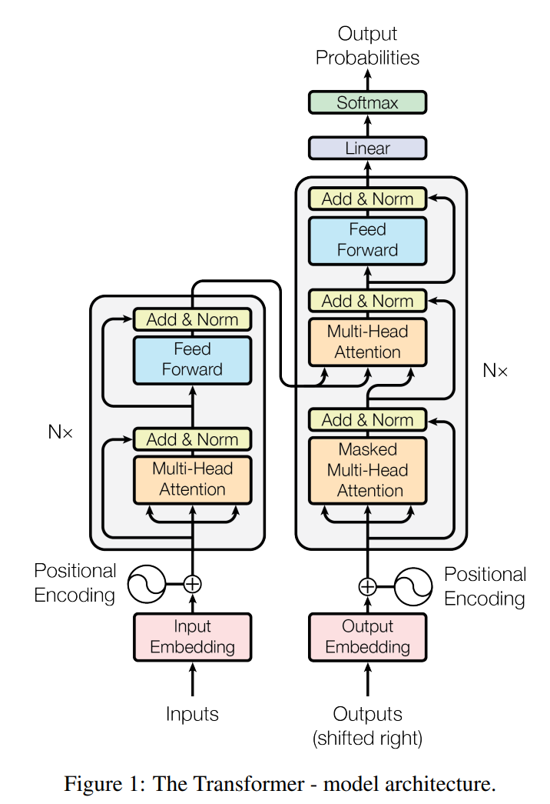
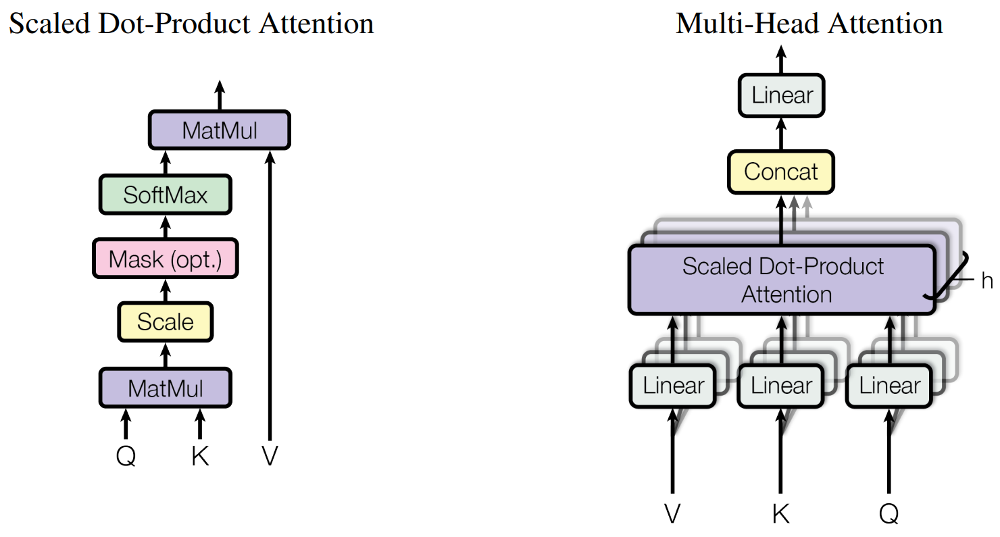
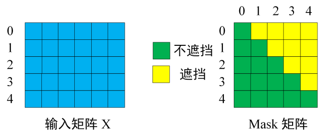
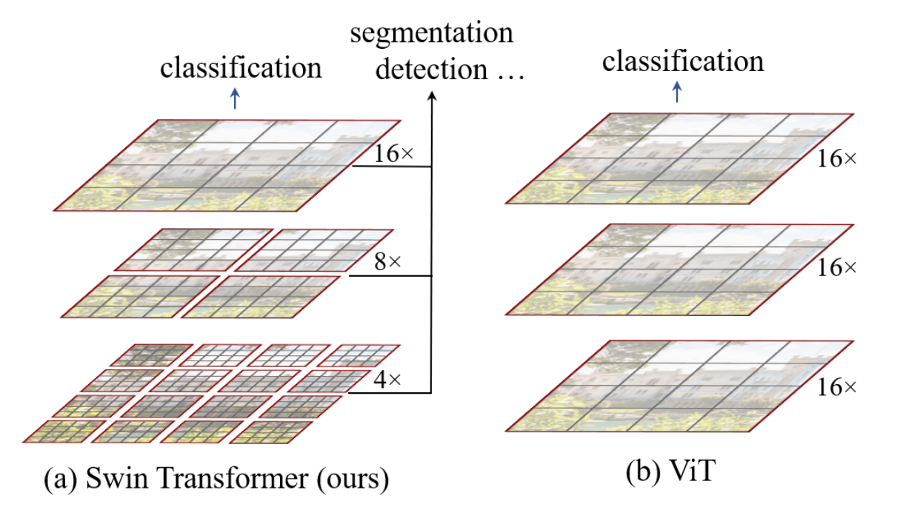
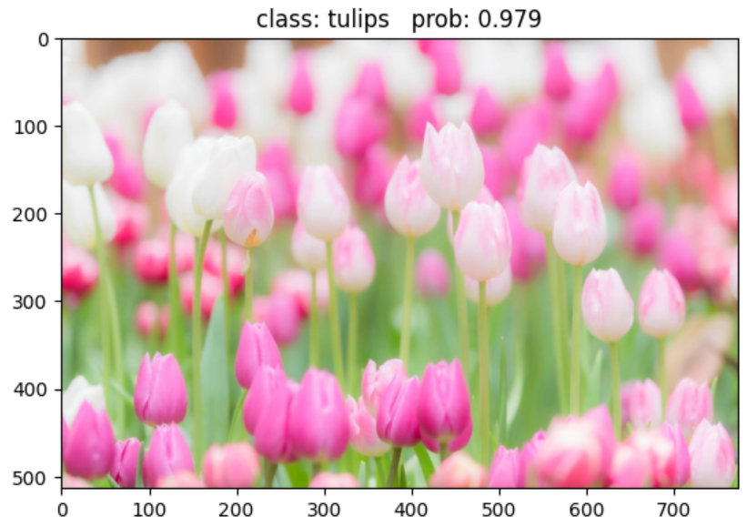
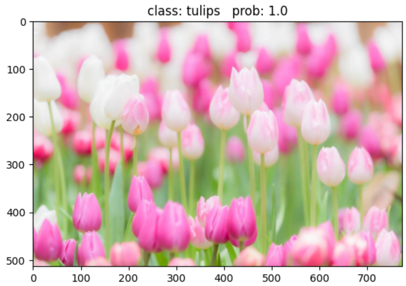
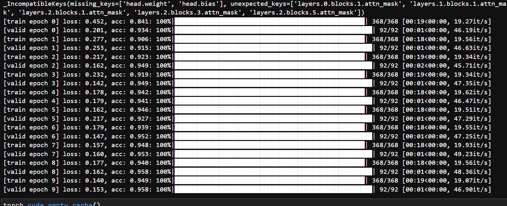
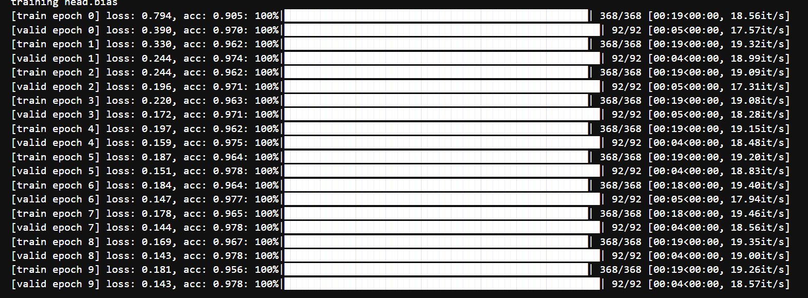

# 人工智能-第六周周报

本周任务：https://gitee.com/gaopursuit/ouc-dl/blob/master/week06.md

## 概要

本周学习 Transformer 模型，了解 Self-Attention 和 Multi-Head Attention 等概念，以及学习 Vision-Transformer 和 Swin-Transformer 的代码实现

## Transformer 的结构

Transformer 是由谷歌的研究团队提出的，原论文[在此](https://arxiv.org/pdf/1706.03762)

我觉得写的不错的文章: 

- https://zhuanlan.zhihu.com/p/338817680

- https://blog.csdn.net/qq_37541097/article/details/117691873

先来看看 Transformer 模型的基本结构



看不懂？别急，我们先说明一下，Transformer 是一个 Encoder-Decoder 模型，也就是说，左边是 Encoder 右边是 Decoder

### Encoder

Transformer 可用于自然语言处理，那我们假设我们左下角的 input 是 `I have a pen`

input 进入 Input Embedding(词嵌入) 将我们的自然语言文本转换成向量，之后的 Positional Encoding 会给每个词打上位置标签（毕竟 Transformer 本身是没有循环结构的，也就是每个词的处理都是并行的而不是串行的），告诉模型单词的位置信息

然后进入 Multi-Head Attention 模块进行注意力处理，至于为什么分成了 3 份，则是因为我们的输入被分成了 Q(查询)、 K(键)、V(值) 这三部分，等一下我们会将具体是怎么算的

再然后进入 ADD & Norm ，其中 ADD 则是类似 ResNet 的残差结构，防止退化的，而 Norm 则是 Layer Normalization(层归一化)，也就是说这一层的输出为 LayerNorm(x + Sublayer(x))

接着进入 Feed Forward(前馈网络)，则是一个简单的全连接的神经网络，用于对每个位置的向量进行非线性变换，用于处理数据，而 ADD & Norm 则与上一句话说的是同一个东西

至于右边的 Nx 则是 Encoder 结构的重复次数，原论文中是 6 个

### Decoder

Decoder 的数量同样是 6 个，这里的东西想必大家已经可以基本上看懂了，最底下进来的 Outputs 是指 Encoder 的 Outputs

但是注意这里的 Multi-Head Attention，他这里的 K 和 V 直接来自 Encoder 的输出，Q 则是下面的 Masked Multi-Head Attention 的输出

## Self-Attention 和 Multi-Head Attention



先说 Self-Attention （图左）

在计算的时候，我们输入 Q、K、V 这三个矩阵，而在实际中，Self-Attention 接收的是输入(单词的表示向量x组成的矩阵X) 或者上一个 Encoder 的输出。而 Q、K、V 正是通过 Self-Attention 的输入进行线性变换得到的

我们来介绍一下 Q、K、V 到底是什么

- Q: Query, 代表当前词，查询其与其他词的关系
- K: Key, 代表句中的所有词，被 Query 查询，用于匹配相关性
- V: Value, 代表句中所有词的实际信息，一旦确定相关性，则从 V 中提取信息

现在我们来了解一下你输入的句子是怎么被 Embedding 成矩阵的，以 `I have a pen` 为例，这个句子有 4 个单词，那么这个矩阵就有 4 行，每行代表一个词，而这里的列我们不知道是多少，假设是 d_model 列吧（算上了位置信息）

至此，你有了一个 shape 为 (4, d_model) 的矩阵，此时，模型将创建 $W_q、W_k、W_v$ 三个矩阵，这三个矩阵是可学习的，在反向传递中不断学习和优化，使得它可以很好的提取其中的特征，其中，他们的 shape 都是 (d_model, x)，这样才能和原矩阵做矩阵乘法

最终我们做完矩阵乘法后，得到 Q、K、V ，他们的 shape 是 (4, x)，行数依然和原句子中的单词一样，最后我们使用这个函数导出 Attention

:::center

$\text{Attention}(Q, K, V) = \text{softmax}\left(\frac{QK^T}{\sqrt{d_k}}\right) V$

:::

其中，Softmax 用于计算每个单词对于其他单词的 attention 系数，也就是让每一行的和都变成 **1** ，做完 Softmax 和 V 做一次矩阵乘法就 ok 了

至此，Self-Attention 就讲完了，但是，在实际使用中，还是 Multi-Head Attention 使用的更多，因为它可以联合来自不同 head 学习到的信息，它的 Attention 计算公式如下

:::center

$\text{head}_i = \text{Attention}\left(QW_i^Q, KW_i^K, VW_i^V\right)$

:::

最后做一个 concat 拼接就完成了，还是很简单的

至于 Mask 则是在算出 Q 后在 Softmax 之前乘以一个 Mask 矩阵



其中黄色部分都是非常大的负数（比如 -1e9 ，权重究极的小），其他的是 0 ，学过线性代数的都知道，这个做完矩阵乘法，得到的也是一个上三角权重很小的矩阵

这么做的目的，是为了防止模型提前学习到后面的文本，导致模型变成`先知`

或者作为填充掩码，防止模型学习到我们人为添加的 padding ，比如

将 `I am a student` 和 `He is a good teacher` 放进同一个矩阵计算，显然第一句话的单词数是不够的，因此我们在这里会添加一个 padding 也就是 

`[
    ["I", "am", "a", "student", <padding>],
    ["He", "is", "a", "good", "teacher"]
]`

通过 Mask ，模型就不会注意到我们添加的 `<padding>` 了

## VisionTransformer

既然我们有了 Self-Attention 功能，那我们不仅能够让大模型用来理解文字的关系和意思，也可以用来让大模型理解图像中的空间相关性

于是，我们便有了 VisionTransformer ，将一整张大图片当成一句话，然后切割成一个个小块，相当于一个个单词(tokens)

它有以下优点：

- 拥有全局感受野
- 在超大规模数据集上训练后，性能超越顶尖 CNN 神经网络

但是也有缺点：

- 计算量爆炸
- 所需数据量非常大

先不说这些，我们来看看它的代码实现

### 代码实现

原 GitHub 链接: https://github.com/WZMIAOMIAO/deep-learning-for-image-processing/tree/master/pytorch_classification/vision_transformer

下面是我改成的 jupyter 能用的版本

```python
# vit_model.py
"""
original code from rwightman:
https://github.com/rwightman/pytorch-image-models/blob/master/timm/models/vision_transformer.py
"""
from functools import partial
from collections import OrderedDict

import torch
import torch.nn as nn


def drop_path(x, drop_prob: float = 0., training: bool = False):
    """
    Drop paths (Stochastic Depth) per sample (when applied in main path of residual blocks).
    This is the same as the DropConnect impl I created for EfficientNet, etc networks, however,
    the original name is misleading as 'Drop Connect' is a different form of dropout in a separate paper...
    See discussion: https://github.com/tensorflow/tpu/issues/494#issuecomment-532968956 ... I've opted for
    changing the layer and argument names to 'drop path' rather than mix DropConnect as a layer name and use
    'survival rate' as the argument.
    """
    if drop_prob == 0. or not training:
        return x
    keep_prob = 1 - drop_prob
    shape = (x.shape[0],) + (1,) * (x.ndim - 1)  # work with diff dim tensors, not just 2D ConvNets
    random_tensor = keep_prob + torch.rand(shape, dtype=x.dtype, device=x.device)
    random_tensor.floor_()  # binarize
    output = x.div(keep_prob) * random_tensor
    return output


class DropPath(nn.Module):
    """
    Drop paths (Stochastic Depth) per sample  (when applied in main path of residual blocks).
    """
    def __init__(self, drop_prob=None):
        super(DropPath, self).__init__()
        self.drop_prob = drop_prob

    def forward(self, x):
        return drop_path(x, self.drop_prob, self.training)


class PatchEmbed(nn.Module):
    """
    2D Image to Patch Embedding
    """
    def __init__(self, img_size=224, patch_size=16, in_c=3, embed_dim=768, norm_layer=None):
        super().__init__()
        img_size = (img_size, img_size)
        patch_size = (patch_size, patch_size)
        self.img_size = img_size
        self.patch_size = patch_size
        self.grid_size = (img_size[0] // patch_size[0], img_size[1] // patch_size[1])
        self.num_patches = self.grid_size[0] * self.grid_size[1]

        self.proj = nn.Conv2d(in_c, embed_dim, kernel_size=patch_size, stride=patch_size)
        self.norm = norm_layer(embed_dim) if norm_layer else nn.Identity()

    def forward(self, x):
        B, C, H, W = x.shape
        assert H == self.img_size[0] and W == self.img_size[1], \
            f"Input image size ({H}*{W}) doesn't match model ({self.img_size[0]}*{self.img_size[1]})."

        # flatten: [B, C, H, W] -> [B, C, HW]
        # transpose: [B, C, HW] -> [B, HW, C]
        x = self.proj(x).flatten(2).transpose(1, 2)
        x = self.norm(x)
        return x


class Attention(nn.Module):
    def __init__(self,
                 dim,   # 输入token的dim
                 num_heads=8,
                 qkv_bias=False,
                 qk_scale=None,
                 attn_drop_ratio=0.,
                 proj_drop_ratio=0.):
        super(Attention, self).__init__()
        self.num_heads = num_heads
        head_dim = dim // num_heads
        self.scale = qk_scale or head_dim ** -0.5
        self.qkv = nn.Linear(dim, dim * 3, bias=qkv_bias)
        self.attn_drop = nn.Dropout(attn_drop_ratio)
        self.proj = nn.Linear(dim, dim)
        self.proj_drop = nn.Dropout(proj_drop_ratio)

    def forward(self, x):
        # [batch_size, num_patches + 1, total_embed_dim]
        B, N, C = x.shape

        # qkv(): -> [batch_size, num_patches + 1, 3 * total_embed_dim]
        # reshape: -> [batch_size, num_patches + 1, 3, num_heads, embed_dim_per_head]
        # permute: -> [3, batch_size, num_heads, num_patches + 1, embed_dim_per_head]
        qkv = self.qkv(x).reshape(B, N, 3, self.num_heads, C // self.num_heads).permute(2, 0, 3, 1, 4)
        # [batch_size, num_heads, num_patches + 1, embed_dim_per_head]
        q, k, v = qkv[0], qkv[1], qkv[2]  # make torchscript happy (cannot use tensor as tuple)

        # transpose: -> [batch_size, num_heads, embed_dim_per_head, num_patches + 1]
        # @: multiply -> [batch_size, num_heads, num_patches + 1, num_patches + 1]
        attn = (q @ k.transpose(-2, -1)) * self.scale
        attn = attn.softmax(dim=-1)
        attn = self.attn_drop(attn)

        # @: multiply -> [batch_size, num_heads, num_patches + 1, embed_dim_per_head]
        # transpose: -> [batch_size, num_patches + 1, num_heads, embed_dim_per_head]
        # reshape: -> [batch_size, num_patches + 1, total_embed_dim]
        x = (attn @ v).transpose(1, 2).reshape(B, N, C)
        x = self.proj(x)
        x = self.proj_drop(x)
        return x


class Mlp(nn.Module):
    """
    MLP as used in Vision Transformer, MLP-Mixer and related networks
    """
    def __init__(self, in_features, hidden_features=None, out_features=None, act_layer=nn.GELU, drop=0.):
        super().__init__()
        out_features = out_features or in_features
        hidden_features = hidden_features or in_features
        self.fc1 = nn.Linear(in_features, hidden_features)
        self.act = act_layer()
        self.fc2 = nn.Linear(hidden_features, out_features)
        self.drop = nn.Dropout(drop)

    def forward(self, x):
        x = self.fc1(x)
        x = self.act(x)
        x = self.drop(x)
        x = self.fc2(x)
        x = self.drop(x)
        return x


class Block(nn.Module):
    def __init__(self,
                 dim,
                 num_heads,
                 mlp_ratio=4.,
                 qkv_bias=False,
                 qk_scale=None,
                 drop_ratio=0.,
                 attn_drop_ratio=0.,
                 drop_path_ratio=0.,
                 act_layer=nn.GELU,
                 norm_layer=nn.LayerNorm):
        super(Block, self).__init__()
        self.norm1 = norm_layer(dim)
        self.attn = Attention(dim, num_heads=num_heads, qkv_bias=qkv_bias, qk_scale=qk_scale,
                              attn_drop_ratio=attn_drop_ratio, proj_drop_ratio=drop_ratio)
        # NOTE: drop path for stochastic depth, we shall see if this is better than dropout here
        self.drop_path = DropPath(drop_path_ratio) if drop_path_ratio > 0. else nn.Identity()
        self.norm2 = norm_layer(dim)
        mlp_hidden_dim = int(dim * mlp_ratio)
        self.mlp = Mlp(in_features=dim, hidden_features=mlp_hidden_dim, act_layer=act_layer, drop=drop_ratio)

    def forward(self, x):
        x = x + self.drop_path(self.attn(self.norm1(x)))
        x = x + self.drop_path(self.mlp(self.norm2(x)))
        return x


class VisionTransformer(nn.Module):
    def __init__(self, img_size=224, patch_size=16, in_c=3, num_classes=1000,
                 embed_dim=768, depth=12, num_heads=12, mlp_ratio=4.0, qkv_bias=True,
                 qk_scale=None, representation_size=None, distilled=False, drop_ratio=0.,
                 attn_drop_ratio=0., drop_path_ratio=0., embed_layer=PatchEmbed, norm_layer=None,
                 act_layer=None):
        """
        Args:
            img_size (int, tuple): input image size
            patch_size (int, tuple): patch size
            in_c (int): number of input channels
            num_classes (int): number of classes for classification head
            embed_dim (int): embedding dimension
            depth (int): depth of transformer
            num_heads (int): number of attention heads
            mlp_ratio (int): ratio of mlp hidden dim to embedding dim
            qkv_bias (bool): enable bias for qkv if True
            qk_scale (float): override default qk scale of head_dim ** -0.5 if set
            representation_size (Optional[int]): enable and set representation layer (pre-logits) to this value if set
            distilled (bool): model includes a distillation token and head as in DeiT models
            drop_ratio (float): dropout rate
            attn_drop_ratio (float): attention dropout rate
            drop_path_ratio (float): stochastic depth rate
            embed_layer (nn.Module): patch embedding layer
            norm_layer: (nn.Module): normalization layer
        """
        super(VisionTransformer, self).__init__()
        self.num_classes = num_classes
        self.num_features = self.embed_dim = embed_dim  # num_features for consistency with other models
        self.num_tokens = 2 if distilled else 1
        norm_layer = norm_layer or partial(nn.LayerNorm, eps=1e-6)
        act_layer = act_layer or nn.GELU

        self.patch_embed = embed_layer(img_size=img_size, patch_size=patch_size, in_c=in_c, embed_dim=embed_dim)
        num_patches = self.patch_embed.num_patches

        self.cls_token = nn.Parameter(torch.zeros(1, 1, embed_dim))
        self.dist_token = nn.Parameter(torch.zeros(1, 1, embed_dim)) if distilled else None
        self.pos_embed = nn.Parameter(torch.zeros(1, num_patches + self.num_tokens, embed_dim))
        self.pos_drop = nn.Dropout(p=drop_ratio)

        dpr = [x.item() for x in torch.linspace(0, drop_path_ratio, depth)]  # stochastic depth decay rule
        self.blocks = nn.Sequential(*[
            Block(dim=embed_dim, num_heads=num_heads, mlp_ratio=mlp_ratio, qkv_bias=qkv_bias, qk_scale=qk_scale,
                  drop_ratio=drop_ratio, attn_drop_ratio=attn_drop_ratio, drop_path_ratio=dpr[i],
                  norm_layer=norm_layer, act_layer=act_layer)
            for i in range(depth)
        ])
        self.norm = norm_layer(embed_dim)

        # Representation layer
        if representation_size and not distilled:
            self.has_logits = True
            self.num_features = representation_size
            self.pre_logits = nn.Sequential(OrderedDict([
                ("fc", nn.Linear(embed_dim, representation_size)),
                ("act", nn.Tanh())
            ]))
        else:
            self.has_logits = False
            self.pre_logits = nn.Identity()

        # Classifier head(s)
        self.head = nn.Linear(self.num_features, num_classes) if num_classes > 0 else nn.Identity()
        self.head_dist = None
        if distilled:
            self.head_dist = nn.Linear(self.embed_dim, self.num_classes) if num_classes > 0 else nn.Identity()

        # Weight init
        nn.init.trunc_normal_(self.pos_embed, std=0.02)
        if self.dist_token is not None:
            nn.init.trunc_normal_(self.dist_token, std=0.02)

        nn.init.trunc_normal_(self.cls_token, std=0.02)
        self.apply(_init_vit_weights)

    def forward_features(self, x):
        # [B, C, H, W] -> [B, num_patches, embed_dim]
        x = self.patch_embed(x)  # [B, 196, 768]
        # [1, 1, 768] -> [B, 1, 768]
        cls_token = self.cls_token.expand(x.shape[0], -1, -1)
        if self.dist_token is None:
            x = torch.cat((cls_token, x), dim=1)  # [B, 197, 768]
        else:
            x = torch.cat((cls_token, self.dist_token.expand(x.shape[0], -1, -1), x), dim=1)

        x = self.pos_drop(x + self.pos_embed)
        x = self.blocks(x)
        x = self.norm(x)
        if self.dist_token is None:
            return self.pre_logits(x[:, 0])
        else:
            return x[:, 0], x[:, 1]

    def forward(self, x):
        x = self.forward_features(x)
        if self.head_dist is not None:
            x, x_dist = self.head(x[0]), self.head_dist(x[1])
            if self.training and not torch.jit.is_scripting():
                # during inference, return the average of both classifier predictions
                return x, x_dist
            else:
                return (x + x_dist) / 2
        else:
            x = self.head(x)
        return x


def _init_vit_weights(m):
    """
    ViT weight initialization
    :param m: module
    """
    if isinstance(m, nn.Linear):
        nn.init.trunc_normal_(m.weight, std=.01)
        if m.bias is not None:
            nn.init.zeros_(m.bias)
    elif isinstance(m, nn.Conv2d):
        nn.init.kaiming_normal_(m.weight, mode="fan_out")
        if m.bias is not None:
            nn.init.zeros_(m.bias)
    elif isinstance(m, nn.LayerNorm):
        nn.init.zeros_(m.bias)
        nn.init.ones_(m.weight)


def vit_base_patch16_224(num_classes: int = 1000):
    """
    ViT-Base model (ViT-B/16) from original paper (https://arxiv.org/abs/2010.11929).
    ImageNet-1k weights @ 224x224, source https://github.com/google-research/vision_transformer.
    weights ported from official Google JAX impl:
    链接: https://pan.baidu.com/s/1zqb08naP0RPqqfSXfkB2EA  密码: eu9f
    """
    model = VisionTransformer(img_size=224,
                              patch_size=16,
                              embed_dim=768,
                              depth=12,
                              num_heads=12,
                              representation_size=None,
                              num_classes=num_classes)
    return model


def vit_base_patch16_224_in21k(num_classes: int = 21843, has_logits: bool = True):
    """
    ViT-Base model (ViT-B/16) from original paper (https://arxiv.org/abs/2010.11929).
    ImageNet-21k weights @ 224x224, source https://github.com/google-research/vision_transformer.
    weights ported from official Google JAX impl:
    https://github.com/rwightman/pytorch-image-models/releases/download/v0.1-vitjx/jx_vit_base_patch16_224_in21k-e5005f0a.pth
    """
    model = VisionTransformer(img_size=224,
                              patch_size=16,
                              embed_dim=768,
                              depth=12,
                              num_heads=12,
                              representation_size=768 if has_logits else None,
                              num_classes=num_classes)
    return model


def vit_base_patch32_224(num_classes: int = 1000):
    """
    ViT-Base model (ViT-B/32) from original paper (https://arxiv.org/abs/2010.11929).
    ImageNet-1k weights @ 224x224, source https://github.com/google-research/vision_transformer.
    weights ported from official Google JAX impl:
    链接: https://pan.baidu.com/s/1hCv0U8pQomwAtHBYc4hmZg  密码: s5hl
    """
    model = VisionTransformer(img_size=224,
                              patch_size=32,
                              embed_dim=768,
                              depth=12,
                              num_heads=12,
                              representation_size=None,
                              num_classes=num_classes)
    return model


def vit_base_patch32_224_in21k(num_classes: int = 21843, has_logits: bool = True):
    """
    ViT-Base model (ViT-B/32) from original paper (https://arxiv.org/abs/2010.11929).
    ImageNet-21k weights @ 224x224, source https://github.com/google-research/vision_transformer.
    weights ported from official Google JAX impl:
    https://github.com/rwightman/pytorch-image-models/releases/download/v0.1-vitjx/jx_vit_base_patch32_224_in21k-8db57226.pth
    """
    model = VisionTransformer(img_size=224,
                              patch_size=32,
                              embed_dim=768,
                              depth=12,
                              num_heads=12,
                              representation_size=768 if has_logits else None,
                              num_classes=num_classes)
    return model


def vit_large_patch16_224(num_classes: int = 1000):
    """
    ViT-Large model (ViT-L/16) from original paper (https://arxiv.org/abs/2010.11929).
    ImageNet-1k weights @ 224x224, source https://github.com/google-research/vision_transformer.
    weights ported from official Google JAX impl:
    链接: https://pan.baidu.com/s/1cxBgZJJ6qUWPSBNcE4TdRQ  密码: qqt8
    """
    model = VisionTransformer(img_size=224,
                              patch_size=16,
                              embed_dim=1024,
                              depth=24,
                              num_heads=16,
                              representation_size=None,
                              num_classes=num_classes)
    return model


def vit_large_patch16_224_in21k(num_classes: int = 21843, has_logits: bool = True):
    """
    ViT-Large model (ViT-L/16) from original paper (https://arxiv.org/abs/2010.11929).
    ImageNet-21k weights @ 224x224, source https://github.com/google-research/vision_transformer.
    weights ported from official Google JAX impl:
    https://github.com/rwightman/pytorch-image-models/releases/download/v0.1-vitjx/jx_vit_large_patch16_224_in21k-606da67d.pth
    """
    model = VisionTransformer(img_size=224,
                              patch_size=16,
                              embed_dim=1024,
                              depth=24,
                              num_heads=16,
                              representation_size=1024 if has_logits else None,
                              num_classes=num_classes)
    return model


def vit_large_patch32_224_in21k(num_classes: int = 21843, has_logits: bool = True):
    """
    ViT-Large model (ViT-L/32) from original paper (https://arxiv.org/abs/2010.11929).
    ImageNet-21k weights @ 224x224, source https://github.com/google-research/vision_transformer.
    weights ported from official Google JAX impl:
    https://github.com/rwightman/pytorch-image-models/releases/download/v0.1-vitjx/jx_vit_large_patch32_224_in21k-9046d2e7.pth
    """
    model = VisionTransformer(img_size=224,
                              patch_size=32,
                              embed_dim=1024,
                              depth=24,
                              num_heads=16,
                              representation_size=1024 if has_logits else None,
                              num_classes=num_classes)
    return model


def vit_huge_patch14_224_in21k(num_classes: int = 21843, has_logits: bool = True):
    """
    ViT-Huge model (ViT-H/14) from original paper (https://arxiv.org/abs/2010.11929).
    ImageNet-21k weights @ 224x224, source https://github.com/google-research/vision_transformer.
    NOTE: converted weights not currently available, too large for github release hosting.
    """
    model = VisionTransformer(img_size=224,
                              patch_size=14,
                              embed_dim=1280,
                              depth=32,
                              num_heads=16,
                              representation_size=1280 if has_logits else None,
                              num_classes=num_classes)
    return model
```

```python
# utils.py
import os
import sys
import json
import pickle
import random

import torch
from tqdm import tqdm

import matplotlib.pyplot as plt


def read_split_data(root: str, val_rate: float = 0.2):
    random.seed(0)  # 保证随机结果可复现
    assert os.path.exists(root), "dataset root: {} does not exist.".format(root)

    # 遍历文件夹，一个文件夹对应一个类别
    flower_class = [cla for cla in os.listdir(root) if os.path.isdir(os.path.join(root, cla))]
    # 排序，保证各平台顺序一致
    flower_class.sort()
    # 生成类别名称以及对应的数字索引
    class_indices = dict((k, v) for v, k in enumerate(flower_class))
    json_str = json.dumps(dict((val, key) for key, val in class_indices.items()), indent=4)
    with open('class_indices.json', 'w') as json_file:
        json_file.write(json_str)

    train_images_path = []  # 存储训练集的所有图片路径
    train_images_label = []  # 存储训练集图片对应索引信息
    val_images_path = []  # 存储验证集的所有图片路径
    val_images_label = []  # 存储验证集图片对应索引信息
    every_class_num = []  # 存储每个类别的样本总数
    supported = [".jpg", ".JPG", ".png", ".PNG"]  # 支持的文件后缀类型
    # 遍历每个文件夹下的文件
    for cla in flower_class:
        cla_path = os.path.join(root, cla)
        # 遍历获取supported支持的所有文件路径
        images = [os.path.join(root, cla, i) for i in os.listdir(cla_path)
                  if os.path.splitext(i)[-1] in supported]
        # 排序，保证各平台顺序一致
        images.sort()
        # 获取该类别对应的索引
        image_class = class_indices[cla]
        # 记录该类别的样本数量
        every_class_num.append(len(images))
        # 按比例随机采样验证样本
        val_path = random.sample(images, k=int(len(images) * val_rate))

        for img_path in images:
            if img_path in val_path:  # 如果该路径在采样的验证集样本中则存入验证集
                val_images_path.append(img_path)
                val_images_label.append(image_class)
            else:  # 否则存入训练集
                train_images_path.append(img_path)
                train_images_label.append(image_class)

    print("{} images were found in the dataset.".format(sum(every_class_num)))
    print("{} images for training.".format(len(train_images_path)))
    print("{} images for validation.".format(len(val_images_path)))
    assert len(train_images_path) > 0, "number of training images must greater than 0."
    assert len(val_images_path) > 0, "number of validation images must greater than 0."

    plot_image = False
    if plot_image:
        # 绘制每种类别个数柱状图
        plt.bar(range(len(flower_class)), every_class_num, align='center')
        # 将横坐标0,1,2,3,4替换为相应的类别名称
        plt.xticks(range(len(flower_class)), flower_class)
        # 在柱状图上添加数值标签
        for i, v in enumerate(every_class_num):
            plt.text(x=i, y=v + 5, s=str(v), ha='center')
        # 设置x坐标
        plt.xlabel('image class')
        # 设置y坐标
        plt.ylabel('number of images')
        # 设置柱状图的标题
        plt.title('flower class distribution')
        plt.show()

    return train_images_path, train_images_label, val_images_path, val_images_label


def plot_data_loader_image(data_loader):
    batch_size = data_loader.batch_size
    plot_num = min(batch_size, 4)

    json_path = './class_indices.json'
    assert os.path.exists(json_path), json_path + " does not exist."
    json_file = open(json_path, 'r')
    class_indices = json.load(json_file)

    for data in data_loader:
        images, labels = data
        for i in range(plot_num):
            # [C, H, W] -> [H, W, C]
            img = images[i].numpy().transpose(1, 2, 0)
            # 反Normalize操作
            img = (img * [0.229, 0.224, 0.225] + [0.485, 0.456, 0.406]) * 255
            label = labels[i].item()
            plt.subplot(1, plot_num, i+1)
            plt.xlabel(class_indices[str(label)])
            plt.xticks([])  # 去掉x轴的刻度
            plt.yticks([])  # 去掉y轴的刻度
            plt.imshow(img.astype('uint8'))
        plt.show()


def write_pickle(list_info: list, file_name: str):
    with open(file_name, 'wb') as f:
        pickle.dump(list_info, f)


def read_pickle(file_name: str) -> list:
    with open(file_name, 'rb') as f:
        info_list = pickle.load(f)
        return info_list


def train_one_epoch(model, optimizer, data_loader, device, epoch):
    model.train()
    loss_function = torch.nn.CrossEntropyLoss()
    accu_loss = torch.zeros(1).to(device)  # 累计损失
    accu_num = torch.zeros(1).to(device)   # 累计预测正确的样本数
    optimizer.zero_grad()

    sample_num = 0
    data_loader = tqdm(data_loader, file=sys.stdout)
    for step, data in enumerate(data_loader):
        images, labels = data
        sample_num += images.shape[0]

        pred = model(images.to(device))
        pred_classes = torch.max(pred, dim=1)[1]
        accu_num += torch.eq(pred_classes, labels.to(device)).sum()

        loss = loss_function(pred, labels.to(device))
        loss.backward()
        accu_loss += loss.detach()

        data_loader.desc = "[train epoch {}] loss: {:.3f}, acc: {:.3f}".format(epoch,
                                                                               accu_loss.item() / (step + 1),
                                                                               accu_num.item() / sample_num)

        if not torch.isfinite(loss):
            print('WARNING: non-finite loss, ending training ', loss)
            sys.exit(1)

        optimizer.step()
        optimizer.zero_grad()

    return accu_loss.item() / (step + 1), accu_num.item() / sample_num


@torch.no_grad()
def evaluate(model, data_loader, device, epoch):
    loss_function = torch.nn.CrossEntropyLoss()

    model.eval()

    accu_num = torch.zeros(1).to(device)   # 累计预测正确的样本数
    accu_loss = torch.zeros(1).to(device)  # 累计损失

    sample_num = 0
    data_loader = tqdm(data_loader, file=sys.stdout)
    for step, data in enumerate(data_loader):
        images, labels = data
        sample_num += images.shape[0]

        pred = model(images.to(device))
        pred_classes = torch.max(pred, dim=1)[1]
        accu_num += torch.eq(pred_classes, labels.to(device)).sum()

        loss = loss_function(pred, labels.to(device))
        accu_loss += loss

        data_loader.desc = "[valid epoch {}] loss: {:.3f}, acc: {:.3f}".format(epoch,
                                                                               accu_loss.item() / (step + 1),
                                                                               accu_num.item() / sample_num)

    return accu_loss.item() / (step + 1), accu_num.item() / sample_num
```

```python
# my_dataset.py
from PIL import Image
import torch
from torch.utils.data import Dataset


class MyDataSet(Dataset):
    """自定义数据集"""

    def __init__(self, images_path: list, images_class: list, transform=None):
        self.images_path = images_path
        self.images_class = images_class
        self.transform = transform

    def __len__(self):
        return len(self.images_path)

    def __getitem__(self, item):
        img = Image.open(self.images_path[item])
        # RGB为彩色图片，L为灰度图片
        if img.mode != 'RGB':
            raise ValueError("image: {} isn't RGB mode.".format(self.images_path[item]))
        label = self.images_class[item]

        if self.transform is not None:
            img = self.transform(img)

        return img, label

    @staticmethod
    def collate_fn(batch):
        # 官方实现的default_collate可以参考
        # https://github.com/pytorch/pytorch/blob/67b7e751e6b5931a9f45274653f4f653a4e6cdf6/torch/utils/data/_utils/collate.py
        images, labels = tuple(zip(*batch))

        images = torch.stack(images, dim=0)
        labels = torch.as_tensor(labels)
        return images, labels
```

```python
# flops.ipynb
import sys
import os

sys.path.append(os.path.abspath('.'))

# ------------------------------------------

import torch
from fvcore.nn import FlopCountAnalysis

from vit_model import Attention

def main():
    # Self-Attention
    a1 = Attention(dim=512, num_heads=1)
    a1.proj = torch.nn.Identity()  # remove Wo

    # Multi-Head Attention
    a2 = Attention(dim=512, num_heads=8)

    # [batch_size, num_tokens, total_embed_dim]
    t = (torch.rand(32, 1024, 512),)

    flops1 = FlopCountAnalysis(a1, t)
    print("Self-Attention FLOPs:", flops1.total())

    flops2 = FlopCountAnalysis(a2, t)
    print("Multi-Head Attention FLOPs:", flops2.total())


if __name__ == '__main__':
    main()
```

```python
# train_and_predict.ipynb
import os
import math
# import argparse  # 不再需要 argparse

import torch
import torch.optim as optim
import torch.optim.lr_scheduler as lr_scheduler
from torch.utils.tensorboard import SummaryWriter
from torchvision import transforms

from my_dataset import MyDataSet
from vit_model import vit_base_patch16_224_in21k as create_model
from utils import read_split_data, train_one_epoch, evaluate

# ------------------- 使用配置类替代 argparse -------------------
class Args:
    num_classes = 5
    epochs = 10
    batch_size = 8
    lr = 0.001
    lrf = 0.01

    # 数据集所在根目录
    data_path = "../SwinTransformer/flower_photos"
    model_name = ''  # 此脚本中未使用，但保留以备将来使用

    # 预训练权重路径
    weights = './vit_base_patch16_224_in21k.pth'
    
    # 是否冻结权重
    freeze_layers = True
    
    # 自动选择设备
    device = 'cuda:0' if torch.cuda.is_available() else 'cpu'

# -----------------------------------------------------------


def main(args):
    device = torch.device(args.device)

    if os.path.exists("./weights") is False:
        os.makedirs("./weights")

    tb_writer = SummaryWriter()

    train_images_path, train_images_label, val_images_path, val_images_label = read_split_data(args.data_path)

    data_transform = {
        "train": transforms.Compose([transforms.RandomResizedCrop(224),
                                     transforms.RandomHorizontalFlip(),
                                     transforms.ToTensor(),
                                     transforms.Normalize([0.5, 0.5, 0.5], [0.5, 0.5, 0.5])]),
        "val": transforms.Compose([transforms.Resize(256),
                                   transforms.CenterCrop(224),
                                   transforms.ToTensor(),
                                   transforms.Normalize([0.5, 0.5, 0.5], [0.5, 0.5, 0.5])])}

    # 实例化训练数据集
    train_dataset = MyDataSet(images_path=train_images_path,
                              images_class=train_images_label,
                              transform=data_transform["train"])

    # 实例化验证数据集
    val_dataset = MyDataSet(images_path=val_images_path,
                            images_class=val_images_label,
                            transform=data_transform["val"])

    batch_size = args.batch_size
    # 注意：如果遇到共享内存问题，请将 nw 设置为 0
    nw = min([os.cpu_count(), batch_size if batch_size > 1 else 0, 8])  # number of workers
    print('Using {} dataloader workers every process'.format(nw))
    train_loader = torch.utils.data.DataLoader(train_dataset,
                                               batch_size=batch_size,
                                               shuffle=True,
                                               pin_memory=True,
                                               num_workers=0,
                                               collate_fn=train_dataset.collate_fn)

    val_loader = torch.utils.data.DataLoader(val_dataset,
                                             batch_size=batch_size,
                                             shuffle=False,
                                             pin_memory=True,
                                             num_workers=0,
                                             collate_fn=val_dataset.collate_fn)

    model = create_model(num_classes=args.num_classes, has_logits=False).to(device)

    if args.weights != "":
        assert os.path.exists(args.weights), "weights file: '{}' not exist.".format(args.weights)
        weights_dict = torch.load(args.weights, map_location=device)
        # 删除不需要的权重
        del_keys = ['head.weight', 'head.bias'] if model.has_logits \
            else ['pre_logits.fc.weight', 'pre_logits.fc.bias', 'head.weight', 'head.bias']
        for k in del_keys:
            if k in weights_dict:
                del weights_dict[k]
        print(model.load_state_dict(weights_dict, strict=False))

    if args.freeze_layers:
        for name, para in model.named_parameters():
            # 除head, pre_logits外，其他权重全部冻结
            if "head" not in name and "pre_logits" not in name:
                para.requires_grad_(False)
            else:
                print("training {}".format(name))

    pg = [p for p in model.parameters() if p.requires_grad]
    optimizer = optim.SGD(pg, lr=args.lr, momentum=0.9, weight_decay=5E-5)
    # Scheduler https://arxiv.org/pdf/1812.01187.pdf
    lf = lambda x: ((1 + math.cos(x * math.pi / args.epochs)) / 2) * (1 - args.lrf) + args.lrf  # cosine
    scheduler = lr_scheduler.LambdaLR(optimizer, lr_lambda=lf)

    for epoch in range(args.epochs):
        # train
        train_loss, train_acc = train_one_epoch(model=model,
                                                optimizer=optimizer,
                                                data_loader=train_loader,
                                                device=device,
                                                epoch=epoch)

        scheduler.step()

        # validate
        val_loss, val_acc = evaluate(model=model,
                                     data_loader=val_loader,
                                     device=device,
                                     epoch=epoch)

        tags = ["train_loss", "train_acc", "val_loss", "val_acc", "learning_rate"]
        tb_writer.add_scalar(tags[0], train_loss, epoch)
        tb_writer.add_scalar(tags[1], train_acc, epoch)
        tb_writer.add_scalar(tags[2], val_loss, epoch)
        tb_writer.add_scalar(tags[3], val_acc, epoch)
        tb_writer.add_scalar(tags[4], optimizer.param_groups[0]["lr"], epoch)

        torch.save(model.state_dict(), "./weights/model-{}.pth".format(epoch))


if __name__ == '__main__':
    torch.cuda.empty_cache()
    
    # 1. 实例化配置类
    args = Args()
    
    # 2. 调用 main 函数
    main(args)
# -----------------------------------------------------------
import os
import json

import torch
from PIL import Image
from torchvision import transforms
import matplotlib.pyplot as plt

from vit_model import vit_base_patch16_224_in21k as create_model


def main():
    device = torch.device("cuda:0" if torch.cuda.is_available() else "cpu")

    data_transform = transforms.Compose(
        [transforms.Resize(256),
         transforms.CenterCrop(224),
         transforms.ToTensor(),
         transforms.Normalize([0.5, 0.5, 0.5], [0.5, 0.5, 0.5])])

    # load image
    img_path = "./tulip.png"
    assert os.path.exists(img_path), "file: '{}' dose not exist.".format(img_path)
    img = Image.open(img_path)
    plt.imshow(img)
    # [N, C, H, W]
    img = data_transform(img)
    # expand batch dimension
    img = torch.unsqueeze(img, dim=0)

    # read class_indict
    json_path = './class_indices.json'
    assert os.path.exists(json_path), "file: '{}' dose not exist.".format(json_path)

    with open(json_path, "r") as f:
        class_indict = json.load(f)

    # create model
    model = create_model(num_classes=5, has_logits=False).to(device)
    # load model weights
    model_weight_path = "./weights/model-9.pth"
    model.load_state_dict(torch.load(model_weight_path, map_location=device))
    model.eval()
    with torch.no_grad():
        # predict class
        output = torch.squeeze(model(img.to(device))).cpu()
        predict = torch.softmax(output, dim=0)
        predict_cla = torch.argmax(predict).numpy()

    print_res = "class: {}   prob: {:.3}".format(class_indict[str(predict_cla)],
                                                 predict[predict_cla].numpy())
    plt.title(print_res)
    for i in range(len(predict)):
        print("class: {:10}   prob: {:.3}".format(class_indict[str(i)],
                                                  predict[i].numpy()))
    plt.show()


if __name__ == '__main__':
    main()
```

## SwinTransformer

我们刚刚说 VisionTransformer 怎么这么不好，性能差什么的，其实感觉 VisionTransformer 就是一个很牛逼的全连接网络，那我们就可以把 SwinTransformer 理解为 CNN 了，



SwinTransformer 也有类似 CNN 中卷积核的概念：

- 基于窗口的自注意力(Window-based Self-Attention)
- 移动窗口的自注意力(Shifted Window Self-Attention)

是不是感觉和 CNN 一模一样？我们来细说他是怎么工作的

**初始层 (Patch Embedding)**:
1. 和 ViT 类似，首先将输入图像（如 H x W x 3）切分成不重叠的 4x4 的小块。
2. 将每个 4x4x3 的 patch 展平并投影到一个 C 维的向量。此时，特征图尺寸变为 (H/4) x (W/4) x C。
**四个 Stage**:
Stage 1: 输入 (H/4) x (W/4) x C 的特征图，经过一系列 Swin Transformer Block（W-MSA 和 SW-MSA 交替），输出尺寸不变。
Patch Merging 层: 在进入下一个 Stage 之前，会经过一个 Patch Merging 层。
作用： 进行下采样，类似 CNN 中的池化层。
操作： 它会选取 2x2 邻域的 patch，将它们的特征在深度维度上拼接（Concatenate）起来。这样特征图尺寸减半（(H/8) x (W/8)），通道数变为 4C。
降维： 之后再通过一个线性层将通道数降为 2C。
Stage 2: 输入 (H/8) x (W/8) x 2C 的特征图，经过另一系列 Swin Transformer Block，输出尺寸不变。
Stage 3 & 4: 重复“Patch Merging + Swin Transformer Blocks”的过程。特征图尺寸不断减半（H/16, H/32），通道数不断翻倍（4C, 8C）。

具体介绍：https://blog.csdn.net/qq_37541097/article/details/121119988

这个博主的文章确实不错

### 代码实现

源码地址：https://github.com/WZMIAOMIAO/deep-learning-for-image-processing/tree/master/pytorch_classification/swin_transformer

```python
# create_confusion_matrix.py
import os
import json
import argparse
import sys

import torch
from torchvision import transforms
import numpy as np
from tqdm import tqdm
import matplotlib.pyplot as plt
from prettytable import PrettyTable

from utils import read_split_data
from my_dataset import MyDataSet
from model import swin_base_patch4_window12_384_in22k as create_model


class ConfusionMatrix(object):
    """
    注意，如果显示的图像不全，是matplotlib版本问题
    本例程使用matplotlib-3.2.1(windows and ubuntu)绘制正常
    需要额外安装prettytable库
    """
    def __init__(self, num_classes: int, labels: list):
        self.matrix = np.zeros((num_classes, num_classes))
        self.num_classes = num_classes
        self.labels = labels

    def update(self, preds, labels):
        for p, t in zip(preds, labels):
            self.matrix[p, t] += 1

    def summary(self):
        # calculate accuracy
        sum_TP = 0
        for i in range(self.num_classes):
            sum_TP += self.matrix[i, i]
        acc = sum_TP / np.sum(self.matrix)
        print("the model accuracy is ", acc)

        # precision, recall, specificity
        table = PrettyTable()
        table.field_names = ["", "Precision", "Recall", "Specificity"]
        for i in range(self.num_classes):
            TP = self.matrix[i, i]
            FP = np.sum(self.matrix[i, :]) - TP
            FN = np.sum(self.matrix[:, i]) - TP
            TN = np.sum(self.matrix) - TP - FP - FN
            Precision = round(TP / (TP + FP), 3) if TP + FP != 0 else 0.
            Recall = round(TP / (TP + FN), 3) if TP + FN != 0 else 0.
            Specificity = round(TN / (TN + FP), 3) if TN + FP != 0 else 0.
            table.add_row([self.labels[i], Precision, Recall, Specificity])
        print(table)

    def plot(self):
        matrix = self.matrix
        print(matrix)
        plt.imshow(matrix, cmap=plt.cm.Blues)

        # 设置x轴坐标label
        plt.xticks(range(self.num_classes), self.labels, rotation=45)
        # 设置y轴坐标label
        plt.yticks(range(self.num_classes), self.labels)
        # 显示colorbar
        plt.colorbar()
        plt.xlabel('True Labels')
        plt.ylabel('Predicted Labels')
        plt.title('Confusion matrix')

        # 在图中标注数量/概率信息
        thresh = matrix.max() / 2
        for x in range(self.num_classes):
            for y in range(self.num_classes):
                # 注意这里的matrix[y, x]不是matrix[x, y]
                info = int(matrix[y, x])
                plt.text(x, y, info,
                         verticalalignment='center',
                         horizontalalignment='center',
                         color="white" if info > thresh else "black")
        plt.tight_layout()
        plt.show()


def main(args):
    device = torch.device(args.device if torch.cuda.is_available() else "cpu")
    print(f"using device: {device}")

    _, _, val_images_path, val_images_label = read_split_data(args.data_path)

    img_size = 384
    data_transform = {
        "val": transforms.Compose([transforms.Resize(int(img_size * 1.143)),
                                   transforms.CenterCrop(img_size),
                                   transforms.ToTensor(),
                                   transforms.Normalize([0.485, 0.456, 0.406], [0.229, 0.224, 0.225])])}

    # 实例化验证数据集
    val_dataset = MyDataSet(images_path=val_images_path,
                            images_class=val_images_label,
                            transform=data_transform["val"])

    nw = min([os.cpu_count(), args.batch_size if args.batch_size > 1 else 0, 8])  # number of workers
    print('Using {} dataloader workers every process'.format(nw))

    val_loader = torch.utils.data.DataLoader(val_dataset,
                                             batch_size=args.batch_size,
                                             shuffle=False,
                                             pin_memory=True,
                                             num_workers=nw,
                                             collate_fn=val_dataset.collate_fn)

    model = create_model(num_classes=args.num_classes)
    # load pretrain weights
    assert os.path.exists(args.weights), "cannot find {} file".format(args.weights)
    model.load_state_dict(torch.load(args.weights, map_location=device))
    model.to(device)

    # read class_indict
    json_label_path = './class_indices.json'
    assert os.path.exists(json_label_path), "cannot find {} file".format(json_label_path)
    json_file = open(json_label_path, 'r')
    class_indict = json.load(json_file)

    labels = [label for _, label in class_indict.items()]
    confusion = ConfusionMatrix(num_classes=args.num_classes, labels=labels)
    model.eval()
    with torch.no_grad():
        for val_data in tqdm(val_loader, file=sys.stdout):
            val_images, val_labels = val_data
            outputs = model(val_images.to(device))
            outputs = torch.softmax(outputs, dim=1)
            outputs = torch.argmax(outputs, dim=1)
            confusion.update(outputs.to("cpu").numpy(), val_labels.to("cpu").numpy())
    confusion.plot()
    confusion.summary()


if __name__ == '__main__':
    parser = argparse.ArgumentParser()
    parser.add_argument('--num_classes', type=int, default=5)
    parser.add_argument('--batch-size', type=int, default=2)

    # 数据集所在根目录
    # http://download.tensorflow.org/example_images/flower_photos.tgz
    parser.add_argument('--data-path', type=str,
                        default="/data/flower_photos")

    # 训练权重路径
    parser.add_argument('--weights', type=str, default='./weights/model-19.pth',
                        help='initial weights path')
    # 是否冻结权重
    parser.add_argument('--device', default='cuda:0', help='device id (i.e. 0 or 0,1 or cpu)')

    opt = parser.parse_args()

    main(opt)
```

```python
# model.py
""" Swin Transformer
A PyTorch impl of : `Swin Transformer: Hierarchical Vision Transformer using Shifted Windows`
    - https://arxiv.org/pdf/2103.14030

Code/weights from https://github.com/microsoft/Swin-Transformer

"""

import torch
import torch.nn as nn
import torch.nn.functional as F
import torch.utils.checkpoint as checkpoint
import numpy as np
from typing import Optional


def drop_path_f(x, drop_prob: float = 0., training: bool = False):
    """Drop paths (Stochastic Depth) per sample (when applied in main path of residual blocks).

    This is the same as the DropConnect impl I created for EfficientNet, etc networks, however,
    the original name is misleading as 'Drop Connect' is a different form of dropout in a separate paper...
    See discussion: https://github.com/tensorflow/tpu/issues/494#issuecomment-532968956 ... I've opted for
    changing the layer and argument names to 'drop path' rather than mix DropConnect as a layer name and use
    'survival rate' as the argument.

    """
    if drop_prob == 0. or not training:
        return x
    keep_prob = 1 - drop_prob
    shape = (x.shape[0],) + (1,) * (x.ndim - 1)  # work with diff dim tensors, not just 2D ConvNets
    random_tensor = keep_prob + torch.rand(shape, dtype=x.dtype, device=x.device)
    random_tensor.floor_()  # binarize
    output = x.div(keep_prob) * random_tensor
    return output


class DropPath(nn.Module):
    """Drop paths (Stochastic Depth) per sample  (when applied in main path of residual blocks).
    """
    def __init__(self, drop_prob=None):
        super(DropPath, self).__init__()
        self.drop_prob = drop_prob

    def forward(self, x):
        return drop_path_f(x, self.drop_prob, self.training)


def window_partition(x, window_size: int):
    """
    将feature map按照window_size划分成一个个没有重叠的window
    Args:
        x: (B, H, W, C)
        window_size (int): window size(M)

    Returns:
        windows: (num_windows*B, window_size, window_size, C)
    """
    B, H, W, C = x.shape
    x = x.view(B, H // window_size, window_size, W // window_size, window_size, C)
    # permute: [B, H//Mh, Mh, W//Mw, Mw, C] -> [B, H//Mh, W//Mh, Mw, Mw, C]
    # view: [B, H//Mh, W//Mw, Mh, Mw, C] -> [B*num_windows, Mh, Mw, C]
    windows = x.permute(0, 1, 3, 2, 4, 5).contiguous().view(-1, window_size, window_size, C)
    return windows


def window_reverse(windows, window_size: int, H: int, W: int):
    """
    将一个个window还原成一个feature map
    Args:
        windows: (num_windows*B, window_size, window_size, C)
        window_size (int): Window size(M)
        H (int): Height of image
        W (int): Width of image

    Returns:
        x: (B, H, W, C)
    """
    B = int(windows.shape[0] / (H * W / window_size / window_size))
    # view: [B*num_windows, Mh, Mw, C] -> [B, H//Mh, W//Mw, Mh, Mw, C]
    x = windows.view(B, H // window_size, W // window_size, window_size, window_size, -1)
    # permute: [B, H//Mh, W//Mw, Mh, Mw, C] -> [B, H//Mh, Mh, W//Mw, Mw, C]
    # view: [B, H//Mh, Mh, W//Mw, Mw, C] -> [B, H, W, C]
    x = x.permute(0, 1, 3, 2, 4, 5).contiguous().view(B, H, W, -1)
    return x


class PatchEmbed(nn.Module):
    """
    2D Image to Patch Embedding
    """
    def __init__(self, patch_size=4, in_c=3, embed_dim=96, norm_layer=None):
        super().__init__()
        patch_size = (patch_size, patch_size)
        self.patch_size = patch_size
        self.in_chans = in_c
        self.embed_dim = embed_dim
        self.proj = nn.Conv2d(in_c, embed_dim, kernel_size=patch_size, stride=patch_size)
        self.norm = norm_layer(embed_dim) if norm_layer else nn.Identity()

    def forward(self, x):
        _, _, H, W = x.shape

        # padding
        # 如果输入图片的H，W不是patch_size的整数倍，需要进行padding
        pad_input = (H % self.patch_size[0] != 0) or (W % self.patch_size[1] != 0)
        if pad_input:
            # to pad the last 3 dimensions,
            # (W_left, W_right, H_top,H_bottom, C_front, C_back)
            x = F.pad(x, (0, self.patch_size[1] - W % self.patch_size[1],
                          0, self.patch_size[0] - H % self.patch_size[0],
                          0, 0))

        # 下采样patch_size倍
        x = self.proj(x)
        _, _, H, W = x.shape
        # flatten: [B, C, H, W] -> [B, C, HW]
        # transpose: [B, C, HW] -> [B, HW, C]
        x = x.flatten(2).transpose(1, 2)
        x = self.norm(x)
        return x, H, W


class PatchMerging(nn.Module):
    r""" Patch Merging Layer.

    Args:
        dim (int): Number of input channels.
        norm_layer (nn.Module, optional): Normalization layer.  Default: nn.LayerNorm
    """

    def __init__(self, dim, norm_layer=nn.LayerNorm):
        super().__init__()
        self.dim = dim
        self.reduction = nn.Linear(4 * dim, 2 * dim, bias=False)
        self.norm = norm_layer(4 * dim)

    def forward(self, x, H, W):
        """
        x: B, H*W, C
        """
        B, L, C = x.shape
        assert L == H * W, "input feature has wrong size"

        x = x.view(B, H, W, C)

        # padding
        # 如果输入feature map的H，W不是2的整数倍，需要进行padding
        pad_input = (H % 2 == 1) or (W % 2 == 1)
        if pad_input:
            # to pad the last 3 dimensions, starting from the last dimension and moving forward.
            # (C_front, C_back, W_left, W_right, H_top, H_bottom)
            # 注意这里的Tensor通道是[B, H, W, C]，所以会和官方文档有些不同
            x = F.pad(x, (0, 0, 0, W % 2, 0, H % 2))

        x0 = x[:, 0::2, 0::2, :]  # [B, H/2, W/2, C]
        x1 = x[:, 1::2, 0::2, :]  # [B, H/2, W/2, C]
        x2 = x[:, 0::2, 1::2, :]  # [B, H/2, W/2, C]
        x3 = x[:, 1::2, 1::2, :]  # [B, H/2, W/2, C]
        x = torch.cat([x0, x1, x2, x3], -1)  # [B, H/2, W/2, 4*C]
        x = x.view(B, -1, 4 * C)  # [B, H/2*W/2, 4*C]

        x = self.norm(x)
        x = self.reduction(x)  # [B, H/2*W/2, 2*C]

        return x


class Mlp(nn.Module):
    """ MLP as used in Vision Transformer, MLP-Mixer and related networks
    """
    def __init__(self, in_features, hidden_features=None, out_features=None, act_layer=nn.GELU, drop=0.):
        super().__init__()
        out_features = out_features or in_features
        hidden_features = hidden_features or in_features

        self.fc1 = nn.Linear(in_features, hidden_features)
        self.act = act_layer()
        self.drop1 = nn.Dropout(drop)
        self.fc2 = nn.Linear(hidden_features, out_features)
        self.drop2 = nn.Dropout(drop)

    def forward(self, x):
        x = self.fc1(x)
        x = self.act(x)
        x = self.drop1(x)
        x = self.fc2(x)
        x = self.drop2(x)
        return x


class WindowAttention(nn.Module):
    r""" Window based multi-head self attention (W-MSA) module with relative position bias.
    It supports both of shifted and non-shifted window.

    Args:
        dim (int): Number of input channels.
        window_size (tuple[int]): The height and width of the window.
        num_heads (int): Number of attention heads.
        qkv_bias (bool, optional):  If True, add a learnable bias to query, key, value. Default: True
        attn_drop (float, optional): Dropout ratio of attention weight. Default: 0.0
        proj_drop (float, optional): Dropout ratio of output. Default: 0.0
    """

    def __init__(self, dim, window_size, num_heads, qkv_bias=True, attn_drop=0., proj_drop=0.):

        super().__init__()
        self.dim = dim
        self.window_size = window_size  # [Mh, Mw]
        self.num_heads = num_heads
        head_dim = dim // num_heads
        self.scale = head_dim ** -0.5

        # define a parameter table of relative position bias
        self.relative_position_bias_table = nn.Parameter(
            torch.zeros((2 * window_size[0] - 1) * (2 * window_size[1] - 1), num_heads))  # [2*Mh-1 * 2*Mw-1, nH]

        # get pair-wise relative position index for each token inside the window
        coords_h = torch.arange(self.window_size[0])
        coords_w = torch.arange(self.window_size[1])
        coords = torch.stack(torch.meshgrid([coords_h, coords_w], indexing="ij"))  # [2, Mh, Mw]
        coords_flatten = torch.flatten(coords, 1)  # [2, Mh*Mw]
        # [2, Mh*Mw, 1] - [2, 1, Mh*Mw]
        relative_coords = coords_flatten[:, :, None] - coords_flatten[:, None, :]  # [2, Mh*Mw, Mh*Mw]
        relative_coords = relative_coords.permute(1, 2, 0).contiguous()  # [Mh*Mw, Mh*Mw, 2]
        relative_coords[:, :, 0] += self.window_size[0] - 1  # shift to start from 0
        relative_coords[:, :, 1] += self.window_size[1] - 1
        relative_coords[:, :, 0] *= 2 * self.window_size[1] - 1
        relative_position_index = relative_coords.sum(-1)  # [Mh*Mw, Mh*Mw]
        self.register_buffer("relative_position_index", relative_position_index)

        self.qkv = nn.Linear(dim, dim * 3, bias=qkv_bias)
        self.attn_drop = nn.Dropout(attn_drop)
        self.proj = nn.Linear(dim, dim)
        self.proj_drop = nn.Dropout(proj_drop)

        nn.init.trunc_normal_(self.relative_position_bias_table, std=.02)
        self.softmax = nn.Softmax(dim=-1)

    def forward(self, x, mask: Optional[torch.Tensor] = None):
        """
        Args:
            x: input features with shape of (num_windows*B, Mh*Mw, C)
            mask: (0/-inf) mask with shape of (num_windows, Wh*Ww, Wh*Ww) or None
        """
        # [batch_size*num_windows, Mh*Mw, total_embed_dim]
        B_, N, C = x.shape
        # qkv(): -> [batch_size*num_windows, Mh*Mw, 3 * total_embed_dim]
        # reshape: -> [batch_size*num_windows, Mh*Mw, 3, num_heads, embed_dim_per_head]
        # permute: -> [3, batch_size*num_windows, num_heads, Mh*Mw, embed_dim_per_head]
        qkv = self.qkv(x).reshape(B_, N, 3, self.num_heads, C // self.num_heads).permute(2, 0, 3, 1, 4)
        # [batch_size*num_windows, num_heads, Mh*Mw, embed_dim_per_head]
        q, k, v = qkv.unbind(0)  # make torchscript happy (cannot use tensor as tuple)

        # transpose: -> [batch_size*num_windows, num_heads, embed_dim_per_head, Mh*Mw]
        # @: multiply -> [batch_size*num_windows, num_heads, Mh*Mw, Mh*Mw]
        q = q * self.scale
        attn = (q @ k.transpose(-2, -1))

        # relative_position_bias_table.view: [Mh*Mw*Mh*Mw,nH] -> [Mh*Mw,Mh*Mw,nH]
        relative_position_bias = self.relative_position_bias_table[self.relative_position_index.view(-1)].view(
            self.window_size[0] * self.window_size[1], self.window_size[0] * self.window_size[1], -1)
        relative_position_bias = relative_position_bias.permute(2, 0, 1).contiguous()  # [nH, Mh*Mw, Mh*Mw]
        attn = attn + relative_position_bias.unsqueeze(0)

        if mask is not None:
            # mask: [nW, Mh*Mw, Mh*Mw]
            nW = mask.shape[0]  # num_windows
            # attn.view: [batch_size, num_windows, num_heads, Mh*Mw, Mh*Mw]
            # mask.unsqueeze: [1, nW, 1, Mh*Mw, Mh*Mw]
            attn = attn.view(B_ // nW, nW, self.num_heads, N, N) + mask.unsqueeze(1).unsqueeze(0)
            attn = attn.view(-1, self.num_heads, N, N)
            attn = self.softmax(attn)
        else:
            attn = self.softmax(attn)

        attn = self.attn_drop(attn)

        # @: multiply -> [batch_size*num_windows, num_heads, Mh*Mw, embed_dim_per_head]
        # transpose: -> [batch_size*num_windows, Mh*Mw, num_heads, embed_dim_per_head]
        # reshape: -> [batch_size*num_windows, Mh*Mw, total_embed_dim]
        x = (attn @ v).transpose(1, 2).reshape(B_, N, C)
        x = self.proj(x)
        x = self.proj_drop(x)
        return x


class SwinTransformerBlock(nn.Module):
    r""" Swin Transformer Block.

    Args:
        dim (int): Number of input channels.
        num_heads (int): Number of attention heads.
        window_size (int): Window size.
        shift_size (int): Shift size for SW-MSA.
        mlp_ratio (float): Ratio of mlp hidden dim to embedding dim.
        qkv_bias (bool, optional): If True, add a learnable bias to query, key, value. Default: True
        drop (float, optional): Dropout rate. Default: 0.0
        attn_drop (float, optional): Attention dropout rate. Default: 0.0
        drop_path (float, optional): Stochastic depth rate. Default: 0.0
        act_layer (nn.Module, optional): Activation layer. Default: nn.GELU
        norm_layer (nn.Module, optional): Normalization layer.  Default: nn.LayerNorm
    """

    def __init__(self, dim, num_heads, window_size=7, shift_size=0,
                 mlp_ratio=4., qkv_bias=True, drop=0., attn_drop=0., drop_path=0.,
                 act_layer=nn.GELU, norm_layer=nn.LayerNorm):
        super().__init__()
        self.dim = dim
        self.num_heads = num_heads
        self.window_size = window_size
        self.shift_size = shift_size
        self.mlp_ratio = mlp_ratio
        assert 0 <= self.shift_size < self.window_size, "shift_size must in 0-window_size"

        self.norm1 = norm_layer(dim)
        self.attn = WindowAttention(
            dim, window_size=(self.window_size, self.window_size), num_heads=num_heads, qkv_bias=qkv_bias,
            attn_drop=attn_drop, proj_drop=drop)

        self.drop_path = DropPath(drop_path) if drop_path > 0. else nn.Identity()
        self.norm2 = norm_layer(dim)
        mlp_hidden_dim = int(dim * mlp_ratio)
        self.mlp = Mlp(in_features=dim, hidden_features=mlp_hidden_dim, act_layer=act_layer, drop=drop)

    def forward(self, x, attn_mask):
        H, W = self.H, self.W
        B, L, C = x.shape
        assert L == H * W, "input feature has wrong size"

        shortcut = x
        x = self.norm1(x)
        x = x.view(B, H, W, C)

        # pad feature maps to multiples of window size
        # 把feature map给pad到window size的整数倍
        pad_l = pad_t = 0
        pad_r = (self.window_size - W % self.window_size) % self.window_size
        pad_b = (self.window_size - H % self.window_size) % self.window_size
        x = F.pad(x, (0, 0, pad_l, pad_r, pad_t, pad_b))
        _, Hp, Wp, _ = x.shape

        # cyclic shift
        if self.shift_size > 0:
            shifted_x = torch.roll(x, shifts=(-self.shift_size, -self.shift_size), dims=(1, 2))
        else:
            shifted_x = x
            attn_mask = None

        # partition windows
        x_windows = window_partition(shifted_x, self.window_size)  # [nW*B, Mh, Mw, C]
        x_windows = x_windows.view(-1, self.window_size * self.window_size, C)  # [nW*B, Mh*Mw, C]

        # W-MSA/SW-MSA
        attn_windows = self.attn(x_windows, mask=attn_mask)  # [nW*B, Mh*Mw, C]

        # merge windows
        attn_windows = attn_windows.view(-1, self.window_size, self.window_size, C)  # [nW*B, Mh, Mw, C]
        shifted_x = window_reverse(attn_windows, self.window_size, Hp, Wp)  # [B, H', W', C]

        # reverse cyclic shift
        if self.shift_size > 0:
            x = torch.roll(shifted_x, shifts=(self.shift_size, self.shift_size), dims=(1, 2))
        else:
            x = shifted_x

        if pad_r > 0 or pad_b > 0:
            # 把前面pad的数据移除掉
            x = x[:, :H, :W, :].contiguous()

        x = x.view(B, H * W, C)

        # FFN
        x = shortcut + self.drop_path(x)
        x = x + self.drop_path(self.mlp(self.norm2(x)))

        return x


class BasicLayer(nn.Module):
    """
    A basic Swin Transformer layer for one stage.

    Args:
        dim (int): Number of input channels.
        depth (int): Number of blocks.
        num_heads (int): Number of attention heads.
        window_size (int): Local window size.
        mlp_ratio (float): Ratio of mlp hidden dim to embedding dim.
        qkv_bias (bool, optional): If True, add a learnable bias to query, key, value. Default: True
        drop (float, optional): Dropout rate. Default: 0.0
        attn_drop (float, optional): Attention dropout rate. Default: 0.0
        drop_path (float | tuple[float], optional): Stochastic depth rate. Default: 0.0
        norm_layer (nn.Module, optional): Normalization layer. Default: nn.LayerNorm
        downsample (nn.Module | None, optional): Downsample layer at the end of the layer. Default: None
        use_checkpoint (bool): Whether to use checkpointing to save memory. Default: False.
    """

    def __init__(self, dim, depth, num_heads, window_size,
                 mlp_ratio=4., qkv_bias=True, drop=0., attn_drop=0.,
                 drop_path=0., norm_layer=nn.LayerNorm, downsample=None, use_checkpoint=False):
        super().__init__()
        self.dim = dim
        self.depth = depth
        self.window_size = window_size
        self.use_checkpoint = use_checkpoint
        self.shift_size = window_size // 2

        # build blocks
        self.blocks = nn.ModuleList([
            SwinTransformerBlock(
                dim=dim,
                num_heads=num_heads,
                window_size=window_size,
                shift_size=0 if (i % 2 == 0) else self.shift_size,
                mlp_ratio=mlp_ratio,
                qkv_bias=qkv_bias,
                drop=drop,
                attn_drop=attn_drop,
                drop_path=drop_path[i] if isinstance(drop_path, list) else drop_path,
                norm_layer=norm_layer)
            for i in range(depth)])

        # patch merging layer
        if downsample is not None:
            self.downsample = downsample(dim=dim, norm_layer=norm_layer)
        else:
            self.downsample = None

    def create_mask(self, x, H, W):
        # calculate attention mask for SW-MSA
        # 保证Hp和Wp是window_size的整数倍
        Hp = int(np.ceil(H / self.window_size)) * self.window_size
        Wp = int(np.ceil(W / self.window_size)) * self.window_size
        # 拥有和feature map一样的通道排列顺序，方便后续window_partition
        img_mask = torch.zeros((1, Hp, Wp, 1), device=x.device)  # [1, Hp, Wp, 1]
        h_slices = (slice(0, -self.window_size),
                    slice(-self.window_size, -self.shift_size),
                    slice(-self.shift_size, None))
        w_slices = (slice(0, -self.window_size),
                    slice(-self.window_size, -self.shift_size),
                    slice(-self.shift_size, None))
        cnt = 0
        for h in h_slices:
            for w in w_slices:
                img_mask[:, h, w, :] = cnt
                cnt += 1

        mask_windows = window_partition(img_mask, self.window_size)  # [nW, Mh, Mw, 1]
        mask_windows = mask_windows.view(-1, self.window_size * self.window_size)  # [nW, Mh*Mw]
        attn_mask = mask_windows.unsqueeze(1) - mask_windows.unsqueeze(2)  # [nW, 1, Mh*Mw] - [nW, Mh*Mw, 1]
        # [nW, Mh*Mw, Mh*Mw]
        attn_mask = attn_mask.masked_fill(attn_mask != 0, float(-100.0)).masked_fill(attn_mask == 0, float(0.0))
        return attn_mask

    def forward(self, x, H, W):
        attn_mask = self.create_mask(x, H, W)  # [nW, Mh*Mw, Mh*Mw]
        for blk in self.blocks:
            blk.H, blk.W = H, W
            if not torch.jit.is_scripting() and self.use_checkpoint:
                x = checkpoint.checkpoint(blk, x, attn_mask)
            else:
                x = blk(x, attn_mask)
        if self.downsample is not None:
            x = self.downsample(x, H, W)
            H, W = (H + 1) // 2, (W + 1) // 2

        return x, H, W


class SwinTransformer(nn.Module):
    r""" Swin Transformer
        A PyTorch impl of : `Swin Transformer: Hierarchical Vision Transformer using Shifted Windows`  -
          https://arxiv.org/pdf/2103.14030

    Args:
        patch_size (int | tuple(int)): Patch size. Default: 4
        in_chans (int): Number of input image channels. Default: 3
        num_classes (int): Number of classes for classification head. Default: 1000
        embed_dim (int): Patch embedding dimension. Default: 96
        depths (tuple(int)): Depth of each Swin Transformer layer.
        num_heads (tuple(int)): Number of attention heads in different layers.
        window_size (int): Window size. Default: 7
        mlp_ratio (float): Ratio of mlp hidden dim to embedding dim. Default: 4
        qkv_bias (bool): If True, add a learnable bias to query, key, value. Default: True
        drop_rate (float): Dropout rate. Default: 0
        attn_drop_rate (float): Attention dropout rate. Default: 0
        drop_path_rate (float): Stochastic depth rate. Default: 0.1
        norm_layer (nn.Module): Normalization layer. Default: nn.LayerNorm.
        patch_norm (bool): If True, add normalization after patch embedding. Default: True
        use_checkpoint (bool): Whether to use checkpointing to save memory. Default: False
    """

    def __init__(self, patch_size=4, in_chans=3, num_classes=1000,
                 embed_dim=96, depths=(2, 2, 6, 2), num_heads=(3, 6, 12, 24),
                 window_size=7, mlp_ratio=4., qkv_bias=True,
                 drop_rate=0., attn_drop_rate=0., drop_path_rate=0.1,
                 norm_layer=nn.LayerNorm, patch_norm=True,
                 use_checkpoint=False, **kwargs):
        super().__init__()

        self.num_classes = num_classes
        self.num_layers = len(depths)
        self.embed_dim = embed_dim
        self.patch_norm = patch_norm
        # stage4输出特征矩阵的channels
        self.num_features = int(embed_dim * 2 ** (self.num_layers - 1))
        self.mlp_ratio = mlp_ratio

        # split image into non-overlapping patches
        self.patch_embed = PatchEmbed(
            patch_size=patch_size, in_c=in_chans, embed_dim=embed_dim,
            norm_layer=norm_layer if self.patch_norm else None)
        self.pos_drop = nn.Dropout(p=drop_rate)

        # stochastic depth
        dpr = [x.item() for x in torch.linspace(0, drop_path_rate, sum(depths))]  # stochastic depth decay rule

        # build layers
        self.layers = nn.ModuleList()
        for i_layer in range(self.num_layers):
            # 注意这里构建的stage和论文图中有些差异
            # 这里的stage不包含该stage的patch_merging层，包含的是下个stage的
            layers = BasicLayer(dim=int(embed_dim * 2 ** i_layer),
                                depth=depths[i_layer],
                                num_heads=num_heads[i_layer],
                                window_size=window_size,
                                mlp_ratio=self.mlp_ratio,
                                qkv_bias=qkv_bias,
                                drop=drop_rate,
                                attn_drop=attn_drop_rate,
                                drop_path=dpr[sum(depths[:i_layer]):sum(depths[:i_layer + 1])],
                                norm_layer=norm_layer,
                                downsample=PatchMerging if (i_layer < self.num_layers - 1) else None,
                                use_checkpoint=use_checkpoint)
            self.layers.append(layers)

        self.norm = norm_layer(self.num_features)
        self.avgpool = nn.AdaptiveAvgPool1d(1)
        self.head = nn.Linear(self.num_features, num_classes) if num_classes > 0 else nn.Identity()

        self.apply(self._init_weights)

    def _init_weights(self, m):
        if isinstance(m, nn.Linear):
            nn.init.trunc_normal_(m.weight, std=.02)
            if isinstance(m, nn.Linear) and m.bias is not None:
                nn.init.constant_(m.bias, 0)
        elif isinstance(m, nn.LayerNorm):
            nn.init.constant_(m.bias, 0)
            nn.init.constant_(m.weight, 1.0)

    def forward(self, x):
        # x: [B, L, C]
        x, H, W = self.patch_embed(x)
        x = self.pos_drop(x)

        for layer in self.layers:
            x, H, W = layer(x, H, W)

        x = self.norm(x)  # [B, L, C]
        x = self.avgpool(x.transpose(1, 2))  # [B, C, 1]
        x = torch.flatten(x, 1)
        x = self.head(x)
        return x


def swin_tiny_patch4_window7_224(num_classes: int = 1000, **kwargs):
    # trained ImageNet-1K
    # https://github.com/SwinTransformer/storage/releases/download/v1.0.0/swin_tiny_patch4_window7_224.pth
    model = SwinTransformer(in_chans=3,
                            patch_size=4,
                            window_size=7,
                            embed_dim=96,
                            depths=(2, 2, 6, 2),
                            num_heads=(3, 6, 12, 24),
                            num_classes=num_classes,
                            **kwargs)
    return model


def swin_small_patch4_window7_224(num_classes: int = 1000, **kwargs):
    # trained ImageNet-1K
    # https://github.com/SwinTransformer/storage/releases/download/v1.0.0/swin_small_patch4_window7_224.pth
    model = SwinTransformer(in_chans=3,
                            patch_size=4,
                            window_size=7,
                            embed_dim=96,
                            depths=(2, 2, 18, 2),
                            num_heads=(3, 6, 12, 24),
                            num_classes=num_classes,
                            **kwargs)
    return model


def swin_base_patch4_window7_224(num_classes: int = 1000, **kwargs):
    # trained ImageNet-1K
    # https://github.com/SwinTransformer/storage/releases/download/v1.0.0/swin_base_patch4_window7_224.pth
    model = SwinTransformer(in_chans=3,
                            patch_size=4,
                            window_size=7,
                            embed_dim=128,
                            depths=(2, 2, 18, 2),
                            num_heads=(4, 8, 16, 32),
                            num_classes=num_classes,
                            **kwargs)
    return model


def swin_base_patch4_window12_384(num_classes: int = 1000, **kwargs):
    # trained ImageNet-1K
    # https://github.com/SwinTransformer/storage/releases/download/v1.0.0/swin_base_patch4_window12_384.pth
    model = SwinTransformer(in_chans=3,
                            patch_size=4,
                            window_size=12,
                            embed_dim=128,
                            depths=(2, 2, 18, 2),
                            num_heads=(4, 8, 16, 32),
                            num_classes=num_classes,
                            **kwargs)
    return model


def swin_base_patch4_window7_224_in22k(num_classes: int = 21841, **kwargs):
    # trained ImageNet-22K
    # https://github.com/SwinTransformer/storage/releases/download/v1.0.0/swin_base_patch4_window7_224_22k.pth
    model = SwinTransformer(in_chans=3,
                            patch_size=4,
                            window_size=7,
                            embed_dim=128,
                            depths=(2, 2, 18, 2),
                            num_heads=(4, 8, 16, 32),
                            num_classes=num_classes,
                            **kwargs)
    return model


def swin_base_patch4_window12_384_in22k(num_classes: int = 21841, **kwargs):
    # trained ImageNet-22K
    # https://github.com/SwinTransformer/storage/releases/download/v1.0.0/swin_base_patch4_window12_384_22k.pth
    model = SwinTransformer(in_chans=3,
                            patch_size=4,
                            window_size=12,
                            embed_dim=128,
                            depths=(2, 2, 18, 2),
                            num_heads=(4, 8, 16, 32),
                            num_classes=num_classes,
                            **kwargs)
    return model


def swin_large_patch4_window7_224_in22k(num_classes: int = 21841, **kwargs):
    # trained ImageNet-22K
    # https://github.com/SwinTransformer/storage/releases/download/v1.0.0/swin_large_patch4_window7_224_22k.pth
    model = SwinTransformer(in_chans=3,
                            patch_size=4,
                            window_size=7,
                            embed_dim=192,
                            depths=(2, 2, 18, 2),
                            num_heads=(6, 12, 24, 48),
                            num_classes=num_classes,
                            **kwargs)
    return model


def swin_large_patch4_window12_384_in22k(num_classes: int = 21841, **kwargs):
    # trained ImageNet-22K
    # https://github.com/SwinTransformer/storage/releases/download/v1.0.0/swin_large_patch4_window12_384_22k.pth
    model = SwinTransformer(in_chans=3,
                            patch_size=4,
                            window_size=12,
                            embed_dim=192,
                            depths=(2, 2, 18, 2),
                            num_heads=(6, 12, 24, 48),
                            num_classes=num_classes,
                            **kwargs)
    return model
```

```python
# my_dataset.py
from PIL import Image
import torch
from torch.utils.data import Dataset


class MyDataSet(Dataset):
    """自定义数据集"""

    def __init__(self, images_path: list, images_class: list, transform=None):
        self.images_path = images_path
        self.images_class = images_class
        self.transform = transform

    def __len__(self):
        return len(self.images_path)

    def __getitem__(self, item):
        img = Image.open(self.images_path[item])
        # RGB为彩色图片，L为灰度图片
        if img.mode != 'RGB':
            raise ValueError("image: {} isn't RGB mode.".format(self.images_path[item]))
        label = self.images_class[item]

        if self.transform is not None:
            img = self.transform(img)

        return img, label

    @staticmethod
    def collate_fn(batch):
        # 官方实现的default_collate可以参考
        # https://github.com/pytorch/pytorch/blob/67b7e751e6b5931a9f45274653f4f653a4e6cdf6/torch/utils/data/_utils/collate.py
        images, labels = tuple(zip(*batch))

        images = torch.stack(images, dim=0)
        labels = torch.as_tensor(labels)
        return images, labels
```

```python
import os
import sys
import json
import pickle
import random

import torch
from tqdm import tqdm

import matplotlib.pyplot as plt


def read_split_data(root: str, val_rate: float = 0.2):
    random.seed(0)  # 保证随机结果可复现
    assert os.path.exists(root), "dataset root: {} does not exist.".format(root)

    # 遍历文件夹，一个文件夹对应一个类别
    flower_class = [cla for cla in os.listdir(root) if os.path.isdir(os.path.join(root, cla))]
    # 排序，保证各平台顺序一致
    flower_class.sort()
    # 生成类别名称以及对应的数字索引
    class_indices = dict((k, v) for v, k in enumerate(flower_class))
    json_str = json.dumps(dict((val, key) for key, val in class_indices.items()), indent=4)
    with open('class_indices.json', 'w') as json_file:
        json_file.write(json_str)

    train_images_path = []  # 存储训练集的所有图片路径
    train_images_label = []  # 存储训练集图片对应索引信息
    val_images_path = []  # 存储验证集的所有图片路径
    val_images_label = []  # 存储验证集图片对应索引信息
    every_class_num = []  # 存储每个类别的样本总数
    supported = [".jpg", ".JPG", ".png", ".PNG"]  # 支持的文件后缀类型
    # 遍历每个文件夹下的文件
    for cla in flower_class:
        cla_path = os.path.join(root, cla)
        # 遍历获取supported支持的所有文件路径
        images = [os.path.join(root, cla, i) for i in os.listdir(cla_path)
                  if os.path.splitext(i)[-1] in supported]
        # 排序，保证各平台顺序一致
        images.sort()
        # 获取该类别对应的索引
        image_class = class_indices[cla]
        # 记录该类别的样本数量
        every_class_num.append(len(images))
        # 按比例随机采样验证样本
        val_path = random.sample(images, k=int(len(images) * val_rate))

        for img_path in images:
            if img_path in val_path:  # 如果该路径在采样的验证集样本中则存入验证集
                val_images_path.append(img_path)
                val_images_label.append(image_class)
            else:  # 否则存入训练集
                train_images_path.append(img_path)
                train_images_label.append(image_class)

    print("{} images were found in the dataset.".format(sum(every_class_num)))
    print("{} images for training.".format(len(train_images_path)))
    print("{} images for validation.".format(len(val_images_path)))
    assert len(train_images_path) > 0, "number of training images must greater than 0."
    assert len(val_images_path) > 0, "number of validation images must greater than 0."

    plot_image = False
    if plot_image:
        # 绘制每种类别个数柱状图
        plt.bar(range(len(flower_class)), every_class_num, align='center')
        # 将横坐标0,1,2,3,4替换为相应的类别名称
        plt.xticks(range(len(flower_class)), flower_class)
        # 在柱状图上添加数值标签
        for i, v in enumerate(every_class_num):
            plt.text(x=i, y=v + 5, s=str(v), ha='center')
        # 设置x坐标
        plt.xlabel('image class')
        # 设置y坐标
        plt.ylabel('number of images')
        # 设置柱状图的标题
        plt.title('flower class distribution')
        plt.show()

    return train_images_path, train_images_label, val_images_path, val_images_label


def plot_data_loader_image(data_loader):
    batch_size = data_loader.batch_size
    plot_num = min(batch_size, 4)

    json_path = './class_indices.json'
    assert os.path.exists(json_path), json_path + " does not exist."
    json_file = open(json_path, 'r')
    class_indices = json.load(json_file)

    for data in data_loader:
        images, labels = data
        for i in range(plot_num):
            # [C, H, W] -> [H, W, C]
            img = images[i].numpy().transpose(1, 2, 0)
            # 反Normalize操作
            img = (img * [0.229, 0.224, 0.225] + [0.485, 0.456, 0.406]) * 255
            label = labels[i].item()
            plt.subplot(1, plot_num, i+1)
            plt.xlabel(class_indices[str(label)])
            plt.xticks([])  # 去掉x轴的刻度
            plt.yticks([])  # 去掉y轴的刻度
            plt.imshow(img.astype('uint8'))
        plt.show()


def write_pickle(list_info: list, file_name: str):
    with open(file_name, 'wb') as f:
        pickle.dump(list_info, f)


def read_pickle(file_name: str) -> list:
    with open(file_name, 'rb') as f:
        info_list = pickle.load(f)
        return info_list


def train_one_epoch(model, optimizer, data_loader, device, epoch):
    model.train()
    loss_function = torch.nn.CrossEntropyLoss()
    accu_loss = torch.zeros(1).to(device)  # 累计损失
    accu_num = torch.zeros(1).to(device)   # 累计预测正确的样本数
    optimizer.zero_grad()

    sample_num = 0
    data_loader = tqdm(data_loader, file=sys.stdout)
    for step, data in enumerate(data_loader):
        images, labels = data
        sample_num += images.shape[0]

        pred = model(images.to(device))
        pred_classes = torch.max(pred, dim=1)[1]
        accu_num += torch.eq(pred_classes, labels.to(device)).sum()

        loss = loss_function(pred, labels.to(device))
        loss.backward()
        accu_loss += loss.detach()

        data_loader.desc = "[train epoch {}] loss: {:.3f}, acc: {:.3f}".format(epoch,
                                                                               accu_loss.item() / (step + 1),
                                                                               accu_num.item() / sample_num)

        if not torch.isfinite(loss):
            print('WARNING: non-finite loss, ending training ', loss)
            sys.exit(1)

        optimizer.step()
        optimizer.zero_grad()

    return accu_loss.item() / (step + 1), accu_num.item() / sample_num


@torch.no_grad()
def evaluate(model, data_loader, device, epoch):
    loss_function = torch.nn.CrossEntropyLoss()

    model.eval()

    accu_num = torch.zeros(1).to(device)   # 累计预测正确的样本数
    accu_loss = torch.zeros(1).to(device)  # 累计损失

    sample_num = 0
    data_loader = tqdm(data_loader, file=sys.stdout)
    for step, data in enumerate(data_loader):
        images, labels = data
        sample_num += images.shape[0]

        pred = model(images.to(device))
        pred_classes = torch.max(pred, dim=1)[1]
        accu_num += torch.eq(pred_classes, labels.to(device)).sum()

        loss = loss_function(pred, labels.to(device))
        accu_loss += loss

        data_loader.desc = "[valid epoch {}] loss: {:.3f}, acc: {:.3f}".format(epoch,
                                                                               accu_loss.item() / (step + 1),
                                                                               accu_num.item() / sample_num)

    return accu_loss.item() / (step + 1), accu_num.item() / sample_num
```

```python
# train_and_predict.ipynb
import os
# import argparse  # 不再需要 argparse

import torch
import torch.optim as optim
from torch.utils.tensorboard import SummaryWriter
from torchvision import transforms

from my_dataset import MyDataSet
from model import swin_tiny_patch4_window7_224 as create_model
from utils import read_split_data, train_one_epoch, evaluate

# ------------------- 使用配置类替代 argparse -------------------
class Args:
    num_classes = 5
    epochs = 10
    batch_size = 8
    lr = 0.0001
    data_path = "./flower_photos"  # 数据集所在根目录
    weights = './swin_tiny_patch4_window7_224.pth'  # 预训练权重路径
    freeze_layers = False  # 是否冻结权重
    device = 'cuda:0' if torch.cuda.is_available() else 'cpu' # 自动检测设备

# -----------------------------------------------------------

def main(args):
    device = torch.device(args.device)

    if os.path.exists("./weights") is False:
        os.makedirs("./weights")

    tb_writer = SummaryWriter()

    train_images_path, train_images_label, val_images_path, val_images_label = read_split_data(args.data_path)

    img_size = 224
    data_transform = {
        "train": transforms.Compose([transforms.RandomResizedCrop(img_size),
                                     transforms.RandomHorizontalFlip(),
                                     transforms.ToTensor(),
                                     transforms.Normalize([0.485, 0.456, 0.406], [0.229, 0.224, 0.225])]),
        "val": transforms.Compose([transforms.Resize(int(img_size * 1.143)),
                                   transforms.CenterCrop(img_size),
                                   transforms.ToTensor(),
                                   transforms.Normalize([0.485, 0.456, 0.406], [0.229, 0.224, 0.225])])}

    train_dataset = MyDataSet(images_path=train_images_path,
                              images_class=train_images_label,
                              transform=data_transform["train"])
    val_dataset = MyDataSet(images_path=val_images_path,
                            images_class=val_images_label,
                            transform=data_transform["val"])

    batch_size = args.batch_size
    nw = min([os.cpu_count(), batch_size if batch_size > 1 else 0, 8])
    print('Using {} dataloader workers every process'.format(nw))
    train_loader = torch.utils.data.DataLoader(train_dataset,
                                               batch_size=batch_size,
                                               shuffle=True,
                                               pin_memory=True,
                                               num_workers=nw,
                                               collate_fn=train_dataset.collate_fn)
    val_loader = torch.utils.data.DataLoader(val_dataset,
                                             batch_size=batch_size,
                                             shuffle=False,
                                             pin_memory=True,
                                             num_workers=nw,
                                             collate_fn=val_dataset.collate_fn)

    model = create_model(num_classes=args.num_classes).to(device)

    if args.weights != "":
        assert os.path.exists(args.weights), "weights file: '{}' not exist.".format(args.weights)
        weights_dict = torch.load(args.weights, map_location=device)["model"]
        for k in list(weights_dict.keys()):
            if "head" in k:
                del weights_dict[k]
        print(model.load_state_dict(weights_dict, strict=False))

    if args.freeze_layers:
        for name, para in model.named_parameters():
            if "head" not in name:
                para.requires_grad_(False)
            else:
                print("training {}".format(name))

    pg = [p for p in model.parameters() if p.requires_grad]
    optimizer = optim.AdamW(pg, lr=args.lr, weight_decay=5E-2)

    for epoch in range(args.epochs):
        train_loss, train_acc = train_one_epoch(model=model,
                                                optimizer=optimizer,
                                                data_loader=train_loader,
                                                device=device,
                                                epoch=epoch)
        val_loss, val_acc = evaluate(model=model,
                                     data_loader=val_loader,
                                     device=device,
                                     epoch=epoch)

        tags = ["train_loss", "train_acc", "val_loss", "val_acc", "learning_rate"]
        tb_writer.add_scalar(tags[0], train_loss, epoch)
        tb_writer.add_scalar(tags[1], train_acc, epoch)
        tb_writer.add_scalar(tags[2], val_loss, epoch)
        tb_writer.add_scalar(tags[3], val_acc, epoch)
        tb_writer.add_scalar(tags[4], optimizer.param_groups[0]["lr"], epoch)

        torch.save(model.state_dict(), "./weights/model-{}.pth".format(epoch))


if __name__ == '__main__':
    # 实例化配置类
    args = Args()
    # 调用 main 函数
    main(args)
    
# --------------------------------------------------------------

import os
import json
# import argparse  # 不再需要 argparse
import sys

import torch
from torchvision import transforms
from tqdm import tqdm

from my_dataset import MyDataSet
from model import swin_tiny_patch4_window7_224 as create_model
from utils import read_split_data

class Args:
    num_classes = 5
    batch_size = 2

    # 数据集所在根目录
    data_path = "./flower_photos"

    # 训练好的权重路径
    weights = './weights/model-9.pth'
    
    # 自动选择设备
    device = 'cuda:0' if torch.cuda.is_available() else 'cpu'


def main(args):
    device = torch.device(args.device)

    _, _, val_images_path, val_images_label = read_split_data(args.data_path)

    img_size = 224
    data_transform = {
        "val": transforms.Compose([transforms.Resize(int(img_size * 1.143)),
                                   transforms.CenterCrop(img_size),
                                   transforms.ToTensor(),
                                   transforms.Normalize([0.485, 0.456, 0.406], [0.229, 0.224, 0.225])])}

    # 实例化验证数据集
    val_dataset = MyDataSet(images_path=val_images_path,
                            images_class=val_images_label,
                            transform=data_transform["val"])

    batch_size = args.batch_size
    # 注意：如果遇到共享内存(shared memory)问题，请将 nw 设置为 0
    nw = min([os.cpu_count(), batch_size if batch_size > 1 else 0, 8])  # number of workers
    print('Using {} dataloader workers every process'.format(nw))

    val_loader = torch.utils.data.DataLoader(val_dataset,
                                             batch_size=batch_size,
                                             shuffle=False,
                                             pin_memory=True,
                                             num_workers=nw,
                                             collate_fn=val_dataset.collate_fn)

    model = create_model(num_classes=args.num_classes).to(device)

    assert os.path.exists(args.weights), "weights file: '{}' not exist.".format(args.weights)
    model.load_state_dict(torch.load(args.weights, map_location=device))

    # read class_indict
    json_path = './class_indices.json'
    assert os.path.exists(json_path), "file: '{}' dose not exist.".format(json_path)

    json_file = open(json_path, "r")
    class_indict = json.load(json_file)

    model.eval()
    with torch.no_grad():
        # 创建或清空 record.txt 文件
        with open("record.txt", "w") as f:
            f.write("File,TrueLabel,PredictLabel\n") # 写入表头，更清晰

        # 追加写入错误记录
        with open("record.txt", "a") as f:
            data_loader = tqdm(val_loader, file=sys.stdout)
            for step, data in enumerate(data_loader):
                images, labels = data
                pred = model(images.to(device))
                pred_classes = torch.max(pred, dim=1)[1]
                
                # 找出预测错误的样本的索引
                misclassified_indexes = (pred_classes != labels.to(device)).nonzero(as_tuple=True)[0]
                
                # 遍历所有预测错误的样本
                for idx in misclassified_indexes:
                    file_name = val_images_path[batch_size * step + idx]
                    true_label_idx = labels[idx].item()
                    pred_label_idx = pred_classes[idx].item()
                    
                    true_label_name = class_indict[str(true_label_idx)]
                    pred_label_name = class_indict[str(pred_label_idx)]
                    
                    f.write(f"{file_name},{true_label_name},{pred_label_name}\n")
    
    print("错误预测记录已保存至 record.txt")


if __name__ == '__main__':
    # 1. 实例化配置类
    args = Args()

    # 2. 调用 main 函数
    main(args)
    
# --------------------------------------------------------------
import os
import json

import torch
from PIL import Image
from torchvision import transforms
import matplotlib.pyplot as plt

from model import swin_tiny_patch4_window7_224 as create_model


def main():
    device = torch.device("cuda:0" if torch.cuda.is_available() else "cpu")

    img_size = 224
    data_transform = transforms.Compose(
        [transforms.Resize(int(img_size * 1.14)),
         transforms.CenterCrop(img_size),
         transforms.ToTensor(),
         transforms.Normalize([0.485, 0.456, 0.406], [0.229, 0.224, 0.225])])

    # load image
    img_path = "./tulip.png"
    assert os.path.exists(img_path), "file: '{}' dose not exist.".format(img_path)
    img = Image.open(img_path)
    plt.imshow(img)
    # [N, C, H, W]
    img = data_transform(img)
    # expand batch dimension
    img = torch.unsqueeze(img, dim=0)

    # read class_indict
    json_path = './class_indices.json'
    assert os.path.exists(json_path), "file: '{}' dose not exist.".format(json_path)

    with open(json_path, "r") as f:
        class_indict = json.load(f)

    # create model
    model = create_model(num_classes=5).to(device)
    # load model weights
    model_weight_path = "./weights/model-9.pth"
    model.load_state_dict(torch.load(model_weight_path, map_location=device))
    model.eval()
    with torch.no_grad():
        # predict class
        output = torch.squeeze(model(img.to(device))).cpu()
        predict = torch.softmax(output, dim=0)
        predict_cla = torch.argmax(predict).numpy()

    print_res = "class: {}   prob: {:.3}".format(class_indict[str(predict_cla)],
                                                 predict[predict_cla].numpy())
    plt.title(print_res)
    for i in range(len(predict)):
        print("class: {:10}   prob: {:.3}".format(class_indict[str(i)],
                                                  predict[i].numpy()))
    plt.show()


if __name__ == '__main__':
    main()
```

最后来看看他们两个的性能表现吧





显然 SwinTransformer 的表现更好，同时在训练时，也发现 SwinTransformer 的优化更好一些





## 思考题

**`Q: 在 ViT 中要降低 Attention 的计算量，有哪些方法?(提示: Swin 的 Window Attention, PVT 的 attention`**

> A: 首先，可以不再关注全局上的注意力，而是将注意力集中在一个个局部窗口上，类似于从全连接网络到 CNN 的转变
> 而关于 PVT ，我们发现，注意力的计算在于 Q、K、V 矩阵他们之间的乘法，如果可以让他们变小，比如在计算之前，做一次降采样，就可以显著减小计算量(O(N^2) -> O(N x N'))

**`Q: Swin 体现了一种什么思路？对后来工作有哪些启发?(提示: 先局部再整体)`**

> A: Swin 是先做局部的注意力，然后进行融合来构建对全局的注意力，这和 ViT 的一步到位形成了鲜明对比
> 直接一步到位显然是需要巨大算力和数据量的，而 Swin 这种从小到大的工作模式，显然是更科学的做法
> 之后的工作中，我们可以将一个大的任务分解成很多小问题来逐个解决，然后就可以轻松的解决大的问题了，
> 这种思想不仅应用在深度学习中，在我们的日常生活中也是有很大的应用空间的
 
**`Q: 有些网络将 CNN 和 Transformer 结合，为什么一般把 CNN block 放在面前，Transformer block 放在后面?`**

> A: 这个问题我们之前或许探讨过，首先，CNN 可以用于提取局部特征与降采样，用于提升模型的局部注意力并减小计算量
> 而后面的 Transformer 模块则是在模型有了局部注意力的情况下再让模型同时有整体的注意力，将 CNN 放在前面，也是优化 Transformer 性能的一个办法

**`Q: 阅读并了解 Restormer, 思考: Transformer 的基本结构为 attention + FNN(Feed-Forward Network), 这个工作分别做了哪些改进? `**

> A: 对于 Attention 模块，Restormer 提出 Multi-DConv Head Transposed Attention(MDTA)，旨在将注意力计算从空间维度转移到计算量更小的通道维度
> 而对于 FFN 模块，Restormer 提出 Gated-DConv Feed-Forward Network (GDFN)，旨在将卷积操作引入 FFN，以增强其捕捉局部空间信息的能力，并使用门控机制来控制信息流
> 这里有篇文章，我觉得写的挺不错的：https://blog.csdn.net/Wenyuanbo/article/details/123306095
> 基于上述理解，我们发现 Restormer 的空间理解能力和对色彩的感知应该是更好的，所以，Restormer 可以用于图像的还原