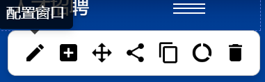
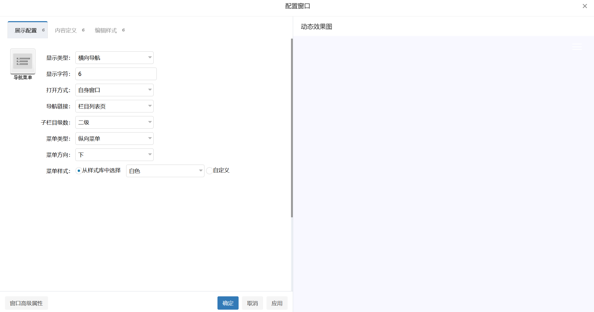

# 吐槽！Webplus 太难用了！

::: info 俳句

> 给学院开发
> 站群实在太难用
> 我要爆炸了

:::

## 前言

最近，海大成立了人工智能学院，本人也是十分的开心啊，我们海大也终于有自己的人工智能学院了。回到正题，本人最近被学院安排开发人工智能学院的官网， 起初我以为这只是一个普通的前端开发任务。然而，在开了需求分析会后，我意识到，事情不简单
倒不是网站设计上的难事，而是，我们学校使用的站群系统 **Webplus** 。当老师给出这个站群系统网站的开发部署文档后，我就感觉到不对劲了，这个文档质量比较差，内容也比较混乱，甚至有些地方还存在一些错误和不严谨的地方，导致我在开发过程中遇到了很多麻烦和困难，下面就由我来给大家介绍一下这个站群系统的槽点和规避方法吧

## Webplus 的槽点

### 槽点1：只能使用原始的 HTML 来开发

众所周知，现在的前端基本上都使用一些前端框架进行开发，比如 React、Vue、Angular 等等，这些框架可以大大提高开发效率和代码质量，然而 Webplus 却只能使用原始的 HTML 来开发，这就意味着我们不能使用任何现代化的前端工具和技术来开发网站了，这对于我们这些习惯了现代化前端开发的人来说，简直就是一个灾难。什么？你说能不能使用一些前端构建工具来编译成 HTML？不好意思，这个站群需要你在html中写一些特定的标签来标识不同的页面和组件，这些标签是无法通过构建工具来编译的，所以只能使用原始的 HTML 来开发了

所以，想要在此站群上开发，最好直接用 HTML 来写吧，虽然效率比较低，但是至少能保证开发的顺利进行。不过，天无绝人之路，你还是可以用一些 javascript 库，比如 jQuery 来提高开发效率的，虽然这也不是一个很好的选择，但是总比什么都没有强吧

### 槽点2：文档质量差，内容混乱，甚至还有错误

正如我前面所说的，这个站群系统的开发部署文档质量比较差，内容也比较混乱，甚至有些地方还存在一些错误和不严谨的地方。比如，文档中提到的占位符 {扩展字段} ，本人翻遍整个文档都没找到这个占位符到底怎么用，就很抽象
同时，文档中只提到使用 Webplus 提供的图形化界面来给网站添加组件和设定功能样式，但却不提如何手动进行组件的添加和配置。如果你将你的网站模板带配置下载下来，你就会发现你的窗口 div 上多了一些无法理解的配置，比如

```html
<div class="topnav" frag="窗口04" portletmode="simpleSudyNavi" configs="{'c5':'2','c9':'0','c6':'write','c4':'_self','c8':'2','c2':'1','c7':'2','c3':'6','c1':'1'}" contents="{'c2':'0', 'c1':''}">
```

这部分文档的缺失就导致网站组件样式的配置和Debug过程变得异常困难和痛苦，但凡 Webplus 提供的图形化界面出现问题无法自行添加配置或修改样式，那么网站的对应功能就很难去推进，甚至无法推进了

### 槽点3：吞样式、吞元素

有时，网站的某些元素在你的本地可以正常展示、正常出现，但在 Webplus 站群上，就突然看不见了，百思不得其解，打开 F12 开发者工具一看，发现这个元素却并未消失，样式看上去也没什么问题，但就是看不见了，这非常奇怪，不过，这个 Bug 并不常见，偶尔出现，有时你把元素的名字改改，它可能又出来了，因此，这个 Bug 还算是可以规避的

### 槽点4：组件样式会被强行覆盖

有时，你在本地写的组件样式，在 Webplus 站群上就被强行覆盖了，导致组件的样式完全变了样，这也是一个比较常见的 Bug，不过这个 Bug 的规避方法也比较简单，你只需要在你的组件样式前面加上 `!important` 就可以了，也可以通过组件的样式修改功能直接改站群给你的样式，不过有时候你改了样式后，站群又会自动把你的样式改回去，比较抽象，这个时候你就只能通过 `!important` 来强行覆盖了

### 槽点5：站群无法使用 a 标签做相对跳转

你在本地写的 `<a href="/xxx/xxx">` 标签，在 Webplus 站群上就无法正常跳转了，这是因为 Webplus 会把这一类标签的 herf 内容改写成 `javascript:void(0)` 的形式，导致无法跳转了，不过，对于 `<a href="https://xxx/xxx>"` 这种绝对跳转的标签，站群是不会改写的，所以你可以通过使用绝对路径来规避这个问题

### 槽点6：站群改动有时候无法立刻生效，甚至回滚

有时候在 Debug 的时候，你发现你虽然修改了样式，但是在站群上就是看不见修改的效果了，甚至你把整个组件都改了，站群上还是老样子，更极端的情况是，你上传了改动后的代码和文件，但是等一下发现它自己又回滚回来了，这个时候多试试或者多等等就行，就是血压容易高（

### 槽点7：站群模板的插件开发难以理解而且难以使用

Webplus 有一个示例插件，叫师资检索插件，虽然它解释了文件结构和 javascript 的一些参数配置，但是还是没有解释它具体的开发部署流程是啥，搞得我很头疼，而且这个插件的师资录入等模块也很难用，属实是把开发者和网站管理员都搞懵了

### 总评

总的来说，Webplus 这个站群系统是比较难用的，本人认为可能是因为站群的开发者想尽可能让网站的开发变得更简单所以设计了这一套系统，然而，这种设计我觉得反而弄巧成拙，毕竟网站的开发者基本上都是非常专业的，具有现代化的网页开发现代的，学校怎么可能让没有开发经验的人来开发网站呢？虽然图形化界面、占位符、组件化、纯HTML的开发方式让不是很懂网站的人也能开发网站了，但是这也让专业的人只能靠这些组件来开发网站，只能使用固化的方式开发网站，不能自己实现后端、接入后端，反而限制了网站的开发了，导致一些好看的样式、实用的功能很难实现甚至没办法实现，更何况站群的文档质量还很差，更没办法做了。
所以， Webplus 应该在网站模板的开发等模块更贴近专业开发者，在网站的文章发布、栏目管理等模块上更贴近非专业开发者才对，而不是一味照顾非专业开发者，能够几手都抓的东西本身就是几乎不可能出现的，华丽和实用本来就是一个互斥的概念，更何况你这个站群做的压根就不华丽，也不实用，这就是典型的想要做好几手结果什么都做不好了，反而让专业开发者和非专业开发者都不满意了，还是希望 Webplus 的开发公司能够重视一下这个问题

## Webplus 网站开发的基本步骤

这篇文章并不只是一味的批评 Webplus ，这里我也简单的介绍一下 Webplus 网站开发的基本步骤，帮助各位开发者进行 Webplus 网站的开发

::: warning 注意事项

本教程只适用于网站模板的开发者，网站的具体部署和发布及 webplus 的具体界面由于保密关系，本文无可奉告

请注意，本教程针对 Webplus Dreamer 版本，Webplus Pro 版本可能会有一些差异，请以实际情况为准

本文默认你熟读过了 Webplus 的文档，你不应该把这篇文章作为完全的 Webplus 教程来读，而是作为一个 Webplus 开发的经验分享来读的

:::

::: tip 仙人指路

Webplus Pro 文档：http://pro.webplus.net.cn/
Webplus Dreamer 文档：http://dreamer.webplus.net.cn/

:::

你需要的前置知识：

> 1. HTML、CSS、JavaScript 基础
> 2. 网页调试器的使用
> 3. 具备基本的开发思想和 debug 经验

### 模板结构

Webplus 的特点是模板式网站，网站是通过模板构建的，Webplus 会基于你的模板，识别内部的组件标识和配置生成最终的静态文件，所以你先创建一个模板，模板的必要文件结构如下：

```txt
main.htm : 首页
listcolumn.htm : 栏目文章列表页
displayinfo.htm : 文章详情页
```

:::warning 注意事项

请注意，以上三个文件是必须的，缺一不可的，如果缺了其中一个文件，站群就无法识别你的模板了

同时，你必须使用 `.htm` 作为你的模板文件的后缀，不能使用 `.html` 或者其他的后缀，否则站群也无法识别你的模板

:::

剩下的样式文件、图片文件、js 文件等都可以随意放在模板的目录下，站群会自动识别的，但是，有一点需要明确注意，就是 `listcolumn.htm` 的样式文件必须叫 `listcolumn.css` ，否则会没有样式的，其他的样式文件可以随意命名

### 创建栏目

你发现你的网站需要一个导航栏和几种文章分类，比如如图所示的这个：


那么你就需要在站群的图形化界面上创建一个栏目了，当然，你也可以在栏目里面创建栏目形成2级、3级导航等

### 编写模板

#### 普通组件的插入和配置

现在，你可以使用正常的 html 语法进行开发了，但是注意，站群会识别一些特定的标签来标识不同的组件和功能，每个组件必须在 `窗口` 中，而且组件必须包含在 `窗口内容` 中，例如：

```html
<div class="logo-stack" frag="窗口01" portletmode="simpleSiteAttri">
    <div frag="窗口内容">
        <a href="{站点URL}" class="logo-main" title="xxx">
            
        </a>
    </div>
</div>
```

这里的 portletmode="simpleSiteAttri" 是快捷绑定，只要写了这个，你就不需要在站群的图形化界面上再去手动绑定一次它的组件了，类似的还有 `simpleColumnAttri`、`simpleSiteAttri` 等，但是其他文档里没写的怎么知道它的名字呢？这个时候你可以在站群的图形化界面打开 F12 开发者工具，找到你想要的组件，看看它的属性名，你就知道了

不过，组件的配置是真没辙了，你只能在站群的图形化界面上进行配置了，如图，点一下这个按钮就可以进行配置了



里面一般会有一些选项，让你编辑样式、选择要展示的信息及如何显示等，并且有一个预览功能，不过有时候不管用就是了。这里的功能和选项是什么意思就不说了，大家自己摸索一下吧，也不难理解，基本上就是字面意思，大不了试试看就行



不过，你或许会问，文档中还提到一个叫 `面板` 的东西，而且面板所在的 div 块还不能有其他属性，这个面板是什么东西呢？我没感觉出来这个东西有啥用，所以在实际开发中，你完全可以不写 `面板` ，不然网页的代码真要和音游铺面一样了

#### 循环组件

循环组件就是和 for 循环一样的 (*类似 Django 里的 *) ，它可以让你在模板里循环输出一些内容，站群会根据你循环的内容来生成对应的静态文件，例如导航栏(simpleSudyNavi)的写法：

```html
<div class="topnav" frag="窗口02" portletmode="simpleSudyNavi">
    <ul class="nav-list clearfix">
        <div frag="窗口内容">
            <li class="nav-item"><a href="{栏目URL}" target="{打开方式}">　{栏目名称}　</a></li>
        </div>
        <li class="nav-item nav-hamburger">
            <button class="menu-btn" type="button" aria-label="展开导航">
                <span class="line-1"></span>
                <span class="line-2"></span>
                <span class="line-3"></span>
            </button>
        </li>
    </ul>
</div>
```

或者，如果你的导航栏比较复杂，比如有二级导航、三级导航等制作需求时，你可以手动标注循环位置，比如

```html
<div frag="窗口03" portletmode="simpleSudyNavi">
        <div frag="窗口内容">
            <!--[NaviStructBegin]-->
            <ul class="mega-grid" data-nav-aside='{"title":"导航","index":1}'>
                <!--[NaviItemCycleBegin]-->
                <li class="mega-col"><h4><a href="{栏目URL}" target="{打开方式}">{栏目名称}</a></h4>
                    <!--[MenuStructBegin]-->
                    <ul>
                        <!--[MenuItemCycleBegin]-->
                        <li>
                            <a href="{栏目URL}" target="{打开方式}">{栏目名称}</a>
                            <!--[SubMenuList]-->
                        </li>
                        <!--[MenuItemCycleEnd]-->
                    </ul>
                    <!--[MenuStructEnd]-->
                </li>
                <!--[NaviItemCycleEnd]-->
            </ul>
            <!--[NaviStructEnd]-->
        </div>
    </div>
</div>
```

这里的层级结构比较清楚了，这一整个循环的范围是 NaviStructBegin 到 NaviStructEnd，第一级导航是 NaviItemCycleBegin 到 NaviItemCycleEnd，第二级导航是 MenuStructBegin 到 MenuStructEnd，三级导航是 MenuItemCycleBegin 到 MenuItemCycleEnd，SubMenuList 是一个特殊的标签，它表示如果有三级导航的话，就在这里插入三级导航，如果没有三级导航的话，这个标签就会被站群自动删除掉了。同时，注意data-nav-aside='{"title":"导航","index":1}'，这个属性是必要的。这里 index 可能不太好理解，其实就是栏目级别，比如我的栏目结构是这样的：

```txt
学院官网
    首页
    学院介绍
        学院概况
    师资队伍
        教师团队
    科研成果
    人才培养
    招生就业
    新闻动态
    联系我们
```

那么这里 index=0 就代表从学院官网开始显示导航，index=1 就代表从首页、学院介绍...开始显示导航，由此类推

不过，这个组件特别容易不认，我这个结构就是最规范的了，可能少一点标签或者多一点标签它就不认了，所以建议多试试，谨慎一点，这玩意的 Debug 过程血压真的会飙地很高

什么？没用那么复杂但是还是想手动标注循环位置？也是可以的，比如这里拿文章列表页的新闻列表的实现方法举例，你可以这么写：

```html
<div class="news-list" id="newsList" frag="窗口04" portletmode="simpleList">
    <div frag="窗口内容">
        <div class="news-item">
            <!--[InfoCycleBegin]-->
            <div class="news-date-box">
                <div class="date-left">
                    <span class="date-year">{发布时间(yyyy)}</span>
                    <span class="date-month">{发布时间(MM月)}</span>
                </div>
                <span class="date-day">{发布时间(dd)}</span>
            </div>
            <a href="{文章URL}" class="news-item-link">
                <h3 class="news-title">{标题}</h3>
                <div class="news-meta">
                    <span class="news-author">{发布者}</span>
                    <span class="news-divider">|</span>
                    <span class="news-views">
                        <svg width="14" height="14" viewBox="0 0 24 24" fill="none" stroke="currentColor" stroke-width="2">
                            <path d="M1 12s4-8 11-8 11 8 11 8-4 8-11 8-11-8-11-8z"></path>
                            <circle cx="12" cy="12" r="3"></circle>
                        </svg>
                        {动态浏览次数}
                    </span>
                </div>
            </a>
            <!--[InfoCycleBegin]-->
        </div>
    </div>
</div>
```

这里的循环范围是 InfoCycleBegin 到 InfoCycleEnd，这样就可以手动标注循环的位置了，当然还有其他几种的循环标签，但是常用的就是这个，其他的如果有需要再看它的[文档](http://pro.webplus.net.cn/_s80/zdyzs/list.psp)吧

### 上传模板

基本上 Webplus 的模板制作方法就这几个逻辑了，剩下的就是上传模板了，上传模板你只需要把你的模板打包成 zip 压缩包，然后在站群的图形化界面上上传就行了，上传成功后你就可以在站群的图形化界面上看到你的模板了

## Webplus 特性

> 1. 如果你的某个栏目里面只有一个文章，那么在文章列表页，该文章会直接显示出来，而不是显示一个链接让你点进去看了，比如下面这种效果
> 

## Webplus 技巧

> 1. 师资资源的制作方法
> 上面说，师资资源的插件难以理解和使用，所以，你可以直接把老师列表发布成一篇文章，然后你再开一个栏目叫教师介绍，一个老师发一篇文章，然后老师列表的文章里对应老师就链接到对应的教师介绍文章里，这样就可以了，非常简单，庆幸它的文章可以直接写 html ，不然真的很麻烦了